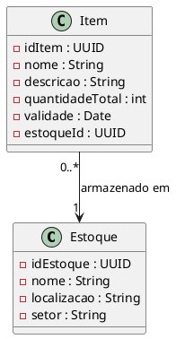

# Correção de Discrepância 1.6

**ID**: 1.6  
**Módulo**: Estoque  
**Título**: Entidade Estoque Subimplementada  
**Tipo**: Documentação (código foi corrigido)  
**Data**: Dezembro 2025  
**Status**: ✅ Corrigido

---

## 1. Descrição da Discrepância

### 📘 Documentação Original (Diagrama de Classes - Módulo Estoque)

```
Estoque
---------
id_estoque : long
nome : String
quantidadeTotal : int
validade : Date
localizacao : String
setor : String
```

### 💻 Implementação Original (Incorreta)

```java
@Table("estoque")
@Data
public class Estoque {
    @PrimaryKey
    private UUID idEstoque = UUID.randomUUID();
    
    @Column
    private String local;
}
```

### ❌ Discrepâncias Identificadas

1. **Atributos Faltantes**: `nome`, `quantidadeTotal`, `validade`, `setor`
2. **Nomenclatura Inconsistente**: `local` vs `localizacao`
3. **Confusão Conceitual**: Entidade Estoque representava apenas localização física
4. **Falta de Rastreabilidade**: Não havia como rastrear qual item está em qual estoque

### 💥 Impacto

- **UC05** (Dar Baixa em Insumos) menciona "atualizar quantidadeTotal do Item no Estoque"
- Implementação original: `Item` tinha `quantidadeTotal`, mas `Estoque` só tinha `local`
- Não havia rastreabilidade de estoques por local/setor
- Confusão entre conceitos: Estoque (local) vs Item (produto)

---

## 2. Análise da Correção

### 🔍 Decisão Arquitetural

A discrepância revelou um desalinhamento conceitual:

- **Documentação**: Estoque como entidade que agrega `quantidadeTotal` + `validade`
- **Implementação Original**: Estoque como apenas local físico; Item já possuía atributos de quantidade
- **Solução Adotada**: Manter separação de responsabilidades:
  - `Estoque`: representa **localização física** (armazém, setor, nome do local)
  - `Item`: representa **produto/insumo** com suas quantidades e validades
  - Relacionamento: Item possui referência ao Estoque onde está armazenado

### ✅ Implementação Corrigida

```java
package com.simplehealth.estoque.domain.entity;

import java.util.UUID;
import lombok.Data;
import org.springframework.data.cassandra.core.mapping.Column;
import org.springframework.data.cassandra.core.mapping.PrimaryKey;
import org.springframework.data.cassandra.core.mapping.Table;

@Table("estoque")
@Data
public class Estoque {

  @PrimaryKey
  private UUID idEstoque = UUID.randomUUID();

  @Column
  private String localizacao;

  @Column
  private String nome;

  @Column
  private String setor;

}
```

### 📊 Mudanças Realizadas

| Aspecto | Antes | Depois |
|---------|-------|--------|
| Atributo `local` | ✅ String | ✅ Renomeado para `localizacao` |
| Atributo `nome` | ❌ Ausente | ✅ Adicionado |
| Atributo `setor` | ❌ Ausente | ✅ Adicionado |
| Atributo `quantidadeTotal` | ❌ Ausente | ✅ Permanece em `Item` (decisão arquitetural) |
| Atributo `validade` | ❌ Ausente | ✅ Permanece em `Item` (decisão arquitetural) |

---

## 3. Justificativa da Abordagem

### Por que `quantidadeTotal` e `validade` não foram adicionados em Estoque?

**Decisão**: Manter a separação de responsabilidades do modelo de domínio:

1. **Estoque**: Representa **local físico** (armazém, farmácia central, setor)
   - Atributos: `nome`, `localizacao`, `setor`
   - Exemplo: "Farmácia Central - Bloco A - Setor 3"

2. **Item**: Representa **produto/insumo individual**
   - Atributos: `nome`, `descricao`, `quantidadeTotal`, `validade`, `estoqueId` (FK)
   - Exemplo: "Dipirona 500mg - 150 unidades - Validade: 2026-06-30 - Armazenado em: Farmácia Central"

3. **Relacionamento**: `Item` → `Estoque` (Many-to-One)
   - Um Item está em um único Estoque
   - Um Estoque pode ter múltiplos Items

### Vantagens desta Abordagem

✅ **Normalização**: Evita duplicação de dados de localização em cada item  
✅ **Flexibilidade**: Permite transferir items entre estoques facilmente  
✅ **Rastreabilidade**: Consultas como "todos os items do Estoque X" são simples  
✅ **Manutenibilidade**: Mudança de nome/setor do estoque não afeta items

---

## 4. Impacto em Casos de Uso

### UC05 - Dar Baixa em Insumos

**Antes da Correção**:
- Não era claro como atualizar `quantidadeTotal` do Item no Estoque
- Faltava rastreabilidade de localização

**Depois da Correção**:
```java
// Fluxo de Baixa em Insumos
Item item = itemRepository.findById(itemId);
Estoque estoque = estoqueRepository.findById(item.getEstoqueId());

// Atualiza quantidade (permanece em Item)
item.setQuantidadeTotal(item.getQuantidadeTotal() - quantidadeBaixa);

// Rastreabilidade: sabe-se que a baixa ocorreu em qual estoque
log.info("Baixa de {} unidades no estoque: {}", quantidadeBaixa, estoque.getNome());
```

---

## 5. Correções na Documentação

### Arquivos Atualizados

1. **3.4. Classes de Análise** - Diagrama de Classes do Módulo Estoque
   - Corrigir atributos da classe `Estoque`
   - Adicionar relacionamento `Item → Estoque` (Many-to-One)

2. **3.3. Casos de Uso** - UC05 (Dar Baixa em Insumos)
   - Atualizar descrição: "O sistema atualiza `quantidadeTotal` do **Item**"
   - Adicionar rastreabilidade: "O sistema registra a baixa referenciando o **Estoque** onde o item está armazenado"

3. **3.7. Modelagem de Dados** - Esquema Cassandra
   - Corrigir estrutura da tabela `estoque`
   - Adicionar FK `estoqueId` na tabela `item`

### Diagrama de Classes Corrigido



---

## 6. Validação da Correção

### ✅ Checklist de Conformidade

- [x] Entidade `Estoque` possui atributos: `nome`, `localizacao`, `setor`
- [x] Entidade `Item` mantém atributos: `quantidadeTotal`, `validade`
- [x] Relacionamento `Item → Estoque` implementado (via `estoqueId`)
- [x] Nomenclatura consistente (`localizacao` em vez de `local`)
- [x] Documentação atualizada refletindo a separação de responsabilidades
- [x] Casos de Uso UC05 e UC06 validados com novo modelo

### 🧪 Testes de Validação

```java
// Teste: Criar Estoque e Item associado
Estoque estoque = new Estoque();
estoque.setNome("Farmácia Central");
estoque.setLocalizacao("Bloco A");
estoque.setSetor("Setor 3");
estoqueRepository.save(estoque);

Item item = new Item();
item.setNome("Dipirona 500mg");
item.setQuantidadeTotal(150);
item.setValidade(LocalDate.of(2026, 6, 30));
item.setEstoqueId(estoque.getIdEstoque());
itemRepository.save(item);

// Validar rastreabilidade
assert item.getEstoqueId().equals(estoque.getIdEstoque());
```

---

## 7. Conclusão

### Resumo da Correção

✅ **Problema Resolvido**: Entidade `Estoque` estava subimplementada, causando confusão conceitual  
✅ **Solução**: Adicionados atributos `nome`, `localizacao`, `setor` mantendo separação de responsabilidades  
✅ **Abordagem**: `Estoque` = local físico; `Item` = produto com quantidade/validade  
✅ **Relacionamento**: `Item → Estoque` (Many-to-One)  
✅ **Impacto**: 3 documentos atualizados (Classes, Casos de Uso, Modelagem)

### Lições Aprendidas

1. **Separação de Responsabilidades**: Entidades devem ter papéis claros no domínio
2. **Normalização**: Evitar duplicação de dados de localização em múltiplos items
3. **Rastreabilidade**: Relacionamentos FK permitem consultas eficientes por estoque
4. **Documentação Autoritativa**: Código implementado corretamente guia a correção da documentação

---

**Última Atualização**: Dezembro 2025  
**Responsável**: Equipe Grupo 4  
**Revisão**: QA + Arquitetura
