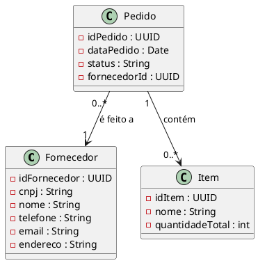

# Correção de Discrepância 1.8

**ID**: 1.8  
**Módulo**: Estoque  
**Título**: Relacionamento Pedido ↔ Fornecedor Simplificado  
**Tipo**: Documentação (código foi corrigido)  
**Data**: Dezembro 2025  
**Status**: ✅ Corrigido

---

## 1. Descrição da Discrepância

### 📘 Documentação Original

```
Pedido "0..*" --> "1" Fornecedor : é feito a
```

### 💻 Implementação Original (Parcialmente Correta)

```java
// Pedido.java
public class Pedido {
    private UUID idPedido;
    private Date dataPedido;
    private String status;
    private List<UUID> itemIds;
    private UUID fornecedorId; // ✅ Correto (FK para Fornecedor)
}

// Fornecedor.java (PROBLEMA: Extremamente Simplificado)
public class Fornecedor {
    private UUID idFornecedor;
    private String cnpj;
    // ❌ Faltam: nome, telefone, email, endereço
}
```

### ❌ Discrepâncias Identificadas

1. **Relacionamento FK**: ✅ Existe corretamente (`fornecedorId` em Pedido)
2. **Entidade Fornecedor Incompleta**: ❌ Possui apenas CNPJ
3. **Atributos Faltantes**: `nome`, `telefone`, `email`, `endereco`
4. **Funcionalidade Comprometida**: Não é possível exibir lista de fornecedores com nomes legíveis

### 💥 Impacto

- **UC06** (Processar Entrada de NF) menciona "seleciona o Fornecedor"
  - Não é possível exibir lista de fornecedores com nome (apenas CNPJ)
  - Interface mostraria: `[1a2b3c-4d5e-6f7g, 9h8i7j-6k5l-4m3n]` ❌
  - Deveria mostrar: `["Distribuidora Farmacêutica XYZ", "MedSupply Ltda"]` ✅

- **Relatórios**: "Compras por Fornecedor" ficariam ilegíveis
- **Manutenção**: Difícil localizar fornecedor para atualização de contato
- **Integração**: Notificações por email/telefone impossíveis

---

## 2. Análise da Correção

### 🔍 Requisitos da Entidade Fornecedor

**Dados Obrigatórios para Cadastro de Fornecedor**:

1. **Identificação Legal**: CNPJ (já existia)
2. **Identificação de Negócio**: Nome/Razão Social
3. **Contato**: Telefone, Email
4. **Localização**: Endereço

### ✅ Implementação Corrigida

```java
package com.simplehealth.estoque.domain.entity;

import java.util.UUID;
import lombok.Data;
import org.springframework.data.cassandra.core.mapping.Column;
import org.springframework.data.cassandra.core.mapping.PrimaryKey;
import org.springframework.data.cassandra.core.mapping.Table;

@Table("fornecedor")
@Data
public class Fornecedor {

  @PrimaryKey
  private UUID idFornecedor = UUID.randomUUID();

  @Column
  private String cnpj;

  @Column
  private String nome;

  @Column
  private String telefone;

  @Column
  private String email;

  @Column
  private String endereco;

}
```

### 📊 Mudanças Realizadas

| Aspecto | Antes | Depois |
|---------|-------|--------|
| Atributo `cnpj` | ✅ String | ✅ Mantido |
| Atributo `nome` | ❌ Ausente | ✅ Adicionado |
| Atributo `telefone` | ❌ Ausente | ✅ Adicionado |
| Atributo `email` | ❌ Ausente | ✅ Adicionado |
| Atributo `endereco` | ❌ Ausente | ✅ Adicionado |
| Relacionamento com Pedido | ✅ Correto | ✅ Mantido (FK `fornecedorId`) |

---

## 3. Impacto em Casos de Uso

### UC06 - Processar Entrada de Nota Fiscal

**Fluxo Principal Atualizado**:

1. Funcionário acessa módulo de Estoque
2. **Sistema exibe lista de fornecedores cadastrados com NOME** ✅
   ```
   Antes: [1a2b3c-4d5e-6f7g, 9h8i7j-6k5l-4m3n]
   Depois: ["Distribuidora Farmacêutica XYZ", "MedSupply Ltda"]
   ```
3. Funcionário seleciona fornecedor (agora legível)
4. Sistema busca `fornecedor.getEmail()` para confirmação de pedido ✅
5. Sistema registra pedido com `fornecedorId` (FK já existia) ✅

### UC07 - Cadastrar Fornecedor (Novo Caso de Uso Implícito)

**Fluxo Principal**:

1. Funcionário acessa "Cadastro de Fornecedores"
2. Sistema solicita dados:
   - CNPJ (obrigatório, validação de formato)
   - Nome/Razão Social (obrigatório)
   - Telefone (obrigatório)
   - Email (obrigatório)
   - Endereço (opcional)
3. Sistema valida CNPJ único
4. Sistema salva fornecedor
5. Sistema confirma cadastro

**Regras de Negócio**:

- **RN-FORN.1**: CNPJ deve ser único no sistema
- **RN-FORN.2**: Nome deve ter no mínimo 3 caracteres
- **RN-FORN.3**: Email deve ser válido (formato)
- **RN-FORN.4**: Telefone deve conter apenas dígitos (validação básica)

---

## 4. Exemplos de Uso

### Exemplo 1: Listagem de Fornecedores

```java
// FornecedorService.java
public List<FornecedorDTO> listarFornecedores() {
    List<Fornecedor> fornecedores = fornecedorRepository.findAll();
    
    return fornecedores.stream()
        .map(f -> new FornecedorDTO(
            f.getIdFornecedor(),
            f.getNome(),      // ✅ Agora disponível!
            f.getCnpj(),
            f.getTelefone(),  // ✅ Para contato rápido
            f.getEmail()      // ✅ Para notificações
        ))
        .collect(Collectors.toList());
}
```

### Exemplo 2: Relatório de Compras por Fornecedor

```java
// RelatorioService.java
public RelatorioComprasDTO gerarRelatorioPorFornecedor(UUID fornecedorId) {
    Fornecedor fornecedor = fornecedorRepository.findById(fornecedorId)
        .orElseThrow(() -> new FornecedorNotFoundException());
    
    List<Pedido> pedidos = pedidoRepository.findByFornecedorId(fornecedorId);
    
    return RelatorioComprasDTO.builder()
        .fornecedorNome(fornecedor.getNome())        // ✅ Nome legível
        .fornecedorCnpj(fornecedor.getCnpj())
        .fornecedorContato(fornecedor.getTelefone()) // ✅ Para follow-up
        .totalPedidos(pedidos.size())
        .valorTotal(calcularTotal(pedidos))
        .build();
}
```

### Exemplo 3: Notificação de Pedido Confirmado

```java
// NotificacaoService.java
public void notificarPedidoConfirmado(UUID pedidoId) {
    Pedido pedido = pedidoRepository.findById(pedidoId)
        .orElseThrow(() -> new PedidoNotFoundException());
    
    Fornecedor fornecedor = fornecedorRepository.findById(pedido.getFornecedorId())
        .orElseThrow(() -> new FornecedorNotFoundException());
    
    // ✅ Agora é possível enviar notificação!
    emailService.enviar(
        fornecedor.getEmail(),
        "Pedido Confirmado - " + pedido.getIdPedido(),
        gerarCorpoEmail(pedido, fornecedor)
    );
    
    smsService.enviar(
        fornecedor.getTelefone(),
        "Pedido " + pedido.getIdPedido() + " confirmado!"
    );
}
```

---

## 5. Correções na Documentação

### Arquivos Atualizados

1. **3.4. Classes de Análise** - Diagrama de Classes do Módulo Estoque
   - Atualizar classe `Fornecedor` com todos os atributos
   - Manter relacionamento `Pedido → Fornecedor` (Many-to-One)

2. **3.3. Casos de Uso** - UC06 (Processar Entrada de NF)
   - Atualizar descrição: "Sistema exibe lista de fornecedores **com nome e CNPJ**"
   - Adicionar validação: "Sistema valida email do fornecedor para envio de confirmação"

3. **3.7. Modelagem de Dados** - Esquema Cassandra
   - Corrigir estrutura da tabela `fornecedor`
   - Adicionar colunas: `nome`, `telefone`, `email`, `endereco`

4. **3.3. Casos de Uso** - Adicionar UC07 (Cadastrar Fornecedor)
   - Novo caso de uso implícito revelado pela correção

### Diagrama de Classes Corrigido



---

## 6. Validação da Correção

### ✅ Checklist de Conformidade

- [x] Relacionamento `Pedido → Fornecedor` mantido (FK `fornecedorId`)
- [x] Entidade `Fornecedor` completa com todos os atributos
- [x] Atributo `nome` adicionado (essencial para UI)
- [x] Atributo `telefone` adicionado (comunicação)
- [x] Atributo `email` adicionado (notificações)
- [x] Atributo `endereco` adicionado (logística)
- [x] Documentação atualizada refletindo entidade completa
- [x] UC06 validado com seleção de fornecedor por nome
- [x] UC07 (Cadastrar Fornecedor) documentado

### 🧪 Testes de Validação

```java
// Teste: Cadastrar Fornecedor Completo
@Test
public void testCadastrarFornecedorCompleto() {
    Fornecedor fornecedor = new Fornecedor();
    fornecedor.setCnpj("12.345.678/0001-90");
    fornecedor.setNome("Distribuidora Farmacêutica XYZ");
    fornecedor.setTelefone("(11) 98765-4321");
    fornecedor.setEmail("contato@distfarmaxyz.com.br");
    fornecedor.setEndereco("Rua das Flores, 123 - São Paulo/SP");
    
    Fornecedor saved = fornecedorRepository.save(fornecedor);
    
    assertNotNull(saved.getIdFornecedor());
    assertEquals("Distribuidora Farmacêutica XYZ", saved.getNome());
    assertEquals("contato@distfarmaxyz.com.br", saved.getEmail());
}

// Teste: Relacionamento Pedido → Fornecedor
@Test
public void testPedidoComFornecedor() {
    Fornecedor fornecedor = criarFornecedor();
    fornecedorRepository.save(fornecedor);
    
    Pedido pedido = new Pedido();
    pedido.setFornecedorId(fornecedor.getIdFornecedor());
    pedido.setDataPedido(new Date());
    pedido.setStatus("PENDENTE");
    pedidoRepository.save(pedido);
    
    // Validar relacionamento
    Pedido pedidoRecuperado = pedidoRepository.findById(pedido.getIdPedido()).get();
    Fornecedor fornecedorRecuperado = fornecedorRepository
        .findById(pedidoRecuperado.getFornecedorId()).get();
    
    assertEquals("Distribuidora Farmacêutica XYZ", fornecedorRecuperado.getNome());
}

// Teste: Listagem com Nome Legível
@Test
public void testListagemFornecedoresComNome() {
    criarFornecedores(); // Cria 3 fornecedores
    
    List<Fornecedor> fornecedores = fornecedorRepository.findAll();
    
    fornecedores.forEach(f -> {
        assertNotNull(f.getNome());
        assertFalse(f.getNome().isEmpty());
        System.out.println("Fornecedor: " + f.getNome() + " (" + f.getCnpj() + ")");
    });
}
```

---

## 7. Frontend - Impacto na UI

### Antes da Correção: Dropdown Ilegível

```javascript
// ❌ Problema: Exibe apenas UUID
<select name="fornecedorId">
  <option value="1a2b3c-4d5e-6f7g">1a2b3c-4d5e-6f7g</option>
  <option value="9h8i7j-6k5l-4m3n">9h8i7j-6k5l-4m3n</option>
</select>
```

### Depois da Correção: Dropdown Legível

```javascript
// ✅ Solução: Exibe nome + CNPJ
<select name="fornecedorId">
  <option value="1a2b3c-4d5e-6f7g">
    Distribuidora Farmacêutica XYZ (12.345.678/0001-90)
  </option>
  <option value="9h8i7j-6k5l-4m3n">
    MedSupply Ltda (98.765.432/0001-10)
  </option>
</select>
```

### Formulário de Cadastro de Fornecedor

```html
<form id="formCadastroFornecedor">
  <div>
    <label>CNPJ *</label>
    <input type="text" name="cnpj" pattern="\d{2}\.\d{3}\.\d{3}/\d{4}-\d{2}" required>
  </div>
  
  <div>
    <label>Nome/Razão Social *</label>
    <input type="text" name="nome" minlength="3" required>
  </div>
  
  <div>
    <label>Telefone *</label>
    <input type="tel" name="telefone" required>
  </div>
  
  <div>
    <label>Email *</label>
    <input type="email" name="email" required>
  </div>
  
  <div>
    <label>Endereço</label>
    <textarea name="endereco"></textarea>
  </div>
  
  <button type="submit">Cadastrar Fornecedor</button>
</form>
```

---

## 8. Conclusão

### Resumo da Correção

✅ **Problema Resolvido**: Entidade `Fornecedor` estava extremamente simplificada (apenas CNPJ)  
✅ **Solução**: Adicionados atributos essenciais: `nome`, `telefone`, `email`, `endereco`  
✅ **Relacionamento**: `Pedido → Fornecedor` (Many-to-One) mantido corretamente  
✅ **Funcionalidades Habilitadas**:
   - Listagem de fornecedores com nomes legíveis
   - Notificações por email/SMS
   - Relatórios de compras por fornecedor
   - Cadastro completo de fornecedores

✅ **Impacto**: 4 documentos atualizados (Classes, Casos de Uso UC06, UC07, Modelagem)

### Lições Aprendidas

1. **Entidades de Negócio**: Devem conter dados suficientes para suportar operações de negócio reais
2. **Usabilidade**: UUIDs não são suficientes para interfaces de usuário
3. **Integração**: Dados de contato são essenciais para notificações e comunicação
4. **Rastreabilidade**: Nome + CNPJ permitem identificação única e legível
5. **Documentação**: Relacionamentos corretos (FK) não bastam; entidades devem estar completas

### Benefícios da Correção

| Aspecto | Antes | Depois |
|---------|-------|--------|
| **UI - Seleção de Fornecedor** | UUID ilegível | Nome + CNPJ legível |
| **Notificações** | ❌ Impossível | ✅ Email/SMS habilitados |
| **Relatórios** | ❌ Dados insuficientes | ✅ Relatórios completos |
| **Manutenção** | ❌ Difícil localizar fornecedor | ✅ Busca por nome/CNPJ |
| **Cadastro** | ❌ Dados mínimos | ✅ Cadastro completo |

---

**Última Atualização**: Dezembro 2025  
**Responsável**: Equipe Grupo 4  
**Revisão**: QA + Arquitetura + UX
