# Relatório de Testes - Módulo Agendamento

**Data:** 15/12/2025  
**Sistema:** SimpleHealth  
**Módulo:** Agendamento  
**Responsável:** Caio

---

## Sumário

1. [CRUD Bloqueio](#crud-bloqueio) - 📋 [UC04: Registrar Bloqueio](../documentos-finais-definitivos/3.2_3.3_Casos%20de%20uso/3.3.%20Descrição%20detalhada%20de%20cada%20Caso%20de%20Uso/3.3.%20Descrição%20detalhada%20de%20cada%20Caso%20de%20Uso.md#uc04-registrar-bloqueio-de-agenda)
   - [Create 1 - Bloqueio](#create-1---bloqueio)
   - [Create 2 - Bloqueio](#create-2---bloqueio)
   - [Update - Bloqueio](#update---bloqueio)
   - [Delete - Bloqueio](#delete---bloqueio)
   - [Operação Especial - Pesquisa por CRM](#operacao-especial---pesquisa-por-crm)

2. [Operações Consulta](#operacoes-consulta) - 📋 [UC02: Agendar Consulta](../documentos-finais-definitivos/3.2_3.3_Casos%20de%20uso/3.3.%20Descrição%20detalhada%20de%20cada%20Caso%20de%20Uso/3.3.%20Descrição%20detalhada%20de%20cada%20Caso%20de%20Uso.md#uc02-agendar-consulta)
   - [Operação Especial - Pesquisa por Motivo](#operacao-especial---pesquisa-por-motivo)
   - [Operação Especial - Cancelar Bloqueio Ativo](#operacao-especial---cancelar-bloqueio-ativo)

3. [CRUD Exame](#crud-exame) - 📋 [UC02: Agendar Consulta (Exame)](../documentos-finais-definitivos/3.2_3.3_Casos%20de%20uso/3.3.%20Descrição%20detalhada%20de%20cada%20Caso%20de%20Uso/3.3.%20Descrição%20detalhada%20de%20cada%20Caso%20de%20Uso.md#uc02-agendar-consulta)
   - [Create 1 - Exame](#create-1---exame)
   - [Create 2 - Exame](#create-2---exame)
   - [Update - Exame](#update---exame)
   - [Delete - Exame](#delete---exame)

4. [CRUD Procedimento](#crud-procedimento) - 📋 [UC02: Agendar Consulta (Procedimento)](../documentos-finais-definitivos/3.2_3.3_Casos%20de%20uso/3.3.%20Descrição%20detalhada%20de%20cada%20Caso%20de%20Uso/3.3.%20Descrição%20detalhada%20de%20cada%20Caso%20de%20Uso.md#uc02-agendar-consulta)
   - [Create 1 - Procedimento](#create-1---procedimento)
   - [Create 2 - Procedimento](#create-2---procedimento)
   - [Update - Procedimento](#update---procedimento)
   - [Delete - Procedimento](#delete---procedimento)

5. [Resumo dos Testes](#resumo-dos-testes)

---

## CRUD Bloqueio

> 📋 **Documentação de Requisitos:** [UC04: Registrar Bloqueio de Agenda](../documentos-finais-definitivos/3.2_3.3_Casos%20de%20uso/3.3.%20Descrição%20detalhada%20de%20cada%20Caso%20de%20Uso/3.3.%20Descrição%20detalhada%20de%20cada%20Caso%20de%20Uso.md#uc04-registrar-bloqueio-de-agenda)

### Create 1 - Bloqueio

**Objetivo:** Criar novo bloqueio de agenda no sistema  

**Resultado Obtido:** [x] Sucesso [ ] Falha

**Evidência:**

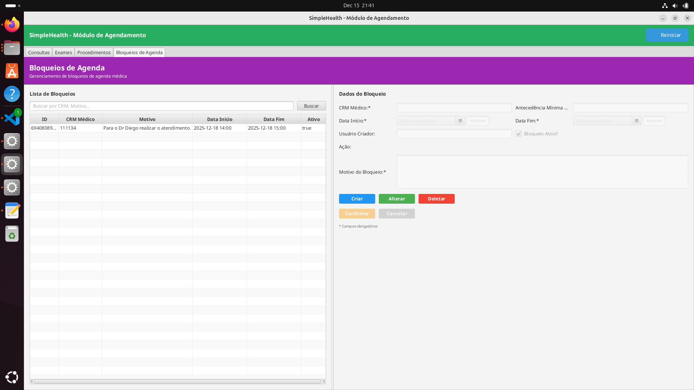

---

### Create 2 - Bloqueio

**Objetivo:** Criar segundo bloqueio de agenda no sistema  

**Resultado Obtido:** [x] Sucesso [ ] Falha

**Evidência:**

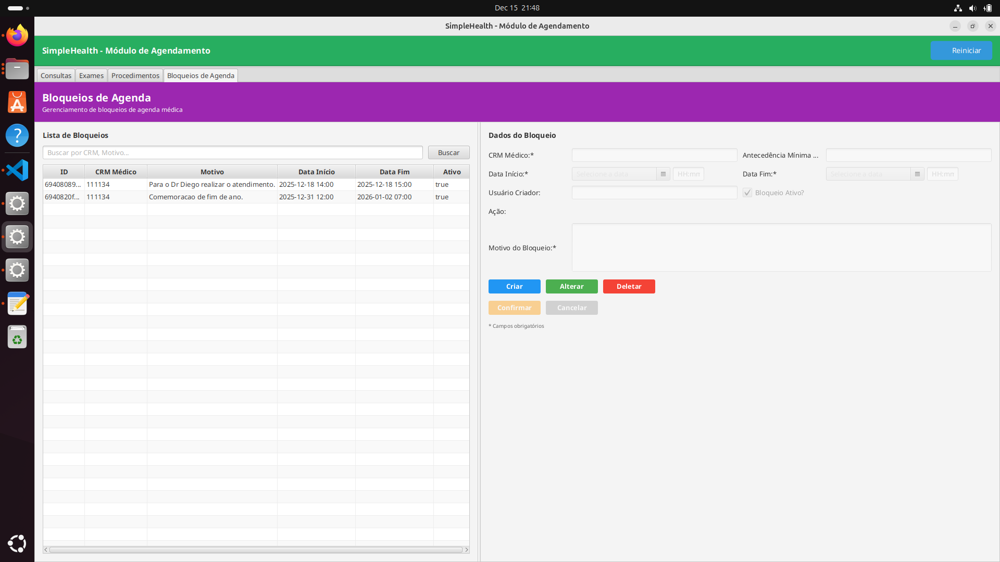

---

### Update - Bloqueio

**Objetivo:** Atualizar dados de bloqueio existente  

**Resultado Obtido:** [x] Sucesso [ ] Falha

**Evidência:**

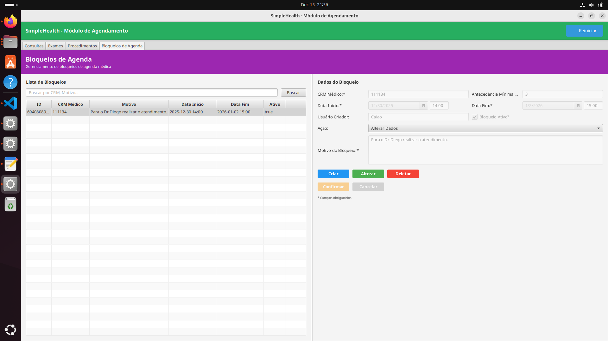

---

### Delete - Bloqueio

**Objetivo:** Excluir bloqueio do sistema  

**Resultado Obtido:** [x] Sucesso [ ] Falha

**Evidência:**

---

### Operação Especial - Pesquisa por CRM

**Objetivo:** Realizar busca de bloqueios filtrando pelo CRM do médico

**Resultado Obtido:** [x] Sucesso [ ] Falha

**Evidência:**

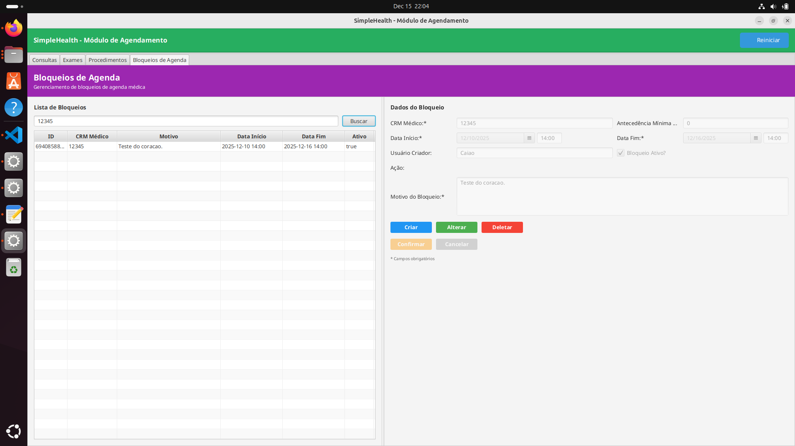

---

## Operações Consulta

> 📋 **Documentação de Requisitos:** [UC02: Agendar Consulta](../documentos-finais-definitivos/3.2_3.3_Casos%20de%20uso/3.3.%20Descrição%20detalhada%20de%20cada%20Caso%20de%20Uso/3.3.%20Descrição%20detalhada%20de%20cada%20Caso%20de%20Uso.md#uc02-agendar-consulta)

### Operação Especial - Pesquisa por Motivo

**Objetivo:** Filtrar consultas agendadas pelo motivo do atendimento

**Resultado Obtido:** [x] Sucesso [ ] Falha

**Evidência:**

---

### Operação Especial - Cancelar Bloqueio Ativo

**Objetivo:** Cancelar um bloqueio que esteja ativo diretamente pela interface de consulta

**Resultado Obtido:** [x] Sucesso [ ] Falha

**Evidência:**

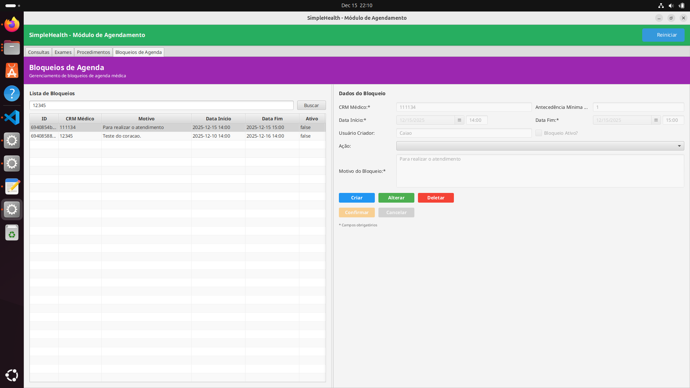

---

## CRUD Exame

> 📋 **Documentação de Requisitos:** [UC02: Agendar Consulta (Exames)](../documentos-finais-definitivos/3.2_3.3_Casos%20de%20uso/3.3.%20Descrição%20detalhada%20de%20cada%20Caso%20de%20Uso/3.3.%20Descrição%20detalhada%20de%20cada%20Caso%20de%20Uso.md#uc02-agendar-consulta)

### Create 1 - Exame

**Objetivo:** Criar novo agendamento de exame no sistema  

**Resultado Obtido:** [x] Sucesso [ ] Falha

**Evidência:**

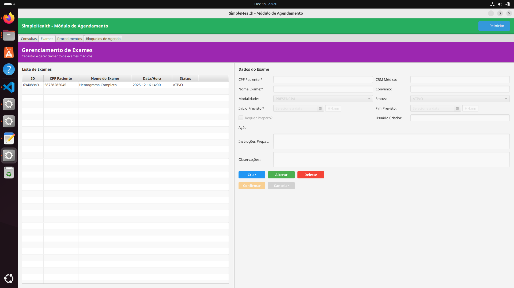

---

### Create 2 - Exame

**Objetivo:** Criar segundo agendamento de exame no sistema  

**Resultado Obtido:** [x] Sucesso [ ] Falha

**Evidência:**

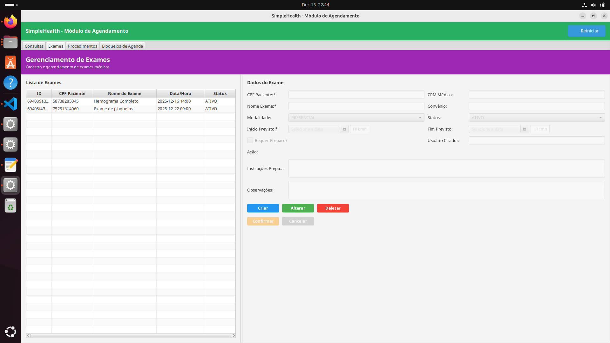

---

### Update - Exame

**Objetivo:** Atualizar dados de exame existente  

**Resultado Obtido:** [x] Sucesso [ ] Falha

**Evidência:**

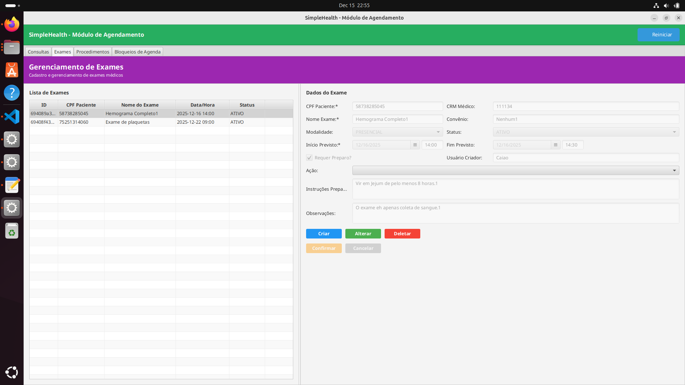

---

### Delete - Exame

**Objetivo:** Cancelar exame do sistema  

**Resultado Obtido:** [x] Sucesso [ ] Falha

**Evidência:**

---

## CRUD Procedimento

> 📋 **Documentação de Requisitos:** [UC02: Agendar Consulta (Procedimentos)](../documentos-finais-definitivos/3.2_3.3_Casos%20de%20uso/3.3.%20Descrição%20detalhada%20de%20cada%20Caso%20de%20Uso/3.3.%20Descrição%20detalhada%20de%20cada%20Caso%20de%20Uso.md#uc02-agendar-consulta)

### Create 1 - Procedimento

**Objetivo:** Criar novo agendamento de procedimento no sistema  

**Resultado Obtido:** [x] Sucesso [ ] Falha

**Evidência:**

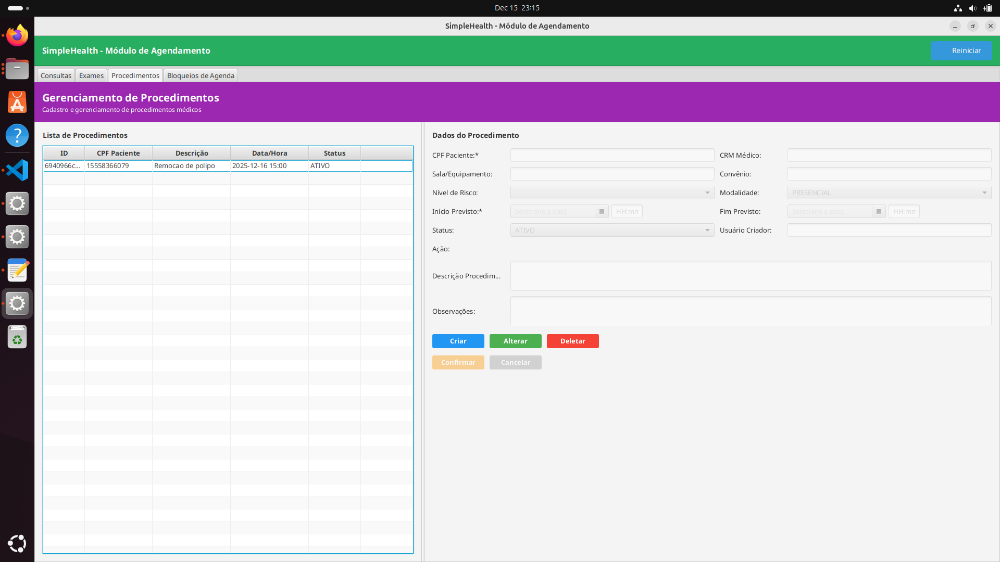

---

### Create 2 - Procedimento

**Objetivo:** Criar segundo agendamento de procedimento no sistema  

**Resultado Obtido:** [x] Sucesso [ ] Falha

**Evidência:**

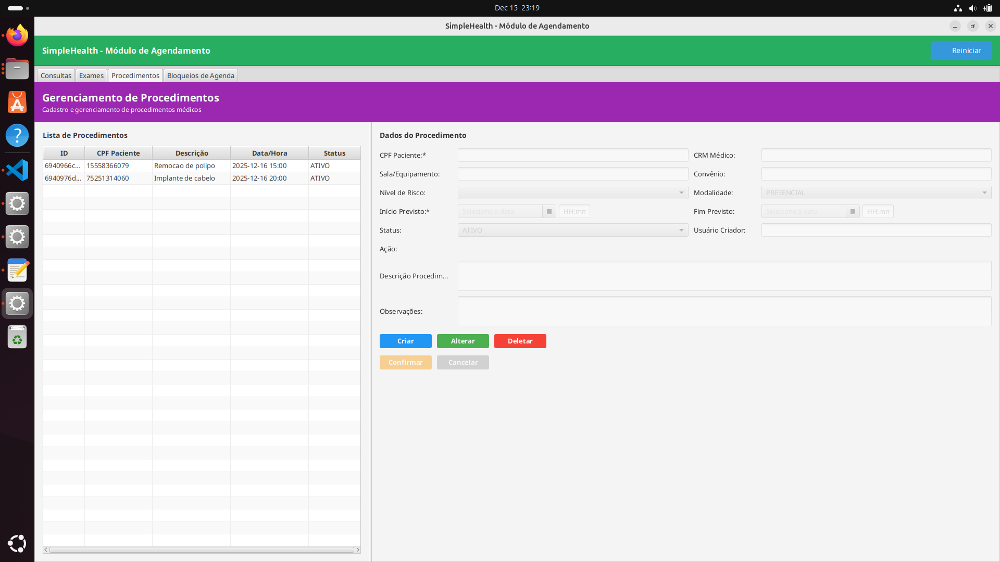

---

### Update - Procedimento

**Objetivo:** Atualizar dados de procedimento existente  

**Resultado Obtido:** [x] Sucesso [ ] Falha

**Evidência:**

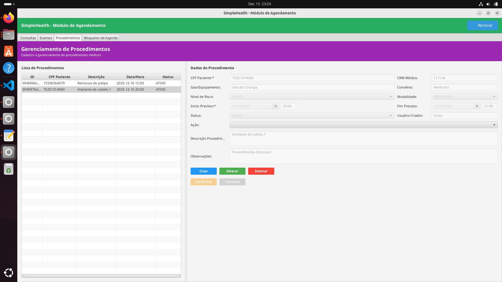

---

### Delete - Procedimento

**Objetivo:** Excluir procedimento do sistema  

**Resultado Obtido:** [x] Sucesso [ ] Falha

**Evidência:**

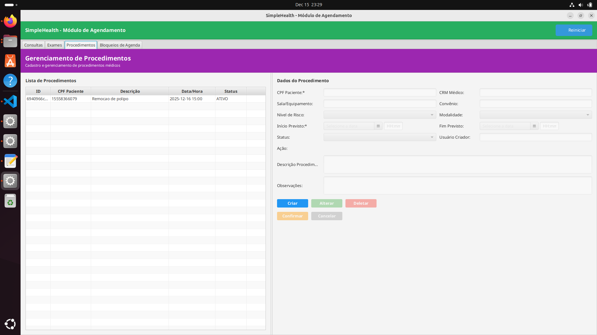

---

## Resumo dos Testes

| Módulo | Funcionalidade | Status | Observações |
| :--- | :--- | :---: | :--- |
| **Agendamento** | CRUD Bloqueio | ✅ | Create, Update, Delete e Pesquisa por CRM validados. |
| **Agendamento** | Operações Consulta | ✅ | Pesquisa por motivo e cancelamento de bloqueio validados. |
| **Agendamento** | CRUD Exame | ✅ | Ciclo completo de agendamento de exame validado. |
| **Agendamento** | CRUD Procedimento | ✅ | Ciclo completo de agendamento de procedimento validado. |

**Conclusão:** O módulo de Agendamento encontra-se estável e as operações principais de Bloqueio, Exames e Procedimentos foram validadas com sucesso conforme as evidências apresentadas.