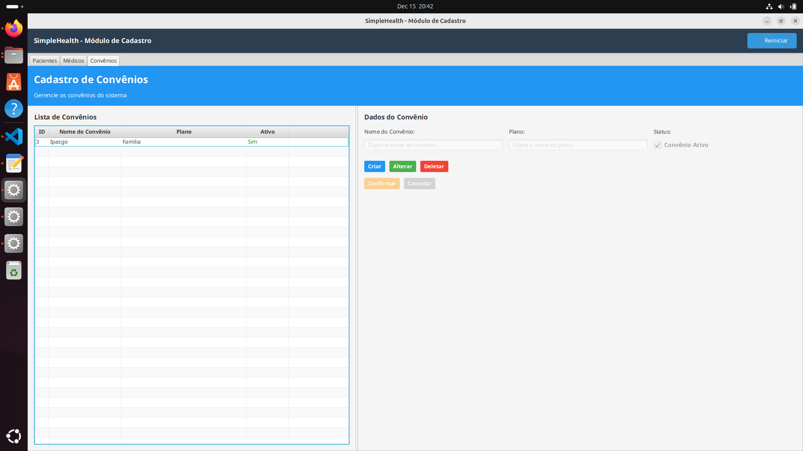
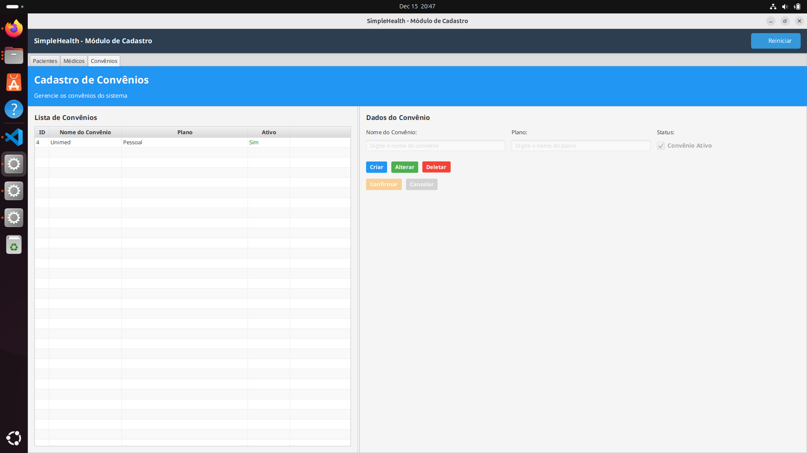
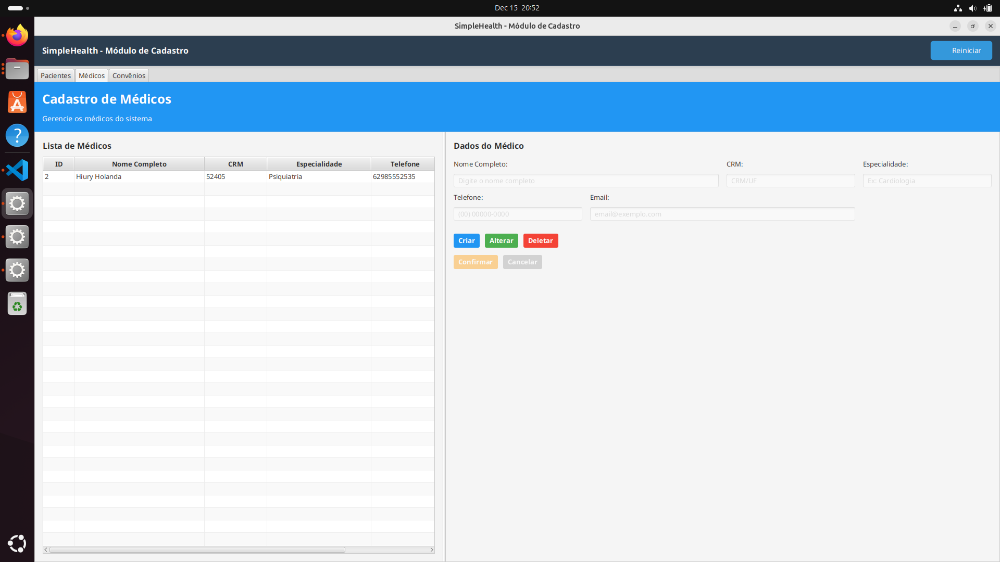
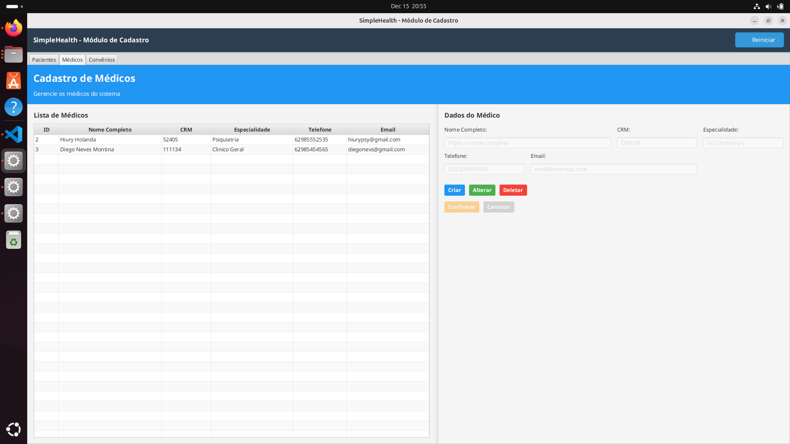
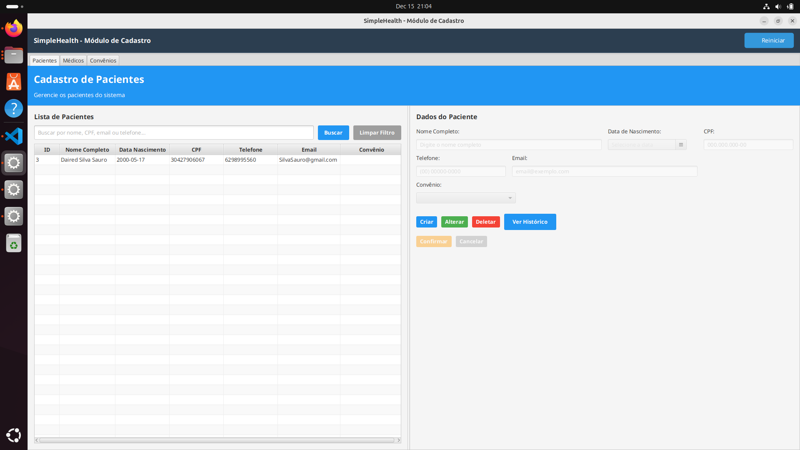
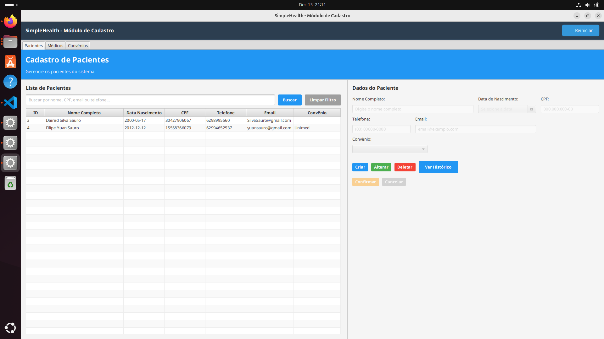
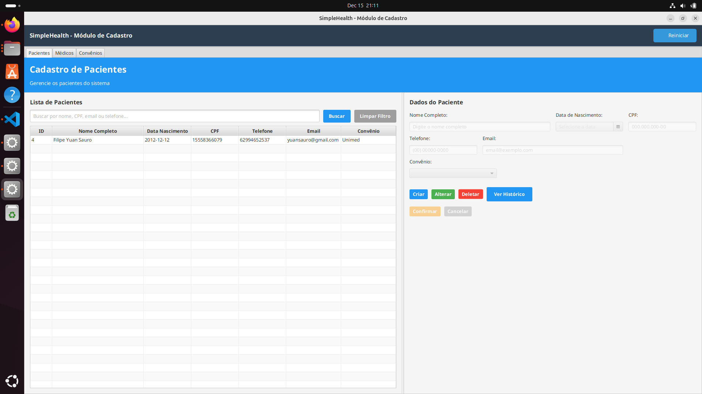
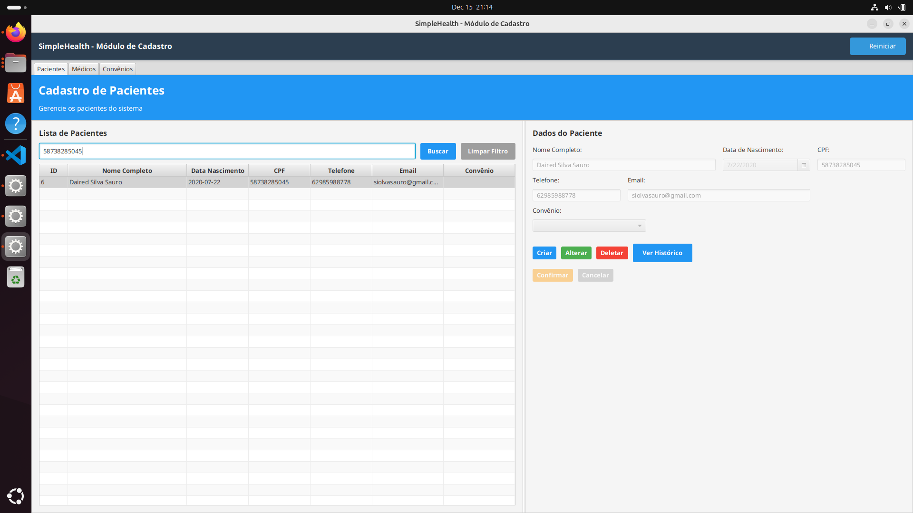
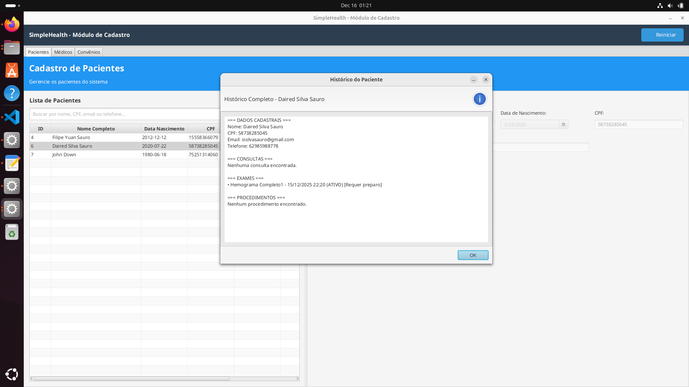

# Relatório de Testes - Módulo Cadastro

**Data:** 15/12/2025  
**Sistema:** SimpleHealth  
**Módulo:** Cadastro  
**Responsável:** Caio

---

## Sumário

1. [CRUD Convênio](#crud-convenio) - 📋 [UC12: Gerenciar Cadastros Base](../documentos-finais-definitivos/3.2_3.3_Casos%20de%20uso/3.3.%20Descrição%20detalhada%20de%20cada%20Caso%20de%20Uso/3.3.%20Descrição%20detalhada%20de%20cada%20Caso%20de%20Uso.md#uc12-gerenciar-cadastros-base-do-sistema)
   - [Create 1 - Convênio](#create-1---convenio)
   - [Create 2 - Convênio](#create-2---convenio)
   - [Update - Convênio](#update---convenio)
   - [Delete - Convênio](#delete---convenio)

2. [CRUD Médico](#crud-medico) - 📋 [UC11: Gerenciar Usuários e Perfis](../documentos-finais-definitivos/3.2_3.3_Casos%20de%20uso/3.3.%20Descrição%20detalhada%20de%20cada%20Caso%20de%20Uso/3.3.%20Descrição%20detalhada%20de%20cada%20Caso%20de%20Uso.md#uc11-gerenciar-usuários-e-perfis-de-acesso)
   - [Create 1 - Médico](#create-1---medico)
   - [Create 2 - Médico](#create-2---medico)
   - [Update - Médico](#update---medico)
   - [Delete - Médico](#delete---medico)

3. [CRUD Paciente](#crud-paciente) - 📋 [UC01: Cadastrar Novo Paciente](../documentos-finais-definitivos/3.2_3.3_Casos%20de%20uso/3.3.%20Descrição%20detalhada%20de%20cada%20Caso%20de%20Uso/3.3.%20Descrição%20detalhada%20de%20cada%20Caso%20de%20Uso.md#uc01-cadastrar-novo-paciente) | [UC08: Consultar Histórico](../documentos-finais-definitivos/3.2_3.3_Casos%20de%20uso/3.3.%20Descrição%20detalhada%20de%20cada%20Caso%20de%20Uso/3.3.%20Descrição%20detalhada%20de%20cada%20Caso%20de%20Uso.md#uc08-consultar-histórico-do-paciente-redução-de-escopo---implementação-parcial)
   - [Create 1 - Paciente](#create-1---paciente)
   - [Create 2 - Paciente](#create-2---paciente)
   - [Update - Paciente](#update---paciente)
   - [Delete - Paciente](#delete---paciente)
   - [Operação Especial - Paciente](#operacao-especial---paciente)

4. [CRUD Usuário](#crud-usuario) - 📋 [UC11: Gerenciar Usuários e Perfis](../documentos-finais-definitivos/3.2_3.3_Casos%20de%20uso/3.3.%20Descrição%20detalhada%20de%20cada%20Caso%20de%20Uso/3.3.%20Descrição%20detalhada%20de%20cada%20Caso%20de%20Uso.md#uc11-gerenciar-usuários-e-perfis-de-acesso)
   - [Create 1 - Usuário](#create-1---usuario)
   - [Create 2 - Usuário](#create-2---usuario)
   - [Update - Usuário](#update---usuario)
   - [Delete - Usuário](#delete---usuario)
   - [Operação Especial - Usuário](#operacao-especial---usuario)

5. [Resumo dos Testes](#resumo-dos-testes)

---

## CRUD Convênio

> 📋 **Documentação de Requisitos:** [UC12: Gerenciar Cadastros Base do Sistema](../documentos-finais-definitivos/3.2_3.3_Casos%20de%20uso/3.3.%20Descrição%20detalhada%20de%20cada%20Caso%20de%20Uso/3.3.%20Descrição%20detalhada%20de%20cada%20Caso%20de%20Uso.md#uc12-gerenciar-cadastros-base-do-sistema)

### Create 1 - Convênio

**Objetivo:** Criar novo convênio no sistema  

**Resultado Obtido:** [x] Sucesso [ ] Falha

**Evidência:**

---

### Create 2 - Convênio

**Objetivo:** Criar segundo convênio no sistema  

**Resultado Obtido:** [x] Sucesso [ ] Falha

**Evidência:**

---

### Update - Convênio

**Objetivo:** Atualizar dados de convênio existente  

**Resultado Obtido:** [x] Sucesso [ ] Falha

**Evidência:**

---

### Delete - Convênio

**Objetivo:** Excluir convênio do sistema  

**Resultado Obtido:** [x] Sucesso [ ] Falha

**Evidência:**

---

## CRUD Médico

> 📋 **Documentação de Requisitos:** [UC11: Gerenciar Usuários e Perfis de Acesso](../documentos-finais-definitivos/3.2_3.3_Casos%20de%20uso/3.3.%20Descrição%20detalhada%20de%20cada%20Caso%20de%20Uso/3.3.%20Descrição%20detalhada%20de%20cada%20Caso%20de%20Uso.md#uc11-gerenciar-usuários-e-perfis-de-acesso)

### Create 1 - Médico

**Objetivo:** Criar novo médico no sistema  

**Resultado Obtido:** [x] Sucesso [ ] Falha

**Evidência:**

---

### Create 2 - Médico

**Objetivo:** Criar segundo médico no sistema  

**Resultado Obtido:** [x] Sucesso [ ] Falha

**Evidência:**

---

### Update - Médico

**Objetivo:** Atualizar dados de médico existente  

**Resultado Obtido:** [x] Sucesso [ ] Falha

**Evidência:**

---

### Delete - Médico

**Objetivo:** Excluir médico do sistema  

**Resultado Obtido:** [x] Sucesso [ ] Falha

**Evidência:**

---

---

---

## CRUD Paciente

> 📋 **Documentação de Requisitos:** [UC01: Cadastrar Novo Paciente](../documentos-finais-definitivos/3.2_3.3_Casos%20de%20uso/3.3.%20Descrição%20detalhada%20de%20cada%20Caso%20de%20Uso/3.3.%20Descrição%20detalhada%20de%20cada%20Caso%20de%20Uso.md#uc01-cadastrar-novo-paciente) | [UC08: Consultar Histórico do Paciente](../documentos-finais-definitivos/3.2_3.3_Casos%20de%20uso/3.3.%20Descrição%20detalhada%20de%20cada%20Caso%20de%20Uso/3.3.%20Descrição%20detalhada%20de%20cada%20Caso%20de%20Uso.md#uc08-consultar-histórico-do-paciente-redução-de-escopo---implementação-parcial)

### Create 1 - Paciente

**Objetivo:** Criar novo paciente no sistema  

**Resultado Obtido:** [x] Sucesso [ ] Falha

**Evidência:**

---

### Create 2 - Paciente

**Objetivo:** Criar segundo paciente no sistema  

**Resultado Obtido:** [x] Sucesso [ ] Falha

**Evidência:**

---

### Update - Paciente

**Objetivo:** Atualizar dados de paciente existente  

**Resultado Obtido:** [x] Sucesso [ ] Falha

**Evidência:**

---

### Delete - Paciente

**Objetivo:** Excluir paciente do sistema  

**Resultado Obtido:** [x] Sucesso [ ] Falha

**Evidência:**

---

### Operação Especial - Paciente

**Objetivo:** Testar funcionalidade especial (ex: busca por convênio, histórico)  

**Resultado Obtido:** [x] Sucesso [ ] Falha

**Evidência:**

---

### Operação Especial - Paciente

**Objetivo:** Exibir Historico do Paciente

**Resultado Obtido:** [x] Sucesso [ ] Falha

**Evidência:**

---
