# Relatório de Testes - Módulo Estoque

**Data:** 15/12/2025  
**Sistema:** SimpleHealth  
**Módulo:** Estoque  
**Responsável:** _______________

---

## Sumário

1. [CRUD Estoque](#crud-estoque) - 📋 [UC05: Dar Baixa](../documentos-finais-definitivos/3.2_3.3_Casos%20de%20uso/3.3.%20Descrição%20detalhada%20de%20cada%20Caso%20de%20Uso/3.3.%20Descrição%20detalhada%20de%20cada%20Caso%20de%20Uso.md#uc05-dar-baixa-em-insumos) | [UC06: Entrada NF](../documentos-finais-definitivos/3.2_3.3_Casos%20de%20uso/3.3.%20Descrição%20detalhada%20de%20cada%20Caso%20de%20Uso/3.3.%20Descrição%20detalhada%20de%20cada%20Caso%20de%20Uso.md#uc06-processar-entrada-de-nfitens)
   - [Create 1 - Estoque](#create-1---estoque)
   - [Create 2 - Estoque](#create-2---estoque)
   - [Update - Estoque](#update---estoque)
   - [Delete - Estoque](#delete---estoque)

2. [CRUD Alimento](#crud-alimento) - 📋 [UC12: Gerenciar Cadastros Base](../documentos-finais-definitivos/3.2_3.3_Casos%20de%20uso/3.3.%20Descrição%20detalhada%20de%20cada%20Caso%20de%20Uso/3.3.%20Descrição%20detalhada%20de%20cada%20Caso%20de%20Uso.md#uc12-gerenciar-cadastros-base-do-sistema)
   - [Create 1 - Alimento](#create-1---alimento)
   - [Create 2 - Alimento](#create-2---alimento)
   - [Update - Alimento](#update---alimento)
   - [Delete - Alimento](#delete---alimento)

3. [CRUD Fornecedor](#crud-fornecedor) - 📋 [UC12: Gerenciar Cadastros Base](../documentos-finais-definitivos/3.2_3.3_Casos%20de%20uso/3.3.%20Descrição%20detalhada%20de%20cada%20Caso%20de%20Uso/3.3.%20Descrição%20detalhada%20de%20cada%20Caso%20de%20Uso.md#uc12-gerenciar-cadastros-base-do-sistema)
   - [Create 1 - Fornecedor](#create-1---fornecedor)
   - [Create 2 - Fornecedor](#create-2---fornecedor)
   - [Update - Fornecedor](#update---fornecedor)
   - [Delete - Fornecedor](#delete---fornecedor)
   - [Operação Especial - Pesquisa por Nome](#operacao-especial---pesquisa-por-nome-fornecedor)

4. [CRUD Hospitalar](#crud-hospitalar) - 📋 [UC12: Gerenciar Cadastros Base](../documentos-finais-definitivos/3.2_3.3_Casos%20de%20uso/3.3.%20Descrição%20detalhada%20de%20cada%20Caso%20de%20Uso/3.3.%20Descrição%20detalhada%20de%20cada%20Caso%20de%20Uso.md#uc12-gerenciar-cadastros-base-do-sistema)
   - [Create 1 - Hospitalar](#create-1---hospitalar)
   - [Create 2 - Hospitalar](#create-2---hospitalar)
   - [Update - Hospitalar](#update---hospitalar)
   - [Delete - Hospitalar](#delete---hospitalar)
   - [Operação Especial - Pesquisa por Nome](#operacao-especial---pesquisa-por-nome-hospitalar)

5. [CRUD Medicamento](#crud-medicamento) - 📋 [UC12: Gerenciar Cadastros Base](../documentos-finais-definitivos/3.2_3.3_Casos%20de%20uso/3.3.%20Descrição%20detalhada%20de%20cada%20Caso%20de%20Uso/3.3.%20Descrição%20detalhada%20de%20cada%20Caso%20de%20Uso.md#uc12-gerenciar-cadastros-base-do-sistema)
   - [Create 1 - Medicamento](#create-1---medicamento)
   - [Create 2 - Medicamento](#create-2---medicamento)
   - [Update - Medicamento](#update---medicamento)
   - [Delete - Medicamento](#delete---medicamento)

6. [CRUD Pedido](#crud-pedido) - 📋 [UC06: Processar Entrada de NF](../documentos-finais-definitivos/3.2_3.3_Casos%20de%20uso/3.3.%20Descrição%20detalhada%20de%20cada%20Caso%20de%20Uso/3.3.%20Descrição%20detalhada%20de%20cada%20Caso%20de%20Uso.md#uc06-processar-entrada-de-nfitens)
   - [Create 1 - Pedido](#create-1---pedido)
   - [Create 2 - Pedido](#create-2---pedido)
   - [Update - Pedido](#update---pedido)
   - [Delete - Pedido](#delete---pedido)

7. [Resumo dos Testes](#resumo-dos-testes)

---

## CRUD Estoque

> 📋 **Documentação de Requisitos:** [UC05: Dar Baixa em Insumos](../documentos-finais-definitivos/3.2_3.3_Casos%20de%20uso/3.3.%20Descrição%20detalhada%20de%20cada%20Caso%20de%20Uso/3.3.%20Descrição%20detalhada%20de%20cada%20Caso%20de%20Uso.md#uc05-dar-baixa-em-insumos) | [UC06: Processar Entrada de NF/Itens](../documentos-finais-definitivos/3.2_3.3_Casos%20de%20uso/3.3.%20Descrição%20detalhada%20de%20cada%20Caso%20de%20Uso/3.3.%20Descrição%20detalhada%20de%20cada%20Caso%20de%20Uso.md#uc06-processar-entrada-de-nfitens)

### Create 1 - Estoque

**Objetivo:** Criar nova entrada de item no estoque  

**Resultado Obtido:** [x] Sucesso [ ] Falha

**Evidência:**

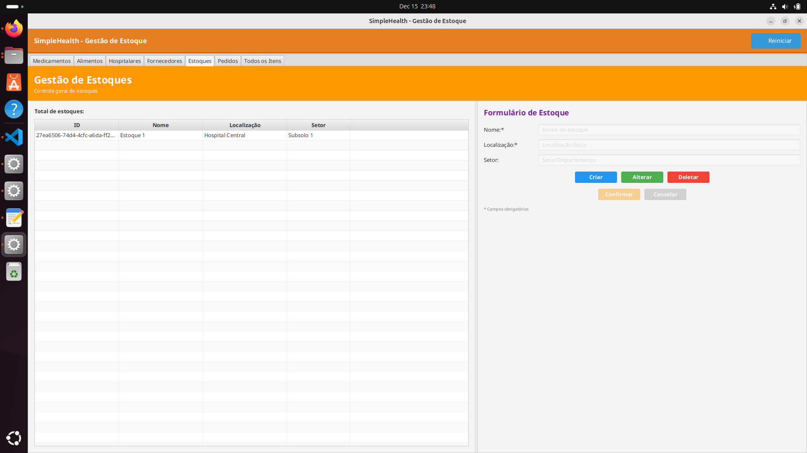

---

### Create 2 - Estoque

**Objetivo:** Criar segunda entrada de item no estoque  

**Resultado Obtido:** [x] Sucesso [ ] Falha

**Evidência:**

---

### Update - Estoque

**Objetivo:** Atualizar dados de um registro de estoque  

**Resultado Obtido:** [x] Sucesso [ ] Falha

**Evidência:**

---

### Delete - Estoque

**Objetivo:** Excluir registro de estoque do sistema  

**Resultado Obtido:** [x] Sucesso [ ] Falha

**Evidência:**

---

## CRUD Alimento

> 📋 **Documentação de Requisitos:** [UC12: Gerenciar Cadastros Base do Sistema](../documentos-finais-definitivos/3.2_3.3_Casos%20de%20uso/3.3.%20Descrição%20detalhada%20de%20cada%20Caso%20de%20Uso/3.3.%20Descrição%20detalhada%20de%20cada%20Caso%20de%20Uso.md#uc12-gerenciar-cadastros-base-do-sistema)

### Create 1 - Alimento

**Objetivo:** Cadastrar novo alimento no sistema  

**Resultado Obtido:** [x] Sucesso [ ] Falha

**Evidência:**

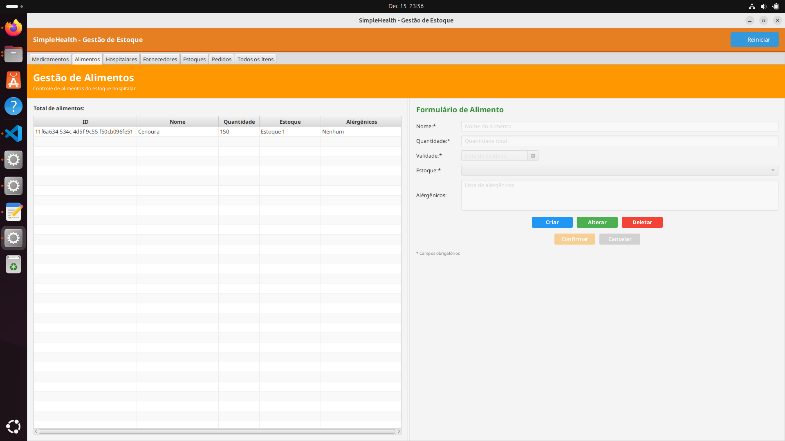

---

### Create 2 - Alimento

**Objetivo:** Cadastrar segundo alimento no sistema  

**Resultado Obtido:** [x] Sucesso [ ] Falha

**Evidência:**

---

### Update - Alimento

**Objetivo:** Atualizar dados de alimento existente  

**Resultado Obtido:** [x] Sucesso [ ] Falha

**Evidência:**

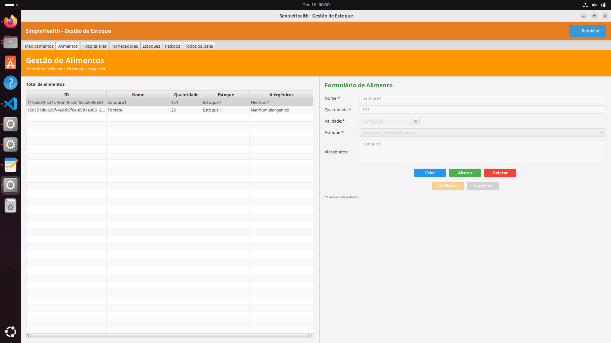

---

### Delete - Alimento

**Objetivo:** Excluir cadastro de alimento  

**Resultado Obtido:** [x] Sucesso [ ] Falha

**Evidência:**

---

## CRUD Fornecedor

> 📋 **Documentação de Requisitos:** [UC12: Gerenciar Cadastros Base do Sistema](../documentos-finais-definitivos/3.2_3.3_Casos%20de%20uso/3.3.%20Descrição%20detalhada%20de%20cada%20Caso%20de%20Uso/3.3.%20Descrição%20detalhada%20de%20cada%20Caso%20de%20Uso.md#uc12-gerenciar-cadastros-base-do-sistema)

### Create 1 - Fornecedor

**Objetivo:** Cadastrar novo fornecedor no sistema  

**Resultado Obtido:** [x] Sucesso [ ] Falha

**Evidência:**

---

### Create 2 - Fornecedor

**Objetivo:** Cadastrar segundo fornecedor no sistema  

**Resultado Obtido:** [x] Sucesso [ ] Falha

**Evidência:**

---

### Update - Fornecedor

**Objetivo:** Atualizar dados de fornecedor existente  

**Resultado Obtido:** [x] Sucesso [ ] Falha

**Evidência:**

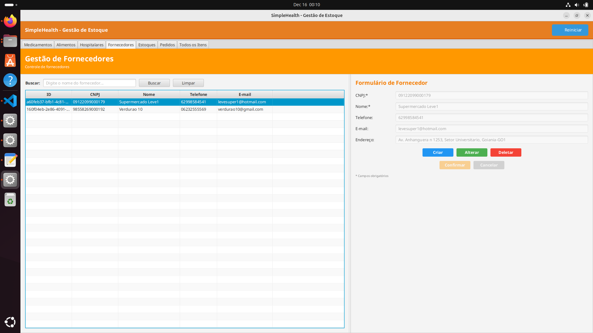

---

### Delete - Fornecedor

**Objetivo:** Excluir fornecedor do sistema  

**Resultado Obtido:** [x] Sucesso [ ] Falha

**Evidência:**

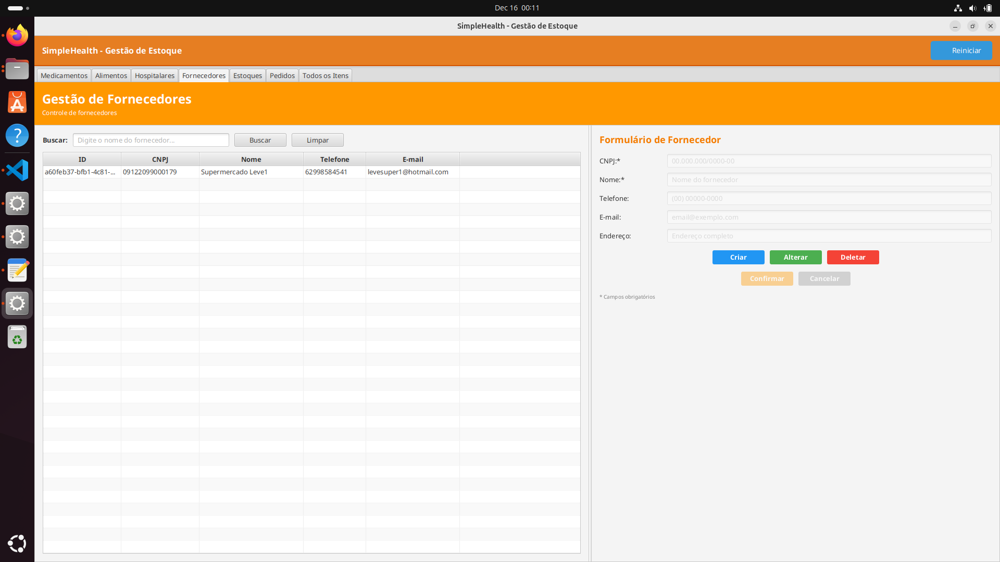

---

### Operação Especial - Pesquisa por Nome (Fornecedor)

**Objetivo:** Realizar busca de fornecedor filtrando pelo nome

**Resultado Obtido:** [x] Sucesso [ ] Falha

**Evidência:**

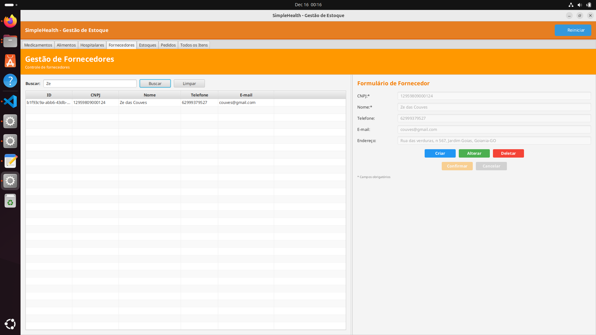

---

## CRUD Hospitalar

> 📋 **Documentação de Requisitos:** [UC12: Gerenciar Cadastros Base do Sistema](../documentos-finais-definitivos/3.2_3.3_Casos%20de%20uso/3.3.%20Descrição%20detalhada%20de%20cada%20Caso%20de%20Uso/3.3.%20Descrição%20detalhada%20de%20cada%20Caso%20de%20Uso.md#uc12-gerenciar-cadastros-base-do-sistema)

### Create 1 - Hospitalar

**Objetivo:** Cadastrar novo item hospitalar no sistema  

**Resultado Obtido:** [x] Sucesso [ ] Falha

**Evidência:**

---

### Create 2 - Hospitalar

**Objetivo:** Cadastrar segundo item hospitalar no sistema  

**Resultado Obtido:** [x] Sucesso [ ] Falha

**Evidência:**

---

### Update - Hospitalar

**Objetivo:** Atualizar dados de item hospitalar existente  

**Resultado Obtido:** [x] Sucesso [ ] Falha

**Evidência:**

---

### Delete - Hospitalar

**Objetivo:** Excluir item hospitalar do sistema  

**Resultado Obtido:** [x] Sucesso [ ] Falha

**Evidência:**

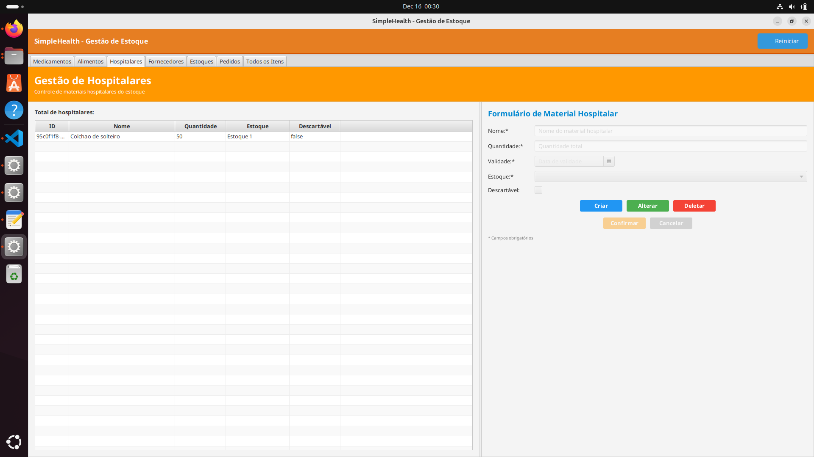

---

### Operação Especial - Pesquisa por Nome (Hospitalar)

**Objetivo:** Realizar busca de item hospitalar filtrando pelo nome

**Resultado Obtido:** [x] Sucesso [ ] Falha

**Evidência:**

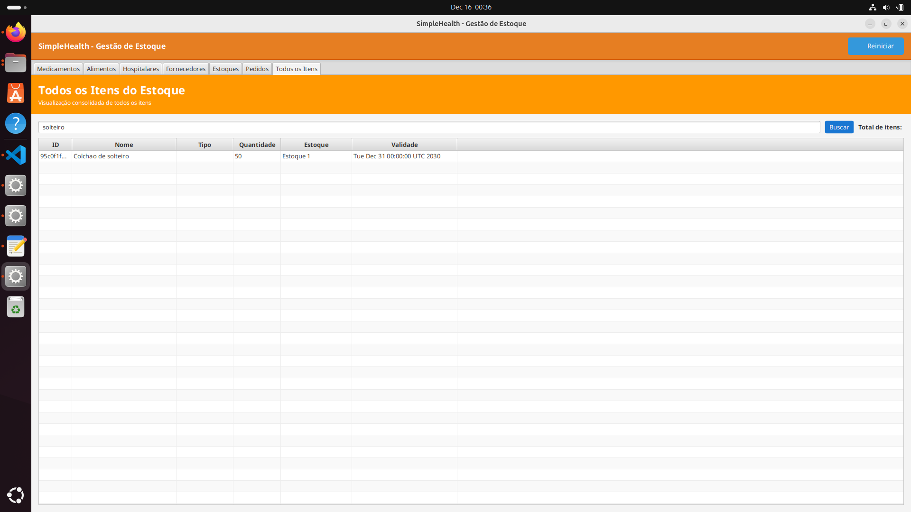

---

## CRUD Medicamento

> 📋 **Documentação de Requisitos:** [UC12: Gerenciar Cadastros Base do Sistema](../documentos-finais-definitivos/3.2_3.3_Casos%20de%20uso/3.3.%20Descrição%20detalhada%20de%20cada%20Caso%20de%20Uso/3.3.%20Descrição%20detalhada%20de%20cada%20Caso%20de%20Uso.md#uc12-gerenciar-cadastros-base-do-sistema)

### Create 1 - Medicamento

**Objetivo:** Cadastrar novo medicamento no sistema  

**Resultado Obtido:** [x] Sucesso [ ] Falha

**Evidência:**

---

### Create 2 - Medicamento

**Objetivo:** Cadastrar segundo medicamento no sistema  

**Resultado Obtido:** [x] Sucesso [ ] Falha

**Evidência:**

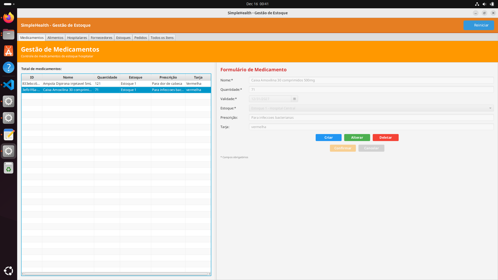

---

### Update - Medicamento

**Objetivo:** Atualizar dados de medicamento existente  

**Resultado Obtido:** [x] Sucesso [ ] Falha

**Evidência:**

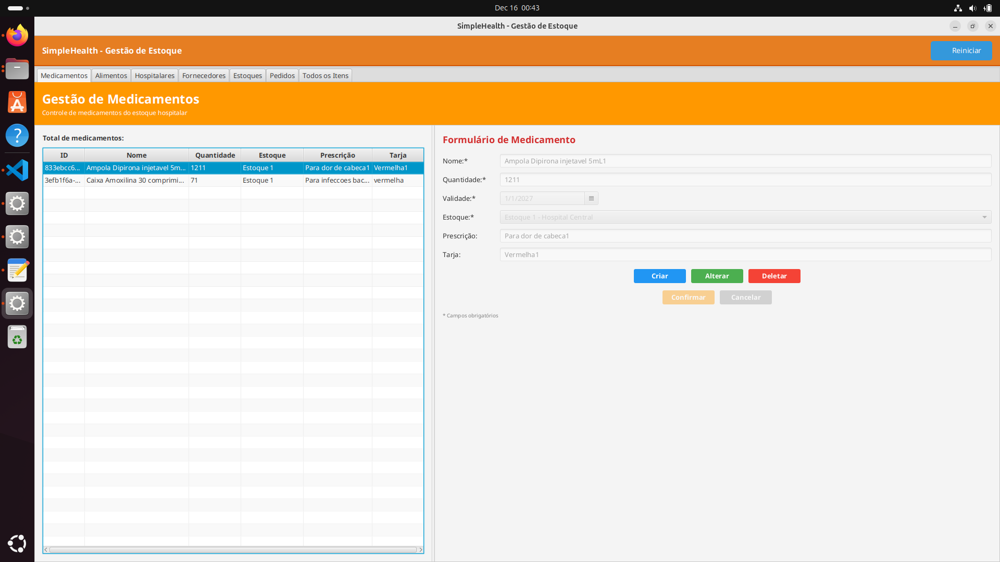

---

### Delete - Medicamento

**Objetivo:** Excluir medicamento do sistema  

**Resultado Obtido:** [x] Sucesso [ ] Falha

**Evidência:**

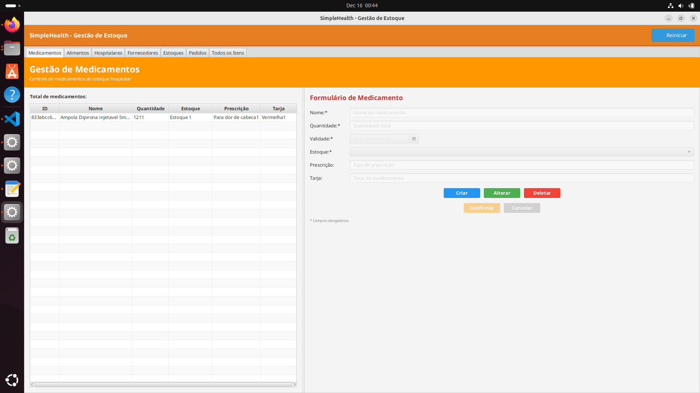

---

## CRUD Pedido

> 📋 **Documentação de Requisitos:** [UC06: Processar Entrada de NF/Itens](../documentos-finais-definitivos/3.2_3.3_Casos%20de%20uso/3.3.%20Descrição%20detalhada%20de%20cada%20Caso%20de%20Uso/3.3.%20Descrição%20detalhada%20de%20cada%20Caso%20de%20Uso.md#uc06-processar-entrada-de-nfitens)

### Create 1 - Pedido

**Objetivo:** Criar novo pedido de compra  

**Resultado Obtido:** [x] Sucesso [ ] Falha

**Evidência:**

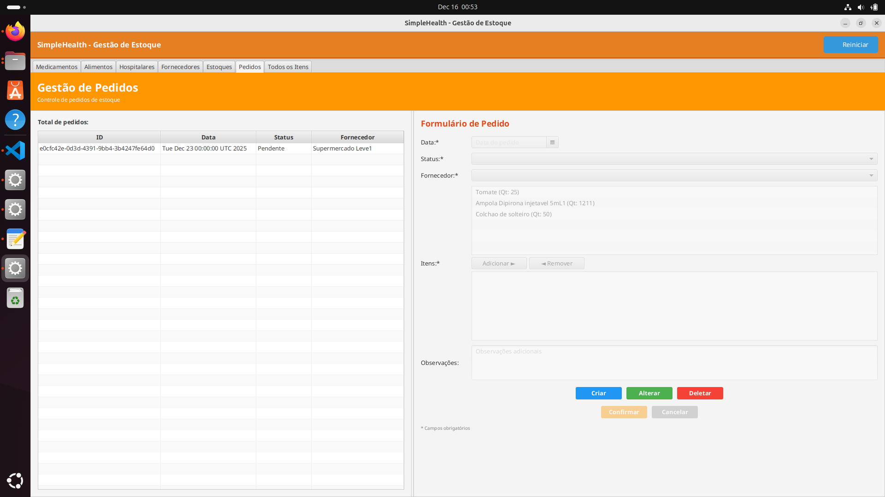

---

### Create 2 - Pedido

**Objetivo:** Criar segundo pedido de compra  

**Resultado Obtido:** [x] Sucesso [ ] Falha

**Evidência:**

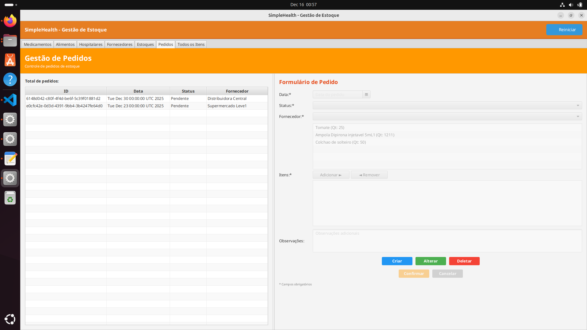

---

### Update - Pedido

**Objetivo:** Atualizar pedido existente  

**Resultado Obtido:** [x] Sucesso [ ] Falha

**Evidência:**

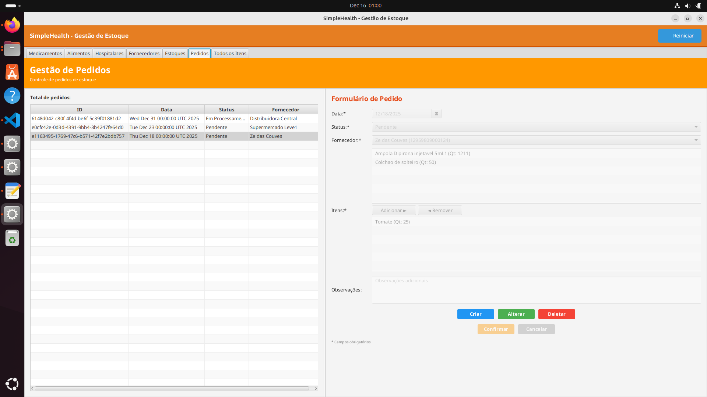

---

### Delete - Pedido

**Objetivo:** Cancelar ou excluir pedido  

**Resultado Obtido:** [x] Sucesso [ ] Falha

**Evidência:**

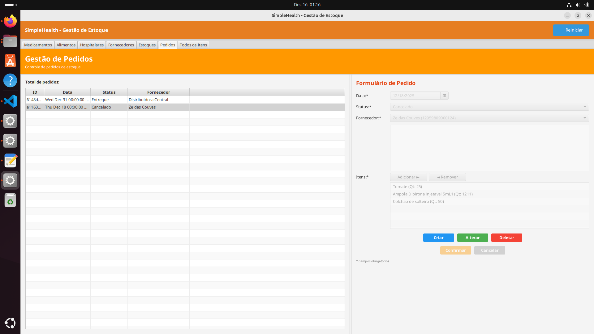

---

## Resumo dos Testes

| Módulo | Funcionalidade | Status | Observações |
| :--- | :--- | :---: | :--- |
| **Estoque** | CRUD Estoque | ✅ | Gestão de entradas e saídas validada. |
| **Estoque** | CRUD Alimento | ✅ | Cadastro base de alimentos validado. |
| **Estoque** | CRUD Fornecedor | ✅ | Cadastro de fornecedores e busca por nome validados. |
| **Estoque** | CRUD Hospitalar | ✅ | Cadastro de itens hospitalares e busca por nome validados. |
| **Estoque** | CRUD Medicamento | ✅ | Cadastro base de medicamentos validado. |
| **Estoque** | CRUD Pedido | ✅ | Gestão de pedidos de compra validada. |

**Conclusão:** O módulo de Estoque apresenta estabilidade nas operações de cadastro base (Alimentos, Medicamentos, Hospitalares, Fornecedores) e nas operações de fluxo (Estoque e Pedidos), com todas as evidências anexadas corretamente.