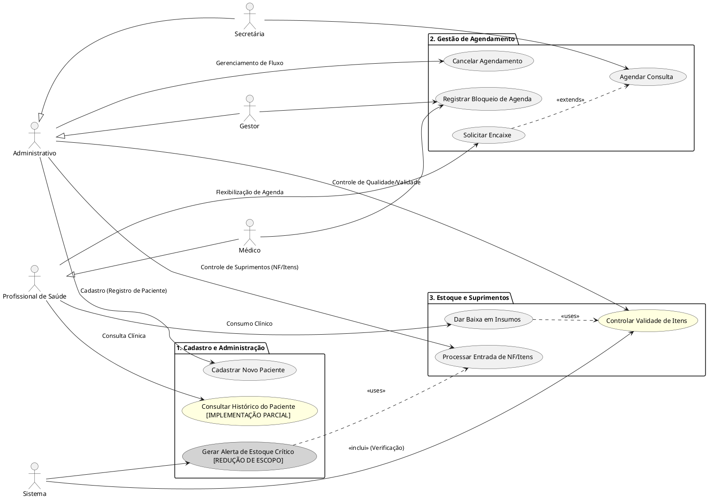

# Diagrama Global de Casos de Uso

## Sumário

- [Notas Técnicas - Correções de Discrepâncias](#notas-técnicas---correções-de-discrepâncias)
- [Visão Geral](#visão-geral)
- [Atores do Sistema](#atores-do-sistema)
- [Módulos e Casos de Uso](#módulos-e-casos-de-uso)
  - [Cadastro e Administração](#cadastro-e-administração)
  - [Gestão de Agendamento](#gestão-de-agendamento)
  - [Estoque e Suprimentos](#estoque-e-suprimentos)
- [Código PlantUML](#código-plantuml)
- [Diagrama Visual](#diagrama-visual)

---

## Notas Técnicas - Correções de Discrepâncias

Este documento foi atualizado para corrigir discrepâncias identificadas entre a documentação e a implementação real do sistema.

### Discrepância 5.1: UC07 - Gerar Alerta de Estoque Crítico

**Discrepância:** UC07 estava documentado como funcionalidade completa, mas não está implementado (0% funcional). Publisher existe em Cadastro, mas não há subscriber no módulo Estoque.

**Mudança Feita:** UC07 marcado como `[REDUÇÃO DE ESCOPO - NÃO IMPLEMENTADO]` com cor cinza (#LightGray) no diagrama PlantUML.

**Justificativa:** Funcionalidade foi planejada mas não desenvolvida. Sistema sempre retorna lista vazia após timeout de 5 segundos.

**Documento Detalhado:** [📄 CORRECAO_DISCREPANCIA_5.1.md](../../../Correções%20de%20Alinhamento/CORRECAO_DISCREPANCIA_5.1.md)

### Discrepância 5.2: UC08 - Consultar Histórico do Paciente

**Discrepância:** UC08 documentado com integração completa de 5 módulos, mas apenas 3 de 5 canais Redis Pub/Sub funcionam (60% funcional).

**Mudança Feita:** UC08 marcado como `[IMPLEMENTAÇÃO PARCIAL]` com cor amarela (#LightYellow) no diagrama. Funciona para consultas, exames e procedimentos. Não funciona para estoque e pagamentos.

**Justificativa:** AgendamentoSubscriber responde 3 canais, mas EstoqueSubscriber não existe e Módulo Financeiro não foi implementado.

**Documento Detalhado:** [📄 CORRECAO_DISCREPANCIA_5.2.md](../../../Correções%20de%20Alinhamento/CORRECAO_DISCREPANCIA_5.2.md)

### Discrepância 5.3: UC10 - Controlar Validade de Itens

**Discrepância:** UC10 documentado com persistência completa de descartes, mas movimentações não são salvas em banco de dados (50% funcional).

**Mudança Feita:** UC10 marcado como `[IMPLEMENTAÇÃO PARCIAL]` com cor amarela (#LightYellow). Consulta por validade funciona via endpoint REST, mas descarte apenas imprime logs no console.

**Justificativa:** ControlarValidadeUseCase existe, mas método `registrarMovimentacaoDescarte()` não persiste dados. Sem integração com Módulo Financeiro.

**Documento Detalhado:** [📄 CORRECAO_DISCREPANCIA_5.3.md](../../../Correções%20de%20Alinhamento/CORRECAO_DISCREPANCIA_5.3.md)

---

Para consultar todas as correções de discrepâncias do projeto, acesse o [📑 Sumário de Correções](../../../Correções%20de%20Alinhamento/SUMARIO_CORRECAO_DISCREPANCIA.md).

---

## Visão Geral

Este diagrama apresenta a estrutura global dos casos de uso do sistema Simple Health, organizado em três módulos principais que cobrem as necessidades de cadastro, agendamento e controle de estoque.

## Atores do Sistema

### Hierarquia de Atores

**Administrativo** (ator abstrato)
- Secretária
- Gestor

**Profissional de Saúde** (ator abstrato)
- Médico

**Sistema** (ator automatizado)

## Módulos e Casos de Uso

### Cadastro e Administração

- **UC01**: Cadastrar Novo Paciente
- **UC08**: Consultar Histórico do Paciente **[REDUÇÃO DE ESCOPO - IMPLEMENTAÇÃO PARCIAL]**

### Gestão de Agendamento

- **UC02**: Agendar Consulta
- **UC03**: Solicitar Encaixe *(extends UC02)*
- **UC04**: Registrar Bloqueio de Agenda
- **UC09**: Cancelar Agendamento

### Estoque e Suprimentos

- **UC05**: Dar Baixa em Insumos
- **UC06**: Processar Entrada de NF/Itens
- **UC07**: Gerar Alerta de Estoque Crítico **[REDUÇÃO DE ESCOPO - NÃO IMPLEMENTADO]**
- **UC10**: Controlar Validade de Itens **[REDUÇÃO DE ESCOPO - IMPLEMENTAÇÃO PARCIAL]**

---

## Código PlantUML

## Diagrama Visual

