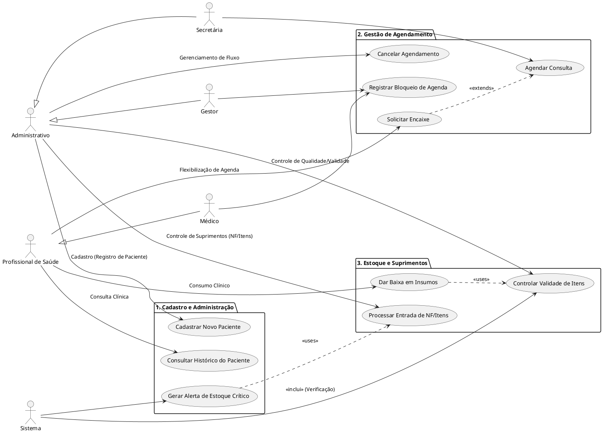

# Diagrama Global de Casos de Uso

## Sumário

- [Visão Geral](#visão-geral)
- [Atores do Sistema](#atores-do-sistema)
- [Módulos e Casos de Uso](#módulos-e-casos-de-uso)
  - [Cadastro e Administração](#cadastro-e-administração)
  - [Gestão de Agendamento](#gestão-de-agendamento)
  - [Estoque e Suprimentos](#estoque-e-suprimentos)
- [Código PlantUML](#código-plantuml)
- [Diagrama Visual](#diagrama-visual)

---

## Visão Geral

Este diagrama apresenta a estrutura global dos casos de uso do sistema Simple Health, organizado em três módulos principais que cobrem as necessidades de cadastro, agendamento e controle de estoque.

## Atores do Sistema

### Hierarquia de Atores

**Administrativo** (ator abstrato)
- Secretária
- Gestor

**Profissional de Saúde** (ator abstrato)
- Médico

**Sistema** (ator automatizado)

## Módulos e Casos de Uso

### Cadastro e Administração

- **UC01**: Cadastrar Novo Paciente
- **UC08**: Consultar Histórico do Paciente

### Gestão de Agendamento

- **UC02**: Agendar Consulta
- **UC03**: Solicitar Encaixe *(extends UC02)*
- **UC04**: Registrar Bloqueio de Agenda
- **UC09**: Cancelar Agendamento

### Estoque e Suprimentos

- **UC05**: Dar Baixa em Insumos
- **UC06**: Processar Entrada de NF/Itens
- **UC07**: Gerar Alerta de Estoque Crítico
- **UC10**: Controlar Validade de Itens

---

## Código PlantUML

## Diagrama Visual

