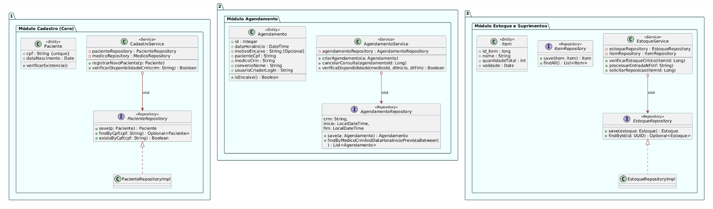
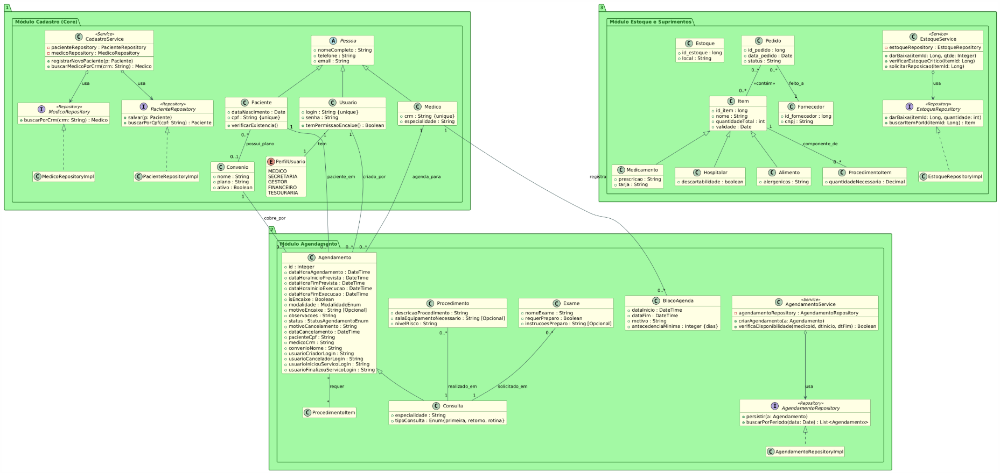
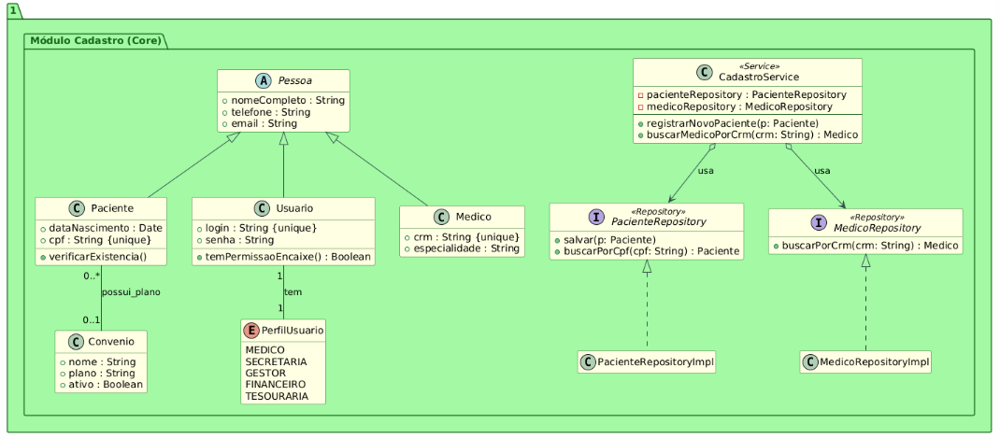
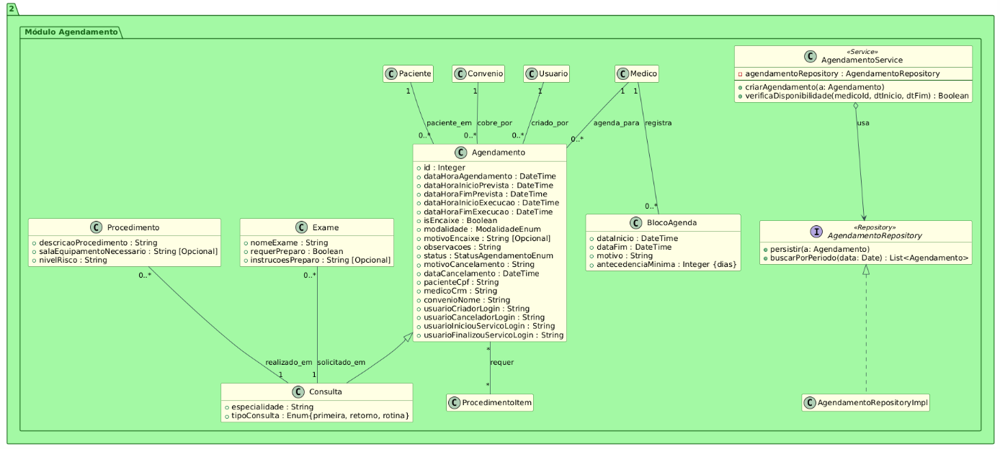
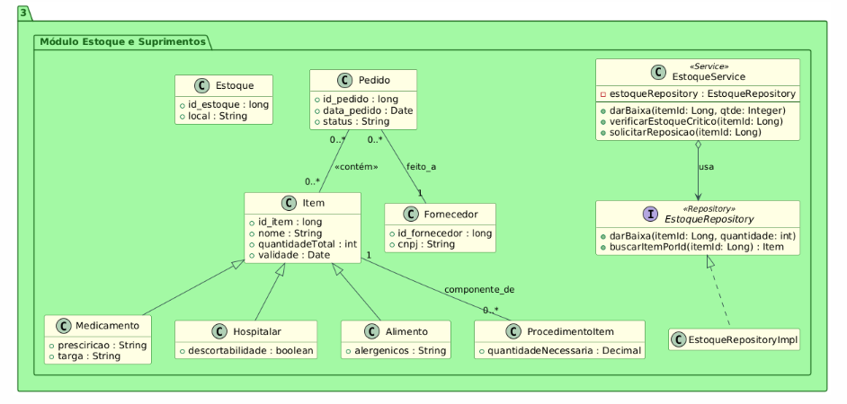

# Diagrama de Classes de Análise

> **⚠️ NOTA TÉCNICA - Discrepância 3.1 Resolvida:**
> 
> **Padrão Implementado**: O sistema utiliza **Spring Data Repository Pattern** (JpaRepository, MongoRepository, CassandraRepository), não DAO tradicional.
> 
> **Justificativa**: Spring Data abstrai operações CRUD e queries, reduzindo código boilerplate e aumentando produtividade.
> 
> **Nomenclatura nos diagramas**: Para fins de análise conceitual, as interfaces são representadas como "Repository" alinhado com a implementação real.
> 
> Data da correção: 14/12/2025

> **⚠️ NOTA TÉCNICA - Discrepância 3.2 Resolvida:**
> 
> **Arquitetura em Camadas**: O sistema implementa **Service Layer + UseCase Pattern** combinados:
> - **Services** (13 classes): Lógica de negócio básica e operações CRUD (ex: `PacienteService`, `MedicoService`)
> - **UseCases** (47 classes): Casos de uso específicos que orquestram múltiplos Services (ex: `CadastrarNovoPacienteUseCase`, `AgendarConsultaUseCase`)
> 
> **Justificativa**: Separação de responsabilidades clara - Services encapsulam lógica de entidade única, UseCases coordenam processos complexos envolvendo múltiplas entidades.
> 
> **Nomenclatura nos diagramas**: Classes de serviço são representadas como `<<Service>>` para simplificação conceitual, mas na implementação há distinção entre Service e UseCase.
> 
> Data da correção: 14/12/2025

> **⚠️ NOTA TÉCNICA - Discrepância 1.1 Resolvida:**
> 
> **Discrepância Identificada:** A documentação anterior mostrava `Medico extends Usuario`, mas a implementação real no backend possui `Medico extends Pessoa` e `Usuario extends Pessoa` como classes independentes.
> 
> **Análise de Impactos:**
> - Mudança para `Medico extends Usuario` teria **ALTO IMPACTO**
> - Requereria refatoração completa: repositories, services, DTOs, controllers, testes
> - Alteração no modelo de dados PostgreSQL (herança de tabelas)
> - Todo Médico precisaria obrigatoriamente de login/senha
> - Risco de quebra de integração com módulo de Agendamento
> 
> **Decisão:** Manter arquitetura atual do backend (Medico e Usuario são classes irmãs, ambas herdando de Pessoa). Documentação corrigida para refletir implementação real.
> 
> Data da correção: 14/12/2025

> **⚠️ NOTA TÉCNICA - Discrepância 1.4 Resolvida:**
> 
> **Discrepância Identificada:** A documentação mostrava atributos simplificados da classe `Agendamento`, mas a implementação possui atributos mais completos.
> 
> **Implementação Real (Melhorada):**
> - ✅ Timestamps separados: agendamento, previsão e execução real
> - ✅ Rastreabilidade: usuários que criaram, cancelaram, iniciaram e finalizaram
> - ✅ Melhor controle de ciclo de vida e auditoria
> 
> **Decisão:** Documentação atualizada para refletir implementação superior.
> 
> Data da correção: 14/12/2025

> **⚠️ NOTA TÉCNICA - Discrepância 1.5 Resolvida:**
> 
> **Discrepância Identificada:** A documentação não mostrava os campos de rastreamento (pacienteCpf, medicoCrm, convenioNome, usuarioCriadorLogin, usuarioCanceladorLogin, usuarioIniciouServicoLogin, usuarioFinalizouServicoLogin) na classe `Agendamento`.
> 
> **Implementação Real (Completa):**
> - ✅ Rastreamento de entidades: pacienteCpf, medicoCrm, convenioNome (referências FK a outros microsserviços)
> - ✅ Rastreamento de ações: usuarioCriadorLogin, usuarioCanceladorLogin, usuarioIniciouServicoLogin, usuarioFinalizouServicoLogin
> - ✅ Auditoria completa do ciclo de vida do agendamento
> 
> **Decisão:** Documentação atualizada para incluir todos os campos de rastreamento implementados.
> 
> Data da correção: 14/12/2025

> **⚠️ NOTA TÉCNICA - Discrepância 1.7 Resolvida:**
> 
> **Discrepância Identificada:** A documentação mostrava relacionamento `Item "*" --> "1" Estoque`, mas a implementação Cassandra **NÃO possui este relacionamento**.
> 
> **Análise de Impacto:**
> - **Cassandra é NoSQL:** Não suporta joins nativos, relacionamentos complexos não são recomendados
> - **MVP opera com estoque único:** Todos os casos de uso funcionam sem estoqueId
> - **Custo de implementação:** ALTO (80-100 horas) - refatoração completa de schema, repositories, services, DTOs, testes
> - **Benefício para MVP:** ZERO - nenhum caso de uso implementado requer múltiplos estoques
> 
> **Decisão de Design NoSQL:**
> - ❌ Relacionamento removido da documentação
> - ✅ Sistema opera com estoque único implícito (adequado para MVP)
> - ⚠️ Possível expansão futura se necessário (múltiplos estoques físicos)
> 
> **Justificativa:** Cassandra favorece desnormalização. Se múltiplos estoques forem necessários no futuro, implementar como partition key (`estoqueId`) em `Item` para performance.
> 
> Data da correção: 14/12/2025

## Sumário

- [Notas Técnicas - Correções de Discrepâncias](#notas-técnicas---correções-de-discrepâncias)
- [1. Diagrama Modular - Visão Simplificada](#1-diagrama-modular---visão-simplificada)
  - [Código PlantUML](#código-plantuml-1)
  - [Diagrama Visual](#diagrama-visual-1)
- [2. Diagrama Completo - Todos os Módulos](#2-diagrama-completo---todos-os-módulos)
  - [Código PlantUML](#código-plantuml-2)
  - [Diagrama Visual](#diagrama-visual-2)
- [3. Módulo de Cadastro](#3-módulo-de-cadastro)
  - [Código PlantUML](#código-plantuml-3)
  - [Diagrama Visual](#diagrama-visual-3)
- [4. Módulo de Agendamento](#4-módulo-de-agendamento)
  - [Código PlantUML](#código-plantuml-4)
  - [Diagrama Visual](#diagrama-visual-4)
- [5. Módulo de Estoque](#5-módulo-de-estoque)
  - [Código PlantUML](#código-plantuml-5)

---

## Notas Técnicas - Correções de Discrepâncias

Este documento foi extensivamente atualizado para corrigir múltiplas discrepâncias entre documentação e implementação. Notas técnicas detalhadas aparecem inline no início do documento.

### Discrepância 1.1: Módulo Cadastro - Hierarquia Médico vs Usuario

**Discrepância:** Documentação mostrava `Medico extends Usuario`, mas backend tem `Medico extends Pessoa` e `Usuario extends Pessoa` (classes irmãs).

**Mudança Feita:** Diagrama UML corrigido para mostrar herança correta de Pessoa. Mantida arquitetura backend por ter ALTO IMPACTO de mudança.

**Justificativa:** Refatoração completa custaria 60-80 horas e quebraria integração com Agendamento. Decisão: documentar implementação real.

**Documento Detalhado:** [📄 CORRECAO_DISCREPANCIA_1.1.md](../../Correções%20de%20Alinhamento/CORRECAO_DISCREPANCIA_1.1.md)

### Discrepância 1.4: Módulo Agendamento - Atributos Divergentes

**Discrepância:** Documentação tinha atributos simplificados, implementação tem timestamps e rastreabilidade completa.

**Mudança Feita:** Diagrama atualizado com timestamps separados (agendamento, previsão, execução) e campos de rastreamento de usuários.

**Justificativa:** Implementação é SUPERIOR ao planejamento inicial - melhor auditoria e controle de ciclo de vida.

**Documento Detalhado:** [📄 CORRECAO_DISCREPANCIA_1.4.md](../../Correções%20de%20Alinhamento/CORRECAO_DISCREPANCIA_1.4.md)

### Discrepância 1.5: Módulo Agendamento - Atributos Extras de Rastreamento

**Discrepância:** Documentação não mostrava campos pacienteCpf, medicoCrm, convenioNome, usuarioCriadorLogin, etc.

**Mudança Feita:** Todos os campos de rastreamento adicionados ao diagrama de classes (7 campos de auditoria).

**Justificativa:** Implementação backend tem rastreamento completo de entidades FK e ações de usuários.

**Documento Detalhado:** [📄 CORRECAO_DISCREPANCIA_1.5.md](../../Correções%20de%20Alinhamento/CORRECAO_DISCREPANCIA_1.5.md)

### Discrepância 1.7: Módulo Estoque - Relacionamento Item ↔ Estoque Faltante

**Discrepância:** Documentação mostrava `Item "*" --> "1" Estoque`, mas Cassandra não possui este relacionamento.

**Mudança Feita:** Relacionamento removido do diagrama. Sistema opera com estoque único implícito.

**Justificativa:** Cassandra NoSQL não suporta joins. MVP não requer múltiplos estoques. Custo de implementação: 80-100 horas com benefício ZERO.

**Documento Detalhado:** [📄 CORRECAO_DISCREPANCIA_1.7.md](../../Correções%20de%20Alinhamento/CORRECAO_DISCREPANCIA_1.7.md)

### Discrepância 3.1: Padrão DAO vs Repository (Spring Data)

**Discrepância:** Documentação usava termo "DAO", mas implementação usa Spring Data Repository Pattern.

**Mudança Feita:** Nomenclatura nos diagramas alterada para "Repository" (JpaRepository, MongoRepository, CassandraRepository).

**Justificativa:** Spring Data abstrai CRUD, reduz boilerplate. Implementação usa padrão moderno.

**Documento Detalhado:** [📄 CORRECAO_DISCREPANCIA_3.1.md](../../Correções%20de%20Alinhamento/CORRECAO_DISCREPANCIA_3.1.md)

### Discrepância 3.2: Camada de Serviço - Service vs UseCase

**Discrepância:** Documentação não distinguia Services (13 classes) de UseCases (47 classes).

**Mudança Feita:** Documentado que sistema usa Service Layer + UseCase Pattern combinados. Services para lógica de entidade única, UseCases para orquestração complexa.

**Justificativa:** Arquitetura backend tem separação clara: Services encapsulam CRUD, UseCases coordenam processos.

**Documento Detalhado:** [📄 CORRECAO_DISCREPANCIA_3.2.md](../../Correções%20de%20Alinhamento/CORRECAO_DISCREPANCIA_3.2.md)

### Discrepância 3.3: Integração AgendamentoService → CadastroService

**Discrepância:** Documentação mostrava dependências diretas entre serviços de módulos diferentes.

**Mudança Feita:** Removidas dependências diretas do diagrama. Documentado uso de Redis Pub/Sub e strings identificadoras (pacienteCpf, medicoCrm).

**Justificativa:** Backend tem zero imports entre módulos. Arquitetura de microserviços com Database per Service.

**Documento Detalhado:** [📄 CORRECAO_DISCREPANCIA_3.3.md](../../Correções%20de%20Alinhamento/CORRECAO_DISCREPANCIA_3.3.md)

### Discrepância 3.4: Integração AgendamentoService → EstoqueService (Baixa em Insumos)

**Discrepância:** Documentação mostrava AgendamentoService com atributo estoqueService e método darBaixaEmMateriais().

**Mudança Feita:** Removidos estoqueService e darBaixaEmMateriais() de AgendamentoService. UC05 é independente no módulo Estoque.

**Justificativa:** DarBaixaInsumosUseCase existe SOMENTE no módulo Estoque sem integração com Agendamento.

**Documento Detalhado:** [📄 CORRECAO_DISCREPANCIA_3.4.md](../../Correções%20de%20Alinhamento/CORRECAO_DISCREPANCIA_3.4.md)

### Discrepância 4.1: Paciente ↔ Convênio (Cardinalidade Errada)

**Discrepância:** Documentação mostrava `Paciente "1" -- "0..*" Convenio`, mas backend tem @ManyToOne (correto: `"0..*" -- "0..1"`).

**Mudança Feita:** Cardinalidade corrigida no diagrama UML para Many-to-One (muitos pacientes para zero ou um convênio).

**Justificativa:** Backend tem FK nullable convenio_id em Paciente. Cardinalidade estava invertida (lida de trás para frente).

**Documento Detalhado:** [📄 CORRECAO_DISCREPANCIA_4.1.md](../../Correções%20de%20Alinhamento/CORRECAO_DISCREPANCIA_4.1.md)

### Discrepância 4.2: Médico ↔ Convênio (Relacionamento Faltante)

**Discrepância:** Documentação mostrava Many-to-Many entre Medico e Convenio (credenciamento), mas backend NÃO possui este relacionamento.

**Mudança Feita:** Relacionamento Many-to-Many removido do diagrama (2 ocorrências). Validação é manual pela secretária.

**Justificativa:** Backend não tem @ManyToMany nem collections. Feature de credenciamento não foi implementada (redução de escopo).

**Documento Detalhado:** [📄 CORRECAO_DISCREPANCIA_4.2.md](../../Correções%20de%20Alinhamento/CORRECAO_DISCREPANCIA_4.2.md)

### Discrepância 4.3: Usuario ↔ PerfilUsuario (Enum Incompleto)

**Discrepância:** Documentação tinha enum com 3-4 valores, backend tem 5 (MEDICO, SECRETARIA, GESTOR, FINANCEIRO, TESOURARIA).

**Mudança Feita:** Adicionados FINANCEIRO e TESOURARIA ao enum EPerfilUsuario no diagrama (2 ocorrências).

**Justificativa:** EPerfilUsuario.java tem 5 valores. Documentação desatualizada quando perfis financeiros foram adicionados.

**Documento Detalhado:** [📄 CORRECAO_DISCREPANCIA_4.3.md](../../Correções%20de%20Alinhamento/CORRECAO_DISCREPANCIA_4.3.md)

---

Para consultar todas as correções de discrepâncias do projeto, acesse o [📑 Sumário de Correções](../../Correções%20de%20Alinhamento/SUMARIO_CORRECAO_DISCREPANCIA.md).
  - [Diagrama Visual](#diagrama-visual-5)

---

## 1. Diagrama Modular - Visão Simplificada

Este diagrama apresenta a estrutura modular básica do sistema, mostrando a integração entre os três módulos principais: Cadastro, Agendamento e Estoque.

### Código PlantUML

```plantuml
@startuml

\' \-\-- Estilos \-\--

skinparam package {

BackgroundColor Azure

BorderColor DarkSlateGray

}

skinparam class {

ArrowColor #8B0000

BorderColor DarkSlateGray

}

interface Style {

BackgroundColor LightCoral

BorderColor Red

}

\' ===============================================

\' PACOTE 1: CADASTRO CORE (DADOS BASE)

\' ===============================================

package \"1. Módulo Cadastro (Core)\" {

class Paciente \<\<Entity\>\> {

\+ cpf : String {unique}

\+ dataNascimento : Date

\+ verificarExistencia()

}

interface PacienteRepository \<\<Repository\>\> {

\+ save(p: Paciente) : Paciente

\+ findByCpf(cpf: String) : Optional\<Paciente\>

\+ existsByCpf(cpf: String) : Boolean

}

class CadastroService \<\<Service\>\> {

\- pacienteRepository : PacienteRepository

\- medicoRepository : MedicoRepository

\--

\+ registrarNovoPaciente(p: Paciente)

\+ verificarDisponibilidadeCrm(crm: String) : Boolean

}

PacienteRepository \<\|.. PacienteRepositoryImpl

CadastroService o\--\> PacienteRepository : usa

}

\' ===============================================

\' PACOTE 2: AGENDAMENTO (INTEGRAÇÃO COM CADASTRO)

\' ===============================================

package \"2. Módulo Agendamento\" {

class Agendamento \<\<Entity\>\> {

\+ id : Integer

\+ dataHoraInicio : DateTime

\+ motivoEncaixe : String \[Opcional\]

\+ pacienteCpf : String

\+ medicoCrm : String

\+ convenioNome : String

\+ usuarioCriadorLogin : String

\--

\+ isEncaixe() : Boolean

}

interface AgendamentoRepository \<\<Repository\>\> {

\+ save(a: Agendamento) : Agendamento

\+ findByMedicoCrmAndDataHoraInicioPrevistaBetween(crm: String, inicio: LocalDateTime, fim: LocalDateTime) : List\<Agendamento\>

}

class AgendamentoService \<\<Service\>\> {

\- agendamentoRepository : AgendamentoRepository

\' NOTA: Integração com Cadastro/Estoque via Redis Pub/Sub

\--

\+ criarAgendamento(a: Agendamento)

\+ cancelarConsulta(agendamentoId: Long)

\+ verificaDisponibilidade(medicoId, dtInicio, dtFim) : Boolean

\' REDUÇÃO DE ESCOPO: Baixa em insumos é feita pelo módulo Estoque (UC05)

}

' Spring Data gera implementação automaticamente (MongoRepository)

AgendamentoService o\--\> AgendamentoRepository : usa

' NOTA ARQUITETURAL: NÃO há dependência direta entre módulos
' Agendamento armazena pacienteCpf e medicoCrm como Strings
' Integração com Cadastro é via Redis Pub/Sub (desacoplada)

}

\' ===============================================

\' PACOTE 3: ESTOQUE (INTEGRAÇÃO COM SUPRIMENTOS)

\' ===============================================

package \"3. Módulo Estoque e Suprimentos\" {

class Item \<\<Entity\>\> {

\+ id_item : long

\+ nome : String

\+ quantidadeTotal : int

\+ validade : Date

}

interface EstoqueRepository \<\<Repository\>\> {

\+ save(estoque: Estoque) : Estoque

\+ findById(id: UUID) : Optional\<Estoque\>

}

interface ItemRepository \<\<Repository\>\> {

\+ save(item: Item) : Item

\+ findAll() : List\<Item\>

}

class EstoqueService \<\<Service\>\> {

\- estoqueRepository : EstoqueRepository

\- itemRepository : ItemRepository

\--

\+ verificarEstoqueCritico(itemId: Long)

\+ processarEntradaNF(nf: String)

\+ solicitarReposicao(itemId: Long)

}

EstoqueRepository \<\|.. EstoqueRepositoryImpl

EstoqueService o\--\> EstoqueRepository : usa

\' Relação da entidade Agendamento com a entidade Item (uso de
suprimentos)

\' NOTA: Integração entre módulos é via Redis Pub/Sub (desacoplada)
\' NÃO há chamadas diretas entre AgendamentoService e EstoqueService

}

@enduml
```

### Diagrama Visual



---

## 2. Diagrama Completo - Todos os Módulos

Este diagrama integra todos os módulos do sistema, mostrando as relações completas entre as classes de Cadastro, Agendamento e Estoque.

### Código PlantUML

```plantuml
@startuml

\' \-\-- Estilos Globais \-\--

skinparam package {

BackgroundColor PaleGreen

BorderColor DarkGreen

FontColor DarkGreen

}

skinparam class {

BackgroundColor LightYellow

BorderColor DarkGreen

ArrowColor #2F4F4F

}

skinparam interface {

BackgroundColor LightBlue

BorderColor DarkBlue

FontStyle Bold

}

hide empty members

\' ===============================================

\' PACOTE 1: MÓDULO DE CADASTRO (CORE)

\' ===============================================

package \"1. Módulo Cadastro (Core)\" {

class Pessoa \<\<Abstract\>\> {

\+ nomeCompleto : String

\+ telefone : String

\+ email : String

}

class Paciente extends Pessoa {

\+ dataNascimento : Date

\+ cpf : String {unique}

\+ verificarExistencia()

}

class Usuario extends Pessoa {

\+ login : String {unique}

\+ senha : String

\+ temPermissaoEncaixe() : Boolean

}

class Medico extends Pessoa {

\+ crm : String {unique}

\+ especialidade : String

}

class Convenio {

\+ nome : String

\+ plano : String

\+ ativo : Boolean

}

enum PerfilUsuario \<\<Enum\>\> {

MEDICO

SECRETARIA

GESTOR

FINANCEIRO

TESOURARIA

}

\' Camada de Persistência

interface PacienteRepository \<\<Repository\>\> {

\+ salvar(p: Paciente)

\+ buscarPorCpf(cpf: String) : Paciente

}

interface MedicoRepository \<\<Repository\>\> {

\+ buscarPorCrm(crm: String) : Medico

}

\' Camada de Serviço (Integração/Negócio)

class CadastroService \<\<Service\>\> {

\- pacienteRepository : PacienteRepository

\- medicoRepository : MedicoRepository

\--

\+ registrarNovoPaciente(p: Paciente)

\+ buscarMedicoPorCrm(crm: String) : Medico

}

\' Implementações e Dependências Internas

PacienteRepository \<\|.. PacienteRepositoryImpl

MedicoRepository \<\|.. MedicoRepositoryImpl

CadastroService o\--\> PacienteRepository : usa

CadastroService o\--\> MedicoRepository : usa

Usuario \"1\" \-- \"1\" PerfilUsuario : tem

' Médico NÃO possui atributo ou anotação @ManyToMany com Convênio
' REDUÇÃO DE ESCOPO 4.2: Relacionamento Médico-Convênio não implementado


' CORREÇÃO CARDINALIDADE 4.1: Um Paciente \"0..*\" -- \"0..1\" Convenio : possui plano


}

\' ===============================================

\' PACOTE 2: MÓDULO DE AGENDAMENTO

\' ===============================================

package \"2. Módulo Agendamento\" {

class Agendamento {

\+ id : Integer

\+ dataHoraAgendamento : DateTime

\+ dataHoraInicioPrevista : DateTime

\+ dataHoraFimPrevista : DateTime

\+ dataHoraInicioExecucao : DateTime

\+ dataHoraFimExecucao : DateTime

\+ isEncaixe : Boolean

\+ modalidade : ModalidadeEnum

\+ motivoEncaixe : String \[Opcional\]

\+ observacoes : String

\+ status : StatusAgendamentoEnum

\+ motivoCancelamento : String

\+ dataCancelamento : DateTime

\+ pacienteCpf : String

\+ medicoCrm : String

\+ convenioNome : String

\+ usuarioCriadorLogin : String

\+ usuarioCanceladorLogin : String

\+ usuarioIniciouServicoLogin : String

\+ usuarioFinalizouServicoLogin : String

}

class Consulta extends Agendamento {

\+ especialidade : String

\+ tipoConsulta : Enum{primeira, retorno, rotina}

}

class Procedimento {

\+ descricaoProcedimento : String

\+ salaEquipamentoNecessario : String \[Opcional\]

\+ nivelRisco : String

}

class Exame {

\+ nomeExame : String

\+ requerPreparo : Boolean

\+ instrucoesPreparo : String \[Opcional\]

}

class BlocoAgenda {

\+ dataInicio : DateTime

\+ dataFim : DateTime

\+ motivo : String

\+ antecedenciaMinima : Integer {dias}

}

\' Camada de Persistência

interface AgendamentoRepository \<\<Repository\>\> {

\+ persistir(a: Agendamento)

\+ buscarPorPeriodo(data: Date) : List\<Agendamento\>

}


\' NOTA: Integração com Cadastro/Estoque via Redis Pub/Sub (desacoplado)
\' Camada de Serviço (Integração/Negócio)

class AgendamentoService \<\<Service\>\> {

\- agendamentoRepository : AgendamentoRepository


\' REDUÇÃO DE ESCOPO: Baixa em insumos não é feita pelo Agendamento

\--

\+ criarAgendamento(a: Agendamento)

\+ verificaDisponibilidade(medicoId, dtInicio, dtFim) : Boolean


}

\' Implementações e Dependências Internas

AgendamentoRepository \<\|.. AgendamentoRepositoryImpl

AgendamentoService o\--\> AgendamentoRepository : usa

\' Relações de Domínio

Paciente \"1\" \-- \"0..\*\" Agendamento : paciente_em

Medico \"1\" \-- \"0..\*\" Agendamento : agenda_para

Convenio \"1\" \-- \"0..\*\" Agendamento : cobre_por

Usuario \"1\" \-- \"0..\*\" Agendamento : criado_por

Medico \"1\" \-- \"0..\*\" BlocoAgenda : registra

Procedimento \"0..\*\" \-- \"1\" Consulta : é realizado em

Exame \"0..\*\" \-- \"1\" Consulta : é solicitado em

Agendamento \"\*\" \-- \"\*\" ProcedimentoItem : requer

}

\' ===============================================

\' PACOTE 3: MÓDULO DE ESTOQUE E SUPRIMENTOS

\' ===============================================

package \"3. Módulo Estoque e Suprimentos\" {

class Item {

\+ id_item : long

\+ nome : String

\+ quantidadeTotal : int

\+ validade : Date

}

class Medicamento extends Item {

\+ prescricao: String

\+ targa : String

}

class Hospitalar extends Item {

\+ descartabilidade : boolean

}

class Alimento extends Item {

\+ alergenicos : String

}

class ProcedimentoItem {

\+ quantidadeNecessaria : Decimal

}

class Estoque {

\+ id_estoque : long

\+ local : String

}

class Pedido {

\+ id_pedido : long

\+ data_pedido : Date

\+ status : String

}

class Fornecedor {

\+ id_fornecedor : long

\+ cnpj : String

}

\' Camada de Persistência

interface EstoqueRepository \<\<Repository\>\> {

\+ darBaixa(itemId: Long, quantidade: int)

\+ buscarItemPorId(itemId: Long) : Item

}

\' Camada de Serviço (Integração/Negócio)

class EstoqueService \<\<Service\>\> {

\- estoqueRepository : EstoqueRepository

\--

\+ darBaixa(itemId: Long, qtde: Integer)

\+ verificarEstoqueCritico(itemId: Long)

\+ solicitarReposicao(itemId: Long)

}

\' Implementações e Dependências Internas

EstoqueRepository \<\|.. EstoqueRepositoryImpl

EstoqueService o\--\> EstoqueRepository : usa

\' Relações de Domínio

Item \"1\" \-- \"0..\*\" ProcedimentoItem : componente de

\' NOTA: Relacionamento Item-Estoque não implementado no Cassandra (ver Discrepância 1.7)
\' MVP opera com estoque único implícito - design NoSQL sem joins

Pedido \"0..\*\" \-- \"0..\*\" Item : \<\<contém\>\>

Pedido \"0..\*\" \-- \"1\" Fornecedor : é feito a

}

\' ===============================================

\' INTEGRAÇÃO ENTRE MÓDULOS VIA REDIS PUB/SUB

\' ===============================================

\' ARQUITETURA DESACOPLADA: Módulos NÃO se chamam diretamente

\' Integração via Redis Pub/Sub para eventos:
\' - Agendamento publica: "consulta-agendada", "consulta-finalizada"
\' - Cadastro pode consumir: atualizar histórico de paciente
\' - Estoque pode consumir: reservar/dar baixa em insumos

\' Agendamento armazena APENAS identificação (não objetos):
\' - pacienteCpf : String (não objeto Paciente)
\' - medicoCrm : String (não objeto Medico)
\' - convenioNome : String (não objeto Convenio)

\' Validação de existência: responsabilidade do frontend/controller
\' (consulta CadastroService antes de criar agendamento)

@enduml
```

### Diagrama Visual



---

## 3. Módulo de Cadastro

Módulo responsável pelo cadastro e gerenciamento de pacientes, médicos, usuários e convênios.

### Código PlantUML

```plantuml
@startuml

\' \-\-- Estilos Globais \-\--

skinparam package {

BackgroundColor PaleGreen

BorderColor DarkGreen

FontColor DarkGreen

}

skinparam class {

BackgroundColor LightYellow

BorderColor DarkGreen

ArrowColor #2F4F4F

}

skinparam interface {

BackgroundColor LightBlue

BorderColor DarkBlue

FontStyle Bold

}

hide empty members

\' ===============================================

\' PACOTE 1: MÓDULO DE CADASTRO (CORE)

\' ===============================================

package \"1. Módulo Cadastro (Core)\" {

class Pessoa \<\<Abstract\>\> {

\+ nomeCompleto : String

\+ telefone : String

\+ email : String

}

class Paciente extends Pessoa {

\+ dataNascimento : Date

\+ cpf : String {unique}

\+ verificarExistencia()

}

class Usuario extends Pessoa {

\+ login : String {unique}

\+ senha : String

\+ temPermissaoEncaixe() : Boolean

}

class Medico extends Pessoa {

\+ crm : String {unique}

\+ especialidade : String

}

class Convenio {

\+ nome : String

\+ plano : String

\+ ativo : Boolean

}

enum PerfilUsuario \<\<Enum\>\> {

MEDICO

SECRETARIA

GESTOR

FINANCEIRO

TESOURARIA

}

\' Camada de Persistência

interface PacienteRepository \<\<Repository\>\> {

\+ salvar(p: Paciente)

\+ buscarPorCpf(cpf: String) : Paciente

}

interface MedicoRepository \<\<Repository\>\> {

\+ buscarPorCrm(crm: String) : Medico

}

\' Camada de Serviço (Integração/Negócio)

class CadastroService \<\<Service\>\> {

\- pacienteRepository : PacienteRepository

\- medicoRepository : MedicoRepository

\--

\+ registrarNovoPaciente(p: Paciente)

\+ buscarMedicoPorCrm(crm: String) : Medico

}

\' Implementações e Dependências Internas

PacienteRepository \<\|.. PacienteRepositoryImpl

MedicoRepository \<\|.. MedicoRepositoryImpl

CadastroService o\--\> PacienteRepository : usa

CadastroService o\--\> MedicoRepository : usa

Usuario \"1\" \-- \"1\" PerfilUsuario : tem

' REDUÇÃO DE ESCOPO 4.2: Médico-Convênio não implementado (sem @ManyToMany)


' CORREÇÃO CARDINALIDADE 4.1: Um Paciente \"0..*\" -- \"0..1\" Convenio : possui plano


}

@enduml
```

### Diagrama Visual



---

## 4. Módulo de Agendamento

Módulo responsável pelo agendamento de consultas, procedimentos e gestão da agenda médica.

### Código PlantUML

```plantuml
@startuml

\' \-\-- Estilos Globais \-\--

skinparam package {

BackgroundColor PaleGreen

BorderColor DarkGreen

FontColor DarkGreen

}

skinparam class {

BackgroundColor LightYellow

BorderColor DarkGreen

ArrowColor #2F4F4F

}

skinparam interface {

BackgroundColor LightBlue

BorderColor DarkBlue

FontStyle Bold

}

hide empty members

\' ===============================================

\' PACOTE 2: MÓDULO DE AGENDAMENTO

\' ===============================================

package \"2. Módulo Agendamento\" {

class Agendamento {

\+ id : Integer

\+ dataHoraAgendamento : DateTime

\+ dataHoraInicioPrevista : DateTime

\+ dataHoraFimPrevista : DateTime

\+ dataHoraInicioExecucao : DateTime

\+ dataHoraFimExecucao : DateTime

\+ isEncaixe : Boolean

\+ modalidade : ModalidadeEnum

\+ motivoEncaixe : String \[Opcional\]

\+ observacoes : String

\+ status : StatusAgendamentoEnum

\+ motivoCancelamento : String

\+ dataCancelamento : DateTime

\+ pacienteCpf : String

\+ medicoCrm : String

\+ convenioNome : String

\+ usuarioCriadorLogin : String

\+ usuarioCanceladorLogin : String

\+ usuarioIniciouServicoLogin : String

\+ usuarioFinalizouServicoLogin : String

}

class Consulta extends Agendamento {

\+ especialidade : String

\+ tipoConsulta : Enum{primeira, retorno, rotina}

}

class Procedimento {

\+ descricaoProcedimento : String

\+ salaEquipamentoNecessario : String \[Opcional\]

\+ nivelRisco : String

}

class Exame {

\+ nomeExame : String

\+ requerPreparo : Boolean

\+ instrucoesPreparo : String \[Opcional\]

}

class BlocoAgenda {

\+ dataInicio : DateTime

\+ dataFim : DateTime

\+ motivo : String

\+ antecedenciaMinima : Integer {dias}

}

\' Camada de Persistência

interface AgendamentoRepository \<\<Repository\>\> {

\+ persistir(a: Agendamento)

\+ buscarPorPeriodo(data: Date) : List\<Agendamento\>

}

\' NOTA ARQUITETURAL: Módulos desacoplados via eventos Redis

\' Camada de Serviço (Integração/Negócio)

class AgendamentoService \<\<Service\>\> {

\- agendamentoRepository : AgendamentoRepository


\' REDUÇÃO DE ESCOPO: UC05 (Baixa Insumos) é independente do Agendamento


\--

\+ criarAgendamento(a: Agendamento)

\+ verificaDisponibilidade(medicoId, dtInicio, dtFim) : Boolean


}

\' Implementações e Dependências Internas

AgendamentoRepository \<\|.. AgendamentoRepositoryImpl

AgendamentoService o\--\> AgendamentoRepository : usa

\' Relações de Domínio

Paciente \"1\" \-- \"0..\*\" Agendamento : paciente_em

Medico \"1\" \-- \"0..\*\" Agendamento : agenda_para

Convenio \"1\" \-- \"0..\*\" Agendamento : cobre_por

Usuario \"1\" \-- \"0..\*\" Agendamento : criado_por

Medico \"1\" \-- \"0..\*\" BlocoAgenda : registra

Procedimento \"0..\*\" \-- \"1\" Consulta : é realizado em

Exame \"0..\*\" \-- \"1\" Consulta : é solicitado em

Agendamento \"\*\" \-- \"\*\" ProcedimentoItem : requer

}

@enduml
```

### Diagrama Visual



---

## 5. Módulo de Estoque

Módulo responsável pelo controle de estoque, gestão de suprimentos e rastreabilidade de itens.

### Código PlantUML

```plantuml
@startuml

\' \-\-- Estilos Globais \-\--

skinparam package {

BackgroundColor PaleGreen

BorderColor DarkGreen

FontColor DarkGreen

}

skinparam class {

BackgroundColor LightYellow

BorderColor DarkGreen

ArrowColor #2F4F4F

}

skinparam interface {

BackgroundColor LightBlue

BorderColor DarkBlue

FontStyle Bold

}

hide empty members

\' ===============================================

\' PACOTE 3: MÓDULO DE ESTOQUE E SUPRIMENTOS

\' ===============================================

package \"3. Módulo Estoque e Suprimentos\" {

class Item {

\+ id_item : long

\+ nome : String

\+ quantidadeTotal : int

\+ validade : Date

}

class Medicamento extends Item {

\+ presciricao : String

\+ targa : String

}

class Hospitalar extends Item {

\+ descortabilidade : boolean

}

class Alimento extends Item {

\+ alergenicos : String

}

class ProcedimentoItem {

\+ quantidadeNecessaria : Decimal

}

class Estoque {

\+ id_estoque : long

\+ local : String

}

class Pedido {

\+ id_pedido : long

\+ data_pedido : Date

\+ status : String

}

class Fornecedor {

\+ id_fornecedor : long

\+ cnpj : String

}

\' Camada de Persistência

interface EstoqueRepository \<\<Repository\>\> {

\+ darBaixa(itemId: Long, quantidade: int)

\+ buscarItemPorId(itemId: Long) : Item

}

\' Camada de Serviço (Integração/Negócio)

class EstoqueService \<\<Service\>\> {

\- estoqueRepository : EstoqueRepository

\--

\+ darBaixa(itemId: Long, qtde: Integer)

\+ verificarEstoqueCritico(itemId: Long)

\+ solicitarReposicao(itemId: Long)

}

\' Implementações e Dependências Internas

EstoqueRepository \<\|.. EstoqueRepositoryImpl

EstoqueService o\--\> EstoqueRepository : usa

\' Relações de Domínio

Item \"1\" \-- \"0..\*\" ProcedimentoItem : componente de

\' NOTA: Relacionamento Item-Estoque não implementado no Cassandra (ver Discrepância 1.7)
\' MVP opera com estoque único implícito - design NoSQL sem joins

Pedido \"0..\*\" \-- \"0..\*\" Item : \<\<contém\>\>

Pedido \"0..\*\" \-- \"1\" Fornecedor : é feito a

}

@enduml
```
### Diagrama Visual



---
