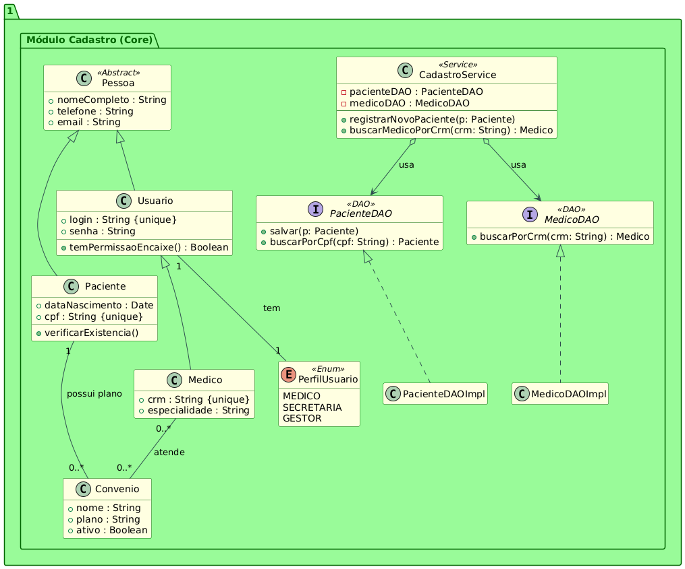

# Diagrama de Classes de Análise

## Sumário

- [1. Diagrama Modular - Visão Simplificada](#1-diagrama-modular---visão-simplificada)
  - [Código PlantUML](#código-plantuml-1)
  - [Diagrama Visual](#diagrama-visual-1)
- [2. Diagrama Completo - Todos os Módulos](#2-diagrama-completo---todos-os-módulos)
  - [Código PlantUML](#código-plantuml-2)
  - [Diagrama Visual](#diagrama-visual-2)
- [3. Módulo de Cadastro](#3-módulo-de-cadastro)
  - [Código PlantUML](#código-plantuml-3)
  - [Diagrama Visual](#diagrama-visual-3)
- [4. Módulo de Agendamento](#4-módulo-de-agendamento)
  - [Código PlantUML](#código-plantuml-4)
  - [Diagrama Visual](#diagrama-visual-4)
- [5. Módulo de Estoque](#5-módulo-de-estoque)
  - [Código PlantUML](#código-plantuml-5)
  - [Diagrama Visual](#diagrama-visual-5)

---

## 1. Diagrama Modular - Visão Simplificada

Este diagrama apresenta a estrutura modular básica do sistema, mostrando a integração entre os três módulos principais: Cadastro, Agendamento e Estoque.

### Código PlantUML

```plantuml
@startuml

\' \-\-- Estilos \-\--

skinparam package {

BackgroundColor Azure

BorderColor DarkSlateGray

}

skinparam class {

ArrowColor #8B0000

BorderColor DarkSlateGray

}

interface Style {

BackgroundColor LightCoral

BorderColor Red

}

\' ===============================================

\' PACOTE 1: CADASTRO CORE (DADOS BASE)

\' ===============================================

package \"1. Módulo Cadastro (Core)\" {

class Paciente \<\<Entity\>\> {

\+ cpf : String {unique}

\+ dataNascimento : Date

\+ verificarExistencia()

}

interface PacienteDAO \<\<DAO\>\> {

\+ salvar(p: Paciente)

\+ buscarPorCpf(cpf: String) : Paciente

}

class CadastroService \<\<Service\>\> {

\- pacienteDAO : PacienteDAO

\- medicoDAO : MedicoDAO

\--

\+ registrarNovoPaciente(p: Paciente)

\+ verificarDisponibilidadeCrm(crm: String) : Boolean

}

PacienteDAO \<\|.. PacienteDAOImpl

CadastroService o\--\> PacienteDAO : usa

}

\' ===============================================

\' PACOTE 2: AGENDAMENTO (INTEGRAÇÃO COM CADASTRO)

\' ===============================================

package \"2. Módulo Agendamento\" {

class Agendamento \<\<Entity\>\> {

\+ id : Integer

\+ dataHoraInicio : DateTime

\+ motivoEncaixe : String \[Opcional\]

\--

\+ isEncaixe() : Boolean

}

interface AgendamentoDAO \<\<DAO\>\> {

\+ persistir(a: Agendamento)

\+ buscarPorMedicoEData(crm: String, data: Date) : List\<Agendamento\>

}

class AgendamentoService \<\<Service\>\> {

\- agendamentoDAO : AgendamentoDAO

\- cadastroService : CadastroService

\--

\+ criarAgendamento(a: Agendamento)

\+ cancelarConsulta(agendamentoId: Long)

\+ verificaDisponibilidade(medicoId, dtInicio, dtFim) : Boolean

}

AgendamentoDAO \<\|.. AgendamentoDAOImpl

AgendamentoService o\--\> AgendamentoDAO : usa

\' Dependência/Integração: AgendamentoService precisa de regras do
CadastroService

AgendamentoService o\--\> CadastroService : usa para validar
Paciente/Medico

}

\' ===============================================

\' PACOTE 3: ESTOQUE (INTEGRAÇÃO COM SUPRIMENTOS)

\' ===============================================

package \"3. Módulo Estoque e Suprimentos\" {

class Item \<\<Entity\>\> {

\+ id_item : long

\+ nome : String

\+ quantidadeTotal : int

\+ validade : Date

}

interface EstoqueDAO \<\<DAO\>\> {

\+ darBaixa(itemId: Long, quantidade: int)

\+ buscarPorValidade(data: Date) : List\<Item\>

}

class EstoqueService \<\<Service\>\> {

\- estoqueDAO : EstoqueDAO

\- item : Item

\--

\+ verificarEstoqueCritico(itemId: Long)

\+ processarEntradaNF(nf: String)

\+ solicitarReposicao(itemId: Long)

}

EstoqueDAO \<\|.. EstoqueDAOImpl

EstoqueService o\--\> EstoqueDAO : usa

\' Relação da entidade Agendamento com a entidade Item (uso de
suprimentos)

\' Embora não esteja explícito, é uma integração comum:

AgendamentoService \--\> EstoqueService : usa (ex: para dar baixa em
material)

}

@enduml
```

### Diagrama Visual


---

## 2. Diagrama Completo - Todos os Módulos

Este diagrama integra todos os módulos do sistema, mostrando as relações completas entre as classes de Cadastro, Agendamento e Estoque.

### Código PlantUML

```plantuml
@startuml

\' \-\-- Estilos Globais \-\--

skinparam package {

BackgroundColor PaleGreen

BorderColor DarkGreen

FontColor DarkGreen

}

skinparam class {

BackgroundColor LightYellow

BorderColor DarkGreen

ArrowColor #2F4F4F

}

skinparam interface {

BackgroundColor LightBlue

BorderColor DarkBlue

FontStyle Bold

}

hide empty members

\' ===============================================

\' PACOTE 1: MÓDULO DE CADASTRO (CORE)

\' ===============================================

package \"1. Módulo Cadastro (Core)\" {

class Pessoa \<\<Abstract\>\> {

\+ nomeCompleto : String

\+ telefone : String

\+ email : String

}

class Paciente extends Pessoa {

\+ dataNascimento : Date

\+ cpf : String {unique}

\+ verificarExistencia()

}

class Usuario extends Pessoa {

\+ login : String {unique}

\+ senha : String

\+ temPermissaoEncaixe() : Boolean

}

class Medico extends Usuario {

\+ crm : String {unique}

\+ especialidade : String

}

class Convenio {

\+ nome : String

\+ plano : String

\+ ativo : Boolean

}

enum PerfilUsuario \<\<Enum\>\> {

MEDICO

SECRETARIA

GESTOR

}

\' Camada de Persistência

interface PacienteDAO \<\<DAO\>\> {

\+ salvar(p: Paciente)

\+ buscarPorCpf(cpf: String) : Paciente

}

interface MedicoDAO \<\<DAO\>\> {

\+ buscarPorCrm(crm: String) : Medico

}

\' Camada de Serviço (Integração/Negócio)

class CadastroService \<\<Service\>\> {

\- pacienteDAO : PacienteDAO

\- medicoDAO : MedicoDAO

\--

\+ registrarNovoPaciente(p: Paciente)

\+ buscarMedicoPorCrm(crm: String) : Medico

}

\' Implementações e Dependências Internas

PacienteDAO \<\|.. PacienteDAOImpl

MedicoDAO \<\|.. MedicoDAOImpl

CadastroService o\--\> PacienteDAO : usa

CadastroService o\--\> MedicoDAO : usa

Usuario \"1\" \-- \"1\" PerfilUsuario : tem

Medico \"0..\*\" \-- \"0..\*\" Convenio : atende

Paciente \"1\" \-- \"0..\*\" Convenio : possui plano

}

\' ===============================================

\' PACOTE 2: MÓDULO DE AGENDAMENTO

\' ===============================================

package \"2. Módulo Agendamento\" {

class Agendamento {

\+ id : Integer

\+ dataHoraInicio : DateTime

\+ dataHoraFim : DateTime

\+ isEncaixe : Boolean

\+ motivoEncaixe : String \[Opcional\]

}

class Consulta extends Agendamento {

\+ especialidade : String

\+ tipoConsulta : Enum{primeira, retorno, rotina}

}

class Procedimento {

\+ descricaoProcedimento : String

\+ salaEquipamentoNecessario : String \[Opcional\]

\+ nivelRisco : String

}

class Exame {

\+ nomeExame : String

\+ requerPreparo : Boolean

\+ instrucoesPreparo : String \[Opcional\]

}

class BlocoAgenda {

\+ dataInicio : DateTime

\+ dataFim : DateTime

\+ motivo : String

\+ antecedenciaMinima : Integer {dias}

}

\' Camada de Persistência

interface AgendamentoDAO \<\<DAO\>\> {

\+ persistir(a: Agendamento)

\+ buscarPorPeriodo(data: Date) : List\<Agendamento\>

}

\' Camada de Serviço (Integração/Negócio)

class AgendamentoService \<\<Service\>\> {

\- agendamentoDAO : AgendamentoDAO

\- cadastroService : CadastroService

\- estoqueService : EstoqueService \' \<\-- Integração

\--

\+ criarAgendamento(a: Agendamento)

\+ verificaDisponibilidade(medicoId, dtInicio, dtFim) : Boolean

\+ darBaixaEmMateriais(procedimentoId: Long)

}

\' Implementações e Dependências Internas

AgendamentoDAO \<\|.. AgendamentoDAOImpl

AgendamentoService o\--\> AgendamentoDAO : usa

\' Relações de Domínio

Paciente \"1\" \-- \"0..\*\" Agendamento : paciente_em

Medico \"1\" \-- \"0..\*\" Agendamento : agenda_para

Convenio \"1\" \-- \"0..\*\" Agendamento : cobre_por

Usuario \"1\" \-- \"0..\*\" Agendamento : criado_por

Medico \"1\" \-- \"0..\*\" BlocoAgenda : registra

Procedimento \"0..\*\" \-- \"1\" Consulta : é realizado em

Exame \"0..\*\" \-- \"1\" Consulta : é solicitado em

Agendamento \"\*\" \-- \"\*\" ProcedimentoItem : requer

}

\' ===============================================

\' PACOTE 3: MÓDULO DE ESTOQUE E SUPRIMENTOS

\' ===============================================

package \"3. Módulo Estoque e Suprimentos\" {

class Item {

\+ id_item : long

\+ nome : String

\+ quantidadeTotal : int

\+ validade : Date

}

class Medicamento extends Item {

\+ prescricao: String

\+ targa : String

}

class Hospitalar extends Item {

\+ descartabilidade : boolean

}

class Alimento extends Item {

\+ alergenicos : String

}

class ProcedimentoItem {

\+ quantidadeNecessaria : Decimal

}

class Estoque {

\+ id_estoque : long

\+ local : String

}

class Pedido {

\+ id_pedido : long

\+ data_pedido : Date

\+ status : String

}

class Fornecedor {

\+ id_fornecedor : long

\+ cnpj : String

}

\' Camada de Persistência

interface EstoqueDAO \<\<DAO\>\> {

\+ darBaixa(itemId: Long, quantidade: int)

\+ buscarItemPorId(itemId: Long) : Item

}

\' Camada de Serviço (Integração/Negócio)

class EstoqueService \<\<Service\>\> {

\- estoqueDAO : EstoqueDAO

\--

\+ darBaixa(itemId: Long, qtde: Integer)

\+ verificarEstoqueCritico(itemId: Long)

\+ solicitarReposicao(itemId: Long)

}

\' Implementações e Dependências Internas

EstoqueDAO \<\|.. EstoqueDAOImpl

EstoqueService o\--\> EstoqueDAO : usa

\' Relações de Domínio

Item \"1\" \-- \"0..\*\" ProcedimentoItem : componente de

Item \"0..\*\" \-- \"1\" Estoque : \<\<tem\>\>

Pedido \"0..\*\" \-- \"0..\*\" Item : \<\<contém\>\>

Pedido \"0..\*\" \-- \"1\" Fornecedor : é feito a

}

\' ===============================================

\' INTEGRAÇÃO ENTRE SERVIÇOS

\' ===============================================

\' O AgendamentoService integra a lógica chamando outros serviços:

AgendamentoService \--\> CadastroService : \<\<integra\>\> (valida
paciente/médico)

AgendamentoService \--\> EstoqueService : \<\<integra\>\> (dá baixa em
insumos)

@enduml
```

### Diagrama Visual


---

## 3. Módulo de Cadastro

Módulo responsável pelo cadastro e gerenciamento de pacientes, médicos, usuários e convênios.

### Código PlantUML

```plantuml
@startuml

\' \-\-- Estilos Globais \-\--

skinparam package {

BackgroundColor PaleGreen

BorderColor DarkGreen

FontColor DarkGreen

}

skinparam class {

BackgroundColor LightYellow

BorderColor DarkGreen

ArrowColor #2F4F4F

}

skinparam interface {

BackgroundColor LightBlue

BorderColor DarkBlue

FontStyle Bold

}

hide empty members

\' ===============================================

\' PACOTE 1: MÓDULO DE CADASTRO (CORE)

\' ===============================================

package \"1. Módulo Cadastro (Core)\" {

class Pessoa \<\<Abstract\>\> {

\+ nomeCompleto : String

\+ telefone : String

\+ email : String

}

class Paciente extends Pessoa {

\+ dataNascimento : Date

\+ cpf : String {unique}

\+ verificarExistencia()

}

class Usuario extends Pessoa {

\+ login : String {unique}

\+ senha : String

\+ temPermissaoEncaixe() : Boolean

}

class Medico extends Usuario {

\+ crm : String {unique}

\+ especialidade : String

}

class Convenio {

\+ nome : String

\+ plano : String

\+ ativo : Boolean

}

enum PerfilUsuario \<\<Enum\>\> {

MEDICO

SECRETARIA

GESTOR

}

\' Camada de Persistência

interface PacienteDAO \<\<DAO\>\> {

\+ salvar(p: Paciente)

\+ buscarPorCpf(cpf: String) : Paciente

}

interface MedicoDAO \<\<DAO\>\> {

\+ buscarPorCrm(crm: String) : Medico

}

\' Camada de Serviço (Integração/Negócio)

class CadastroService \<\<Service\>\> {

\- pacienteDAO : PacienteDAO

\- medicoDAO : MedicoDAO

\--

\+ registrarNovoPaciente(p: Paciente)

\+ buscarMedicoPorCrm(crm: String) : Medico

}

\' Implementações e Dependências Internas

PacienteDAO \<\|.. PacienteDAOImpl

MedicoDAO \<\|.. MedicoDAOImpl

CadastroService o\--\> PacienteDAO : usa

CadastroService o\--\> MedicoDAO : usa

Usuario \"1\" \-- \"1\" PerfilUsuario : tem

Medico \"0..\*\" \-- \"0..\*\" Convenio : atende

Paciente \"1\" \-- \"0..\*\" Convenio : possui plano

}

@enduml
```

### Diagrama Visual



---

## 4. Módulo de Agendamento

Módulo responsável pelo agendamento de consultas, procedimentos e gestão da agenda médica.

### Código PlantUML

```plantuml
@startuml

\' \-\-- Estilos Globais \-\--

skinparam package {

BackgroundColor PaleGreen

BorderColor DarkGreen

FontColor DarkGreen

}

skinparam class {

BackgroundColor LightYellow

BorderColor DarkGreen

ArrowColor #2F4F4F

}

skinparam interface {

BackgroundColor LightBlue

BorderColor DarkBlue

FontStyle Bold

}

hide empty members

\' ===============================================

\' PACOTE 2: MÓDULO DE AGENDAMENTO

\' ===============================================

package \"2. Módulo Agendamento\" {

class Agendamento {

\+ id : Integer

\+ dataHoraInicio : DateTime

\+ dataHoraFim : DateTime

\+ isEncaixe : Boolean

\+ motivoEncaixe : String \[Opcional\]

}

class Consulta extends Agendamento {

\+ especialidade : String

\+ tipoConsulta : Enum{primeira, retorno, rotina}

}

class Procedimento {

\+ descricaoProcedimento : String

\+ salaEquipamentoNecessario : String \[Opcional\]

\+ nivelRisco : String

}

class Exame {

\+ nomeExame : String

\+ requerPreparo : Boolean

\+ instrucoesPreparo : String \[Opcional\]

}

class BlocoAgenda {

\+ dataInicio : DateTime

\+ dataFim : DateTime

\+ motivo : String

\+ antecedenciaMinima : Integer {dias}

}

\' Camada de Persistência

interface AgendamentoDAO \<\<DAO\>\> {

\+ persistir(a: Agendamento)

\+ buscarPorPeriodo(data: Date) : List\<Agendamento\>

}

\' Camada de Serviço (Integração/Negócio)

class AgendamentoService \<\<Service\>\> {

\- agendamentoDAO : AgendamentoDAO

\- cadastroService : CadastroService

\- estoqueService : EstoqueService \' \<\-- Integração

\--

\+ criarAgendamento(a: Agendamento)

\+ verificaDisponibilidade(medicoId, dtInicio, dtFim) : Boolean

\+ darBaixaEmMateriais(procedimentoId: Long)

}

\' Implementações e Dependências Internas

AgendamentoDAO \<\|.. AgendamentoDAOImpl

AgendamentoService o\--\> AgendamentoDAO : usa

\' Relações de Domínio

Paciente \"1\" \-- \"0..\*\" Agendamento : paciente_em

Medico \"1\" \-- \"0..\*\" Agendamento : agenda_para

Convenio \"1\" \-- \"0..\*\" Agendamento : cobre_por

Usuario \"1\" \-- \"0..\*\" Agendamento : criado_por

Medico \"1\" \-- \"0..\*\" BlocoAgenda : registra

Procedimento \"0..\*\" \-- \"1\" Consulta : é realizado em

Exame \"0..\*\" \-- \"1\" Consulta : é solicitado em

Agendamento \"\*\" \-- \"\*\" ProcedimentoItem : requer

}

@enduml
```

### Diagrama Visual


---

## 5. Módulo de Estoque

Módulo responsável pelo controle de estoque, gestão de suprimentos e rastreabilidade de itens.

### Código PlantUML

```plantuml
@startuml

\' \-\-- Estilos Globais \-\--

skinparam package {

BackgroundColor PaleGreen

BorderColor DarkGreen

FontColor DarkGreen

}

skinparam class {

BackgroundColor LightYellow

BorderColor DarkGreen

ArrowColor #2F4F4F

}

skinparam interface {

BackgroundColor LightBlue

BorderColor DarkBlue

FontStyle Bold

}

hide empty members

\' ===============================================

\' PACOTE 3: MÓDULO DE ESTOQUE E SUPRIMENTOS

\' ===============================================

package \"3. Módulo Estoque e Suprimentos\" {

class Item {

\+ id_item : long

\+ nome : String

\+ quantidadeTotal : int

\+ validade : Date

}

class Medicamento extends Item {

\+ presciricao : String

\+ targa : String

}

class Hospitalar extends Item {

\+ descortabilidade : boolean

}

class Alimento extends Item {

\+ alergenicos : String

}

class ProcedimentoItem {

\+ quantidadeNecessaria : Decimal

}

class Estoque {

\+ id_estoque : long

\+ local : String

}

class Pedido {

\+ id_pedido : long

\+ data_pedido : Date

\+ status : String

}

class Fornecedor {

\+ id_fornecedor : long

\+ cnpj : String

}

\' Camada de Persistência

interface EstoqueDAO \<\<DAO\>\> {

\+ darBaixa(itemId: Long, quantidade: int)

\+ buscarItemPorId(itemId: Long) : Item

}

\' Camada de Serviço (Integração/Negócio)

class EstoqueService \<\<Service\>\> {

\- estoqueDAO : EstoqueDAO

\--

\+ darBaixa(itemId: Long, qtde: Integer)

\+ verificarEstoqueCritico(itemId: Long)

\+ solicitarReposicao(itemId: Long)

}

\' Implementações e Dependências Internas

EstoqueDAO \<\|.. EstoqueDAOImpl

EstoqueService o\--\> EstoqueDAO : usa

\' Relações de Domínio

Item \"1\" \-- \"0..\*\" ProcedimentoItem : componente de

Item \"0..\*\" \-- \"1\" Estoque : \<\<tem\>\>

Pedido \"0..\*\" \-- \"0..\*\" Item : \<\<contém\>\>

Pedido \"0..\*\" \-- \"1\" Fornecedor : é feito a

}

@enduml
```

