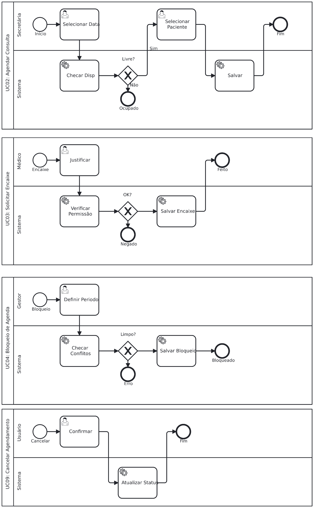
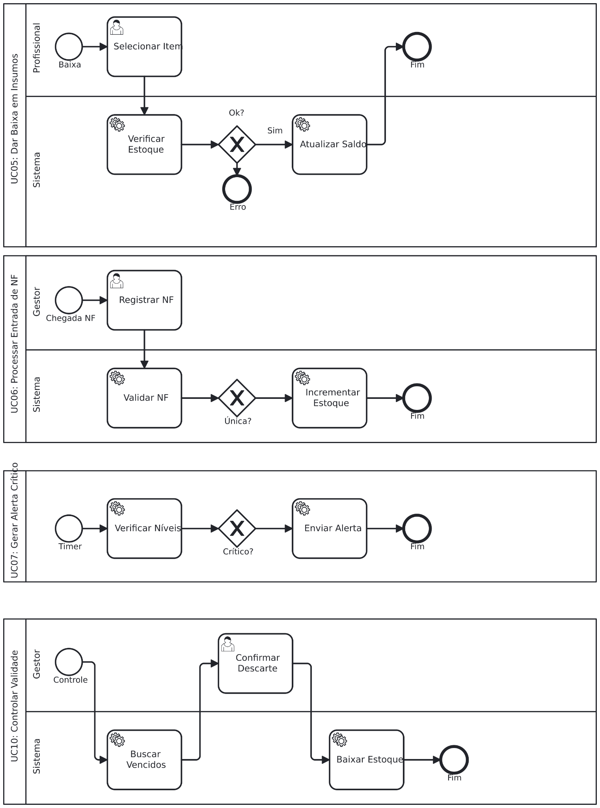
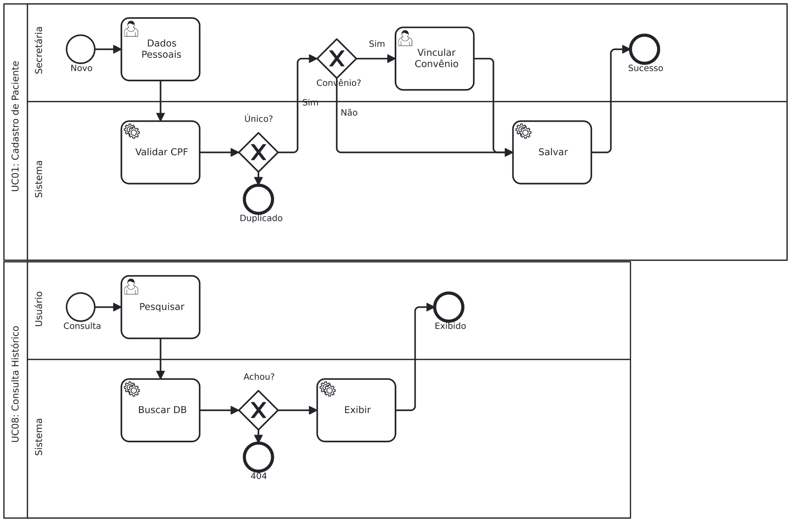

# Diagramas de Processos de Negócio (BPM)

## Sumário

- [Diagramas de Processos de Negócio (BPM)](#diagramas-de-processos-de-negócio-bpm)
  - [Sumário](#sumário)
  - [1. Diagrama: Módulo de Agendamento](#1-diagrama-módulo-de-agendamento)
    - [UC02: Agendar Consulta](#uc02-agendar-consulta)
    - [UC03: Solicitar Encaixe (A exceção)](#uc03-solicitar-encaixe-a-exceção)
    - [UC04: Registrar Bloqueio de Agenda (Gestão)](#uc04-registrar-bloqueio-de-agenda-gestão)
  - [2. Diagrama: Módulo de Estoque)](#2-diagrama-módulo-de-estoque)
    - [UC05: Dar Baixa em Insumos (Consumo)](#uc05-dar-baixa-em-insumos-consumo)
    - [UC06: Processar Entrada de NF (Abastecimento)](#uc06-processar-entrada-de-nf-abastecimento)
    - [UC07: Gerar Alerta de Estoque Crítico (Monitoramento)](#uc07-gerar-alerta-de-estoque-crítico-monitoramento)
    - [UC10: Controlar Validade (Limpeza)](#uc10-controlar-validade-limpeza)
  - [3. Diagrama: Cadastro e Consulta](#3-diagrama-cadastro-e-consulta)

---

## 1. Diagrama: Módulo de Agendamento

Este diagrama é uma Colaboração que foca na gestão temporal da clínica. Ele orquestra como horários são ocupados, forçados (encaixes), bloqueados ou liberados.

### UC02: Agendar Consulta

- Participantes (Raias): A Secretária inicia a ação e o Sistema processa
  as regras.

- Fluxo:

  1. Início: O processo começa com a \"Necessidade de Consulta\".

  2. Verificação: A Secretária seleciona médico e data. O Sistema
      executa uma *Service Task* (tarefa automática) para consultar o
      banco de dados e verificar disponibilidade.

  3. Decisão (Gateway Exclusivo):

      - Caminho \"Sim\": Se livre, o fluxo segue para selecionar o
        paciente e persistir (salvar) o agendamento.

      - Caminho \"Não\": Se ocupado, o fluxo termina em um *End Event*
        de falha. *Nota: No mundo real, isso gatilharia o UC03.*

### UC03: Solicitar Encaixe (A exceção)

- Cenário: Este processo é acionado quando o UC02 falha (horário
  indisponível).

- Regra de Negócio Crítica: O sistema verifica se o usuário logado tem a
  permissão temPermissaoEncaixe().

- Fluxo:

  1. O usuário preenche a justificativa (obrigatória conforme
      RN-ENCAIXE.1 ).

  2. Gateway de Permissão:

      - Se autorizado: O sistema salva o agendamento marcando a flag
        isEncaixe = true.

      - Se negado: O processo morre em um evento de fim \"Encaixe
        Negado\".

### UC04: Registrar Bloqueio de Agenda (Gestão)

- Objetivo: Impedir agendamentos em períodos de férias ou congressos.

- Validação: Antes de salvar o bloqueio, o Sistema verifica se já
  existem consultas marcadas naquele intervalo. Se houver conflito
  (Gateway \"Conflito?\"), o sistema rejeita o bloqueio e exige que o
  usuário cancele as consultas primeiro.

UC09: Cancelar Agendamento

- Complexidade: Verifica a antecedência do cancelamento.

- Gateway \"Cancelamento Tarde?\": Se o cancelamento for muito em cima
  da hora, o sistema aplica uma penalidade ou loga o incidente antes de
  liberar o horário. Em ambos os casos, o status final é atualizado para
  \"Cancelado\".

## 2. Diagrama: Módulo de Estoque)

Este diagrama gerencia o ciclo de vida dos materiais, desde a entrada
(compra), uso (baixa) até o descarte e reposição.

### UC05: Dar Baixa em Insumos (Consumo)

- Atores: O Profissional de Saúde solicita o material e o Sistema
  valida.

- Regras de Negócio (Gateways):

  1. Estoque Suficiente? Verifica se a quantidade solicitada existe.

  2. Validade OK? O sistema aplica a regra FIFO/FEFO (First-Expired,
      First-Out). Se o lote selecionado estiver vencido, a baixa é
      bloqueada.

- Integração (Call Activity): Após atualizar o saldo, o processo chama
  automaticamente o UC07 para verificar se o estoque ficou crítico.

### UC06: Processar Entrada de NF (Abastecimento)

- Ator: Gestor.

- Validações:

  1. Unicidade da NF: O sistema impede a entrada de uma Nota Fiscal
      duplicada.

  2. Validade Curta: Se o item comprado vencer em menos de 30 dias, o
      sistema pode emitir um alerta, mas permite a entrada (caminho de
      exceção tratado).

### UC07: Gerar Alerta de Estoque Crítico (Monitoramento)

- Natureza: É um processo de sistema (automatizado), geralmente
  disparado por um *Timer* (tempo) ou *Signal* (após baixa/entrada).

- Lógica: O sistema itera sobre os itens. Se Quantidade Total \< Ponto
  Reposição , ele envia uma notificação ao Gestor.

### UC10: Controlar Validade (Limpeza)

- Fluxo: O Gestor define um critério (ex: \"vence em 30 dias\"). O
  sistema busca esses itens.

- Ação: O Gestor seleciona os itens para descarte. O sistema realiza uma
  baixa especial do tipo \"Descarte\", reduzindo o saldo contábil e
  físico.

## 3. Diagrama: Cadastro e Consulta

Focado na integridade dos dados e na segurança da informação
(privacidade do paciente).

UC01: Cadastrar Novo Paciente

- Ator: Secretária.

- Gateway Crítico \"CPF Único?\": Antes de salvar, o sistema valida se o
  CPF já existe na base PacienteDAO. Se existir, ocorre um *Error End
  Event* (Erro de Negócio).

- Caminho Opcional: Um Gateway verifica se o paciente possui convênio.
  Se \"Sim\", habilita a tarefa de \"Associar Convênio\". Se \"Não\",
  salva apenas os dados particulares.

UC08: Consultar Histórico

- Segurança (Gateway de Acesso): Este é o ponto mais importante.

  - O sistema verifica o Perfil do Usuário logado.

  - Caminho Médico: O sistema exibe dados completos (Dados Clínicos +
    Administrativos).

  - Caminho Secretária: O sistema exibe apenas dados restritos
    (Agendamentos + Administrativos), protegendo o sigilo médico.

