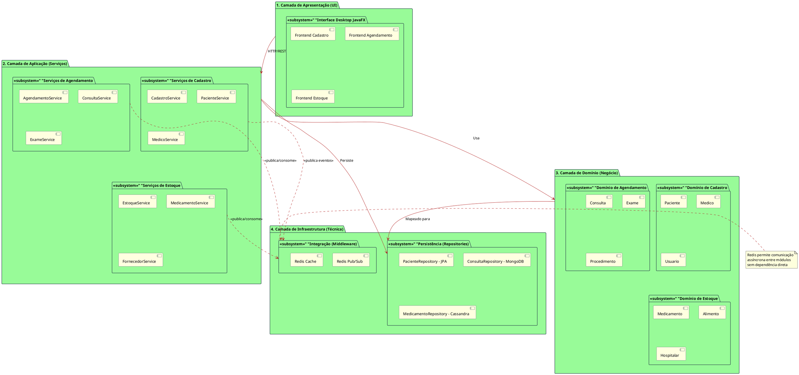
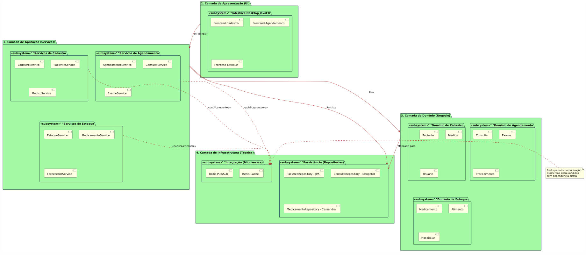
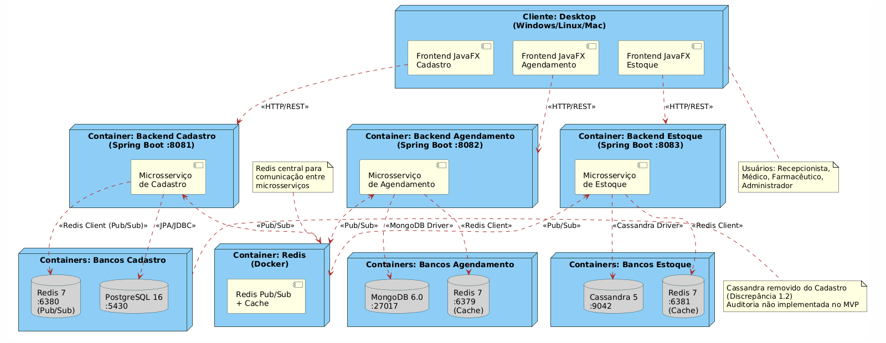

# 3.6. Arquitetura do Sistema - Lógica e Física

## Sumário

- [Notas Técnicas - Correções de Discrepâncias](#notas-técnicas---correções-de-discrepâncias)
- [1. Decisões Arquiteturais](#1-decisões-arquiteturais)
- [2. Persistência Poliglota](#2-persistência-poliglota)
- [3. Arquitetura Lógica](#3-arquitetura-lógica)
- [4. Arquitetura Física](#4-arquitetura-física)
- [5. Integração entre Módulos](#5-integração-entre-módulos)
- [6. Benefícios e Desafios](#6-benefícios-e-desafios)

---

## Notas Técnicas - Correções de Discrepâncias

A arquitetura do sistema foi documentada com correções importantes.

### Discrepância 1.2: EventoAuditoria com Cassandra Não Implementado

**Discrepância:** Documentação mostrava Cassandra no módulo Cadastro para auditoria, mas apenas PostgreSQL é usado.

**Mudança Feita:** Removida referência a Cassandra e EventoAuditoria do módulo Cadastro. Nota inline adicionada.

**Justificativa:** Auditoria não é crítica para MVP. Redução de escopo.

**Documento Detalhado:** [📄 CORRECAO_DISCREPANCIA_1.2.md](../../Correções%20de%20Alinhamento/CORRECAO_DISCREPANCIA_1.2.md)

### Discrepância 1.3: Redis para Cache Não Implementado

**Discrepância:** Documentação indicava Redis para cache de consultas, mas implementação usa Redis SOMENTE para Pub/Sub.

**Mudança Feita:** Documentado uso real do Redis (4 instâncias para mensageria, não cache).

**Justificativa:** Sistema não possui @Cacheable. Redis é usado exclusivamente para comunicação assíncrona entre microserviços.

**Documento Detalhado:** [📄 CORRECAO_DISCREPANCIA_1.3.md](../../Correções%20de%20Alinhamento/CORRECAO_DISCREPANCIA_1.3.md)

### Discrepância 2.1: PostgreSQL + Cassandra no Módulo Cadastro (Auditoria)

**Discrepância:** Diagrama de arquitetura mostrava Cadastro com PostgreSQL E Cassandra, mas apenas PostgreSQL existe.

**Mudança Feita:** Cassandra removido do diagrama do módulo Cadastro. Documentado uso SOMENTE no módulo Estoque.

**Justificativa:** Backend cadastro-service usa SOMENTE PostgreSQL. Cassandra está no estoque-service.

**Documento Detalhado:** [📄 CORRECAO_DISCREPANCIA_2.1.md](../../Correções%20de%20Alinhamento/CORRECAO_DISCREPANCIA_2.1.md)

### Discrepância 5.1: Integração Redis Pub/Sub - UC07 Não Implementado

**Discrepância:** Documentação indicava canal `estoque.alerta.request` funcional, mas subscriber não existe.

**Mudança Feita:** Seção "Integração entre Módulos" atualizada com notas sobre canais Redis não implementados.

**Justificativa:** Publisher existe no Cadastro, subscriber não existe no Estoque.

**Documento Detalhado:** [📄 CORRECAO_DISCREPANCIA_5.1.md](../../Correções%20de%20Alinhamento/CORRECAO_DISCREPANCIA_5.1.md)

---

Para consultar todas as correções, acesse o [📑 Sumário de Correções](../../Correções%20de%20Alinhamento/SUMARIO_CORRECAO_DISCREPANCIA.md).

---

## 1. Decisões Arquiteturais

### Por que Microsserviços?

**Decisão**: Dividir o sistema em 3 módulos independentes (Cadastro, Agendamento, Estoque)

**Justificativa**:

1. **Escalabilidade Independente**: Cada módulo pode escalar conforme demanda
   - Cadastro: baixa frequência, alta consistência
   - Agendamento: alta frequência em horários específicos
   - Estoque: média frequência, picos em horários de dispensação

2. **Tecnologias Específicas**: Cada módulo usa o banco mais adequado para seu domínio

3. **Resiliência**: Falha em um módulo não derruba o sistema todo

4. **Desenvolvimento Paralelo**: Times diferentes podem trabalhar simultaneamente

---

## 2. Persistência Poliglota

O SimpleHealth implementa **persistência poliglota**, onde cada módulo utiliza o banco de dados mais adequado às suas necessidades:

### Módulo Cadastro: PostgreSQL + Redis

> **⚠️ NOTA TÉCNICA - Discrepância 1.2 Resolvida:**
> 
> **Redução de Escopo:** Cassandra e EventoAuditoria foram **removidos** do módulo de Cadastro por decisão de redução de escopo do projeto.
> 
> **Justificativa:** Funcionalidade de auditoria não é crítica para MVP. Pode ser implementada em versões futuras usando PostgreSQL ou soluções de logging centralizadas.
> 
> Data da correção: 14/12/2025

#### PostgreSQL 16 (Banco Principal)

**Porta**: 5430

**Por quê?**

1. **Consistência ACID**: Dados de pacientes/médicos requerem transações confiáveis
2. **Relacionamentos Complexos**: JOINs entre Paciente ↔ Convênio ↔ Médico
3. **Queries Complexas**: Busca por CPF, nome, especialidade médica
4. **Maturidade**: Banco robusto, bem documentado

**Trade-offs**:

- ✅ Consistência forte
- ✅ Queries relacionais
- ❌ Escalabilidade horizontal limitada
- ❌ Menor performance em altíssimo volume

**Entidades**: Paciente, Médico, Usuário, Convênio

> **📝 Nota sobre Modelo de Dados:** As entidades `Medico` e `Usuario` são classes independentes que herdam diretamente de `Pessoa` (não há herança entre Medico e Usuario). Esta arquitetura permite que um médico possa existir no sistema sem necessariamente ter credenciais de acesso. Para mais detalhes, veja a análise de discrepância 1.1 nos documentos de Classes de Análise e Modelagem de Classes de Projeto.

#### Redis 7 (Pub/Sub para Comunicação entre Módulos)

**Porta**: 6380

> **⚠️ NOTA TÉCNICA - Discrepância 1.3 Resolvida:**
> 
> **Implementação Parcial:** Redis está implementado no módulo de Cadastro **apenas para Pub/Sub** (comunicação entre módulos), **NÃO para cache**.
> 
> **Funcionalidades Implementadas:**
> - ✅ Pub/Sub para comunicação assíncrona entre módulos
> - ✅ Integração com Agendamento e Estoque via mensagens
> 
> **Funcionalidades NÃO Implementadas (redução de escopo):**
> - ❌ Cache de listas de médicos
> - ❌ Session storage
> - ❌ Cache de consultas frequentes
> 
> Data da correção: 14/12/2025

**Por quê?**

1. **Pub/Sub**: Comunicação assíncrona entre módulos (consultar histórico de paciente)
2. **Event-Driven**: Notificações entre microsserviços
3. **Baixo Acoplamento**: Módulos não precisam conhecer URLs uns dos outros

**Trade-offs**:

- ✅ Comunicação assíncrona eficiente
- ✅ Desacoplamento entre módulos
- ✅ Performance em mensageria
- ❌ Mensagens não persistidas (volatilidade)
- ❌ Sem garantias de entrega (fire-and-forget)

---

### Módulo Agendamento: MongoDB + Redis

#### MongoDB 6.0

**Porta**: 27017

**Por quê?**

1. **Flexibilidade**: Consultas, Exames e Procedimentos têm estruturas diferentes
2. **Schema-less**: Facilita evolução dos tipos de agendamento
3. **Embedded Documents**: Agenda médica pode ter disponibilidades embutidas
4. **Queries Geoespaciais**: Futuro - agendar por localização

**Trade-offs**:

- ✅ Flexibilidade de schema
- ✅ Performance boa para reads/writes
- ✅ Escalabilidade horizontal (sharding)
- ❌ Sem transações ACID completas (até versão 4.0)
- ❌ Queries relacionais menos eficientes

**Entidades**: Consulta, Exame, Procedimento, BloqueioAgenda

#### Redis 7 (Cache)

**Porta**: 6379

**Por quê?**

1. **Cache de Agendas**: Disponibilidade de médicos (consulta a cada clique)
2. **Locks Distribuídos**: Evitar double-booking de horários

---

### Módulo Estoque: Cassandra + Redis

#### Cassandra 5

**Porta**: 9042

**Por quê?**

1. **Alta Disponibilidade**: Estoque crítico não pode ficar offline
2. **Write-Heavy**: Movimentações constantes de entrada/saída
3. **Particionamento Natural**: Dados por localizacao/setor/tipo
4. **Time Series**: Histórico de movimentações ordenado por tempo

**Trade-offs**:

- ✅ Alta disponibilidade
- ✅ Escalabilidade horizontal
- ✅ Performance em writes
- ❌ Queries complexas difíceis
- ❌ Modelagem exige planejamento (denormalização)

**Entidades**: Medicamento, Alimento, Hospitalar, Fornecedor, Estoque, Pedido, Item

#### Redis 7 (Cache + Pub/Sub)

**Porta**: 6381

**Por quê?**

1. **Cache de Estoque Crítico**: Lista de itens abaixo do mínimo **[PLANEJADO - NÃO IMPLEMENTADO]**
2. **Pub/Sub**: Alertas para módulo Cadastro quando estoque crítico **[REDUÇÃO DE ESCOPO - Cadastro publica mas Estoque não possui subscriber]**

⚠️ **Observação**: O canal Redis `estoque.alerta.request` é usado pelo módulo Cadastro para solicitar alertas, mas o módulo Estoque NÃO implementa o subscriber correspondente. UC07 não está funcional.

---

### 📊 Comparação de Bancos

| Banco | Tipo | Consistência | Escalabilidade | Casos de Uso |
|-------|------|--------------|----------------|--------------|
| **PostgreSQL** | Relacional | ACID (Forte) | Vertical | Cadastros, transações |
| **MongoDB** | Documento | Eventual | Horizontal | Agendamentos flexíveis |
| **Cassandra** | Wide-Column | Eventual | Horizontal | Auditoria, logs, estoque |
| **Redis** | Key-Value | Forte (single-node) | Vertical | Cache, pub/sub, sessions |

---

## 3. Arquitetura Lógica

A arquitetura lógica define a organização do software, seus componentes e suas responsabilidades, independentemente do hardware onde serão executados.

O sistema é dividido **verticalmente** em **Partições/Subsistemas** que representam os módulos de negócio (Cadastro, Agendamento, Estoque). Cada partição é organizada **horizontalmente** em **quatro camadas lógicas**:

### 3.1 Camadas do Sistema

#### 1. Camada de Apresentação (UI)

**O que é**: Interface com o usuário, responsável por exibir informações e capturar entradas.

**No projeto**: 
- **Interface Desktop JavaFX**: Três aplicações frontend independentes
- Comunicação via HTTP/REST com os backends

#### 2. Camada de Aplicação (Serviços)

**O que é**: Contém a lógica de coordenação dos casos de uso e os serviços que o frontend consome.

**No projeto**: Três serviços principais independentes:

- **CadastroService**: Orquestra UC01-UC05 (Cadastrar Paciente, Médico, Usuário, Convênio, Autenticação)
- **AgendamentoService**: Orquestra UC06-UC09 (Agendar Consulta, Exame, Procedimento, Bloqueios)
- **EstoqueService**: Orquestra UC10-UC16 (Gestão de Medicamentos, Alimentos, Materiais, Fornecedores, Pedidos)

#### 3. Camada de Domínio (Negócio)

**O que é**: O coração do software. Contém as regras de negócio e as entidades principais.

**No projeto**: Cada serviço gerencia seu próprio conjunto de entidades:

- **Domínio de Cadastro**: Paciente, Médico, Usuário, Convênio
- **Domínio de Agendamento**: Consulta, Exame, Procedimento, BloqueioAgenda
- **Domínio de Estoque**: Medicamento, Alimento, Hospitalar, Fornecedor, Pedido, Item

#### 4. Camada de Infraestrutura (Técnica)

**O que é**: Fornece serviços técnicos genéricos (acesso a dados, comunicação, cache).

**No projeto**: Dividida em duas partes:

- **Persistência (Repositories)**: Interfaces para acesso aos bancos de dados
  - Spring Data JPA (PostgreSQL - Cadastro)
  - Spring Data MongoDB (Agendamento)
  - Spring Data Cassandra (Estoque apenas)
- **Integração (Middleware)**: Redis Pub/Sub para comunicação assíncrona entre módulos

**⚠️ Nota**: Cassandra utilizado apenas no módulo de Estoque (ver Discrepância 2.1).

### 3.2 Diagrama PlantUML - Arquitetura Lógica



**Diagrama Gerado:**



**Para visualizar**: Copie o código acima e cole em [PlantUML Online](http://www.plantuml.com/plantuml/uml/) ou use a extensão PlantUML no VS Code.

---

## 4. Arquitetura Física

A arquitetura física mostra como os componentes de software são distribuídos em nós de processamento físicos (hardware, servidores, containers).

### 4.1 Nós de Processamento

#### Nó 1: Cliente Desktop

- **Hardware**: Computador do usuário (Windows/Linux/Mac)
- **Software**: Aplicações JavaFX (Cadastro, Agendamento, Estoque)
- **Comunicação**: HTTP/REST para backends

#### Nó 2: Servidor Middleware (Redis)

- **Hardware**: Container Docker
- **Software**: Redis 7
- **Função**: 
  - Pub/Sub (mensagens entre serviços)
  - Cache (dados frequentemente acessados)
- **Portas**: 6379, 6380, 6381 (um para cada módulo)

#### Nó 3: Microsserviço de Cadastro

- **Hardware**: Container Docker (Backend)
- **Software**: Spring Boot 3.5.6, Java 17
- **Porta**: 8081
- **Bancos de Dados**:
  - PostgreSQL 16 (porta 5430) - Dados mestres
  - Cassandra 5 (porta 9042) - Auditoria
  - Redis 7 (porta 6380) - Cache

#### Nó 4: Microsserviço de Agendamento

- **Hardware**: Container Docker (Backend)
- **Software**: Spring Boot 3.5.6, Java 17
- **Porta**: 8082
- **Bancos de Dados**:
  - MongoDB 6.0 (porta 27017) - Dados de agendamento
  - Redis 7 (porta 6379) - Cache/Pub-Sub

#### Nó 5: Microsserviço de Estoque

- **Hardware**: Container Docker (Backend)
- **Software**: Spring Boot 3.5.6, Java 17
- **Porta**: 8083
- **Bancos de Dados**:
  - Cassandra 5 (porta 9042) - Dados de estoque
  - Redis 7 (porta 6381) - Cache/Pub-Sub

### 4.2 Diagrama PlantUML - Arquitetura Física

```plantuml
@startuml

skinparam node {
  BorderColor DarkSlateGray
  BackgroundColor LightSkyBlue
}

skinparam component {
  BorderColor DarkSlateGray
  BackgroundColor LightYellow
  ArrowColor Firebrick
}

skinparam database {
  BorderColor DarkSlateGray
  BackgroundColor LightGray
}

skinparam ArrowColor Firebrick

' Nó 1: Cliente Desktop
node "Cliente: Desktop\n(Windows/Linux/Mac)" as Desktop {
  component "[Frontend JavaFX\nCadastro]" as UI_Cadastro
  component "[Frontend JavaFX\nAgendamento]" as UI_Agendamento
  component "[Frontend JavaFX\nEstoque]" as UI_Estoque
}

' Nó 2: Middleware (Docker)
node "Container: Redis\n(Docker)" as Redis_Container {
  component "[Redis Pub/Sub\n+ Cache]" as Redis_Comp
}

\' --- Microsserviço de Cadastro (Docker) ---
node "Container: Backend Cadastro\n(Spring Boot :8081)" as Cadastro_Server {
  component "Microsserviço\nde Cadastro" as Cadastro_Comp
}

node "Containers: Bancos Cadastro" as DB_Cadastro_Node {
  database "PostgreSQL 16\n:5430" as DB_Postgres
  database "Redis 7\n:6380\n(Pub/Sub)" as Redis_Cad
}

note right of DB_Cadastro_Node
  ⚠️ Cassandra removido do Cadastro
  (Discrepância 1.2)
  Auditoria não implementada no MVP
end note

\' --- Microsserviço de Agendamento (Docker) ---
node "Container: Backend Agendamento\n(Spring Boot :8082)" as Agendamento_Server {
  component "Microsserviço\nde Agendamento" as Agendamento_Comp
}

node "Containers: Bancos Agendamento" as DB_Agendamento_Node {
  database "MongoDB 6.0\n:27017" as DB_Mongo
  database "Redis 7\n:6379\n(Cache)" as Redis_Agend
}

' --- Microsserviço de Estoque (Docker) ---
node "Container: Backend Estoque\n(Spring Boot :8083)" as Estoque_Server {
  component "Microsserviço\nde Estoque" as Estoque_Comp
}

node "Containers: Bancos Estoque" as DB_Estoque_Node {
  database "Cassandra 5\n:9042" as DB_Cassandra_Est
  database "Redis 7\n:6381\n(Cache)" as Redis_Est
}

' --- Conexões ---
' 1. Cliente -> Serviços (via HTTP REST)
UI_Cadastro ..> Cadastro_Server : "<<HTTP/REST>>"
UI_Agendamento ..> Agendamento_Server : "<<HTTP/REST>>"
UI_Estoque ..> Estoque_Server : "<<HTTP/REST>>"

\' 2. Serviços -> Seus próprios Bancos de Dados
Cadastro_Comp ..> DB_Postgres : "<<JPA/JDBC>>"
Cadastro_Comp ..> Redis_Cad : "<<Redis Client (Pub/Sub)>>"

Agendamento_Comp ..> DB_Mongo : "<<MongoDB Driver>>"
Agendamento_Comp ..> Redis_Agend : "<<Redis Client>>"

Estoque_Comp ..> DB_Cassandra_Est : "<<Cassandra Driver>>"
Estoque_Comp ..> Redis_Est : "<<Redis Client>>"

' 3. Serviços <-> Middleware (via Redis Pub/Sub)
Cadastro_Comp <..> Redis_Container : "<<Pub/Sub>>"
Agendamento_Comp <..> Redis_Container : "<<Pub/Sub>>"
Estoque_Comp <..> Redis_Container : "<<Pub/Sub>>"

note top of Redis_Container
  Redis central para
  comunicação entre
  microsserviços
end note

note bottom of Desktop
  Usuários: Recepcionista,
  Médico, Farmacêutico,
  Administrador
end note

@enduml
```

**Diagrama Gerado:**



**Para visualizar**: Copie o código acima e cole em [PlantUML Online](http://www.plantuml.com/plantuml/uml/) ou use a extensão PlantUML no VS Code.

---

## 5. Integração entre Módulos

### 5.1 Redis Pub/Sub

**Exemplo**: Alerta de Estoque Crítico

```
Módulo Estoque                Redis                 Módulo Cadastro
     │                          │                          │
     │  1. PUBLISH              │                          │
     │  "estoque:alerta"        │                          │
     │  { "medicamento": "X" }  │                          │
     ├─────────────────────────>│                          │
     │                          │  2. SUBSCRIBE            │
     │                          │  "estoque:alerta"        │
     │                          │<─────────────────────────┤
     │                          │  3. Mensagem recebida    │
     │                          ├─────────────────────────>│
     │                          │                          │
     │                          │  4. Notifica médicos     │
     │                          │     responsáveis         │
```

**Implementação**:
- Publisher: `EstoqueAlertaPublisher.java` (Estoque)
- Subscriber: `EstoqueAlertaSubscriber.java` (Cadastro)

### 5.2 Fluxo de Comunicação Completo

**Exemplo**: Agendamento de Consulta que Requer Materiais do Estoque

```
1. [Cliente Desktop JavaFX] 
   ↓ HTTP POST /agendamentos
   
2. [Backend Agendamento]
   ↓ Salva consulta no MongoDB
   ↓ Publica evento "ConsultaAgendada" no Redis
   
3. [Redis Pub/Sub]
   ↓ Retransmite mensagem para subscribers
   
4. [Backend Estoque]
   ↓ Recebe evento "ConsultaAgendada"
   ↓ Verifica materiais necessários
   ↓ Atualiza estoque no Cassandra
   ↓ Publica evento "EstoqueAtualizado"
   
5. [Backend Agendamento]
   ↓ Recebe confirmação de estoque
   ↓ Atualiza status da consulta
```

### 5.3 Características do Design

- **Baixo Acoplamento**: Módulos não se comunicam diretamente
- **Assíncrono**: Mensagens via Redis não bloqueiam operações
- **Escalável**: Cada módulo pode escalar independentemente
- **Resiliente**: Falha em um módulo não derruba o sistema
- **Rastreável**: Eventos podem ser logados para auditoria

---

## 6. Benefícios e Desafios

### 6.1 Benefícios da Arquitetura Poliglota

1. **Cada problema com sua solução ideal**
   - Cadastro: ACID com PostgreSQL
   - Agendamento: Flexibilidade com MongoDB
   - Estoque: Alta disponibilidade com Cassandra

2. **Aprendizado Tecnológico**
   - Experiência com 4 bancos de dados diferentes
   - Compreensão de trade-offs

3. **Preparação para Mundo Real**
   - Empresas usam múltiplos bancos (ex: Netflix, Uber)
   - Arquitetura reflete cenários reais

### 6.2 Desafios e Complexidade

#### Complexidade Operacional

- **Problema**: Gerenciar 5 containers Docker (PostgreSQL + 3 Redis + MongoDB + 1 Cassandra)
- **Nota**: Cassandra removido do módulo Cadastro (ver Discrepância 1.2)
- **Solução**: Scripts `start-all.sh`, `stop-all.sh`, `status.sh`

#### Consistência Entre Módulos

- **Problema**: Eventual consistency entre módulos
- **Solução**: Design aceita inconsistências temporárias (não crítico para o domínio)

#### Aprendizado

- **Problema**: Curva de aprendizado de 4 tecnologias
- **Solução**: Documentação extensa, exemplos práticos

---

## Tecnologias Utilizadas

### Backend

- **Framework**: Spring Boot 3.5.6
- **Linguagem**: Java 17
- **Build**: Maven 3.9.x

### Frontend

- **Framework**: JavaFX 17
- **Comunicação**: Apache HttpClient 5.2.1
- **Serialização**: Jackson (JSON)

### Bancos de Dados

- **PostgreSQL 16**: Dados mestres (Cadastro)
- **MongoDB 6.0**: Documentos (Agendamento)
- **Cassandra 5**: Alta disponibilidade (Estoque, Auditoria)
- **Redis 7**: Cache e Pub/Sub

### Infraestrutura

- **Containerização**: Docker & Docker Compose
- **Orquestração**: Scripts Bash/PowerShell

---

**Versão**: 1.0  
**Última Atualização**: Dezembro de 2025  
**Equipe**: Grupo 4 - SimpleHealth
