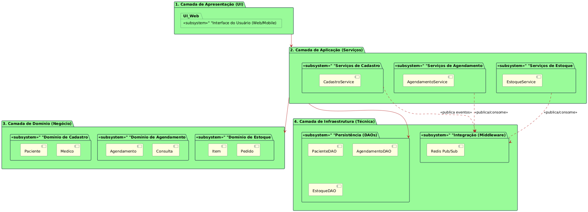

# Arquitetura do Sistema - Lógica e Física

## Sumário

- [BorderColor DarkSlateGray](#bordercolor-darkslategray)
- [BorderColor DarkSlateGray](#bordercolor-darkslategray)
- [SUBSYSTEM \"Interface do Usuário (Web/Mobile)\" as UI_Web](#subsystem-interface-do-usuário-webmobile-as-ui-web)
- [SUBSYSTEM \"Serviços de Cadastro\" as App_Cadastro {](#subsystem-serviços-de-cadastro-as-app-cadastro-)
- [SUBSYSTEM \"Serviços de Agendamento\" as App_Agendamento {](#subsystem-serviços-de-agendamento-as-app-agendamento-)
- [SUBSYSTEM \"Serviços de Estoque\" as App_Estoque {](#subsystem-serviços-de-estoque-as-app-estoque-)
- [SUBSYSTEM \"Domínio de Cadastro\" as Dom_Cadastro {](#subsystem-domínio-de-cadastro-as-dom-cadastro-)
- [SUBSYSTEM \"Domínio de Agendamento\" as Dom_Agendamento {](#subsystem-domínio-de-agendamento-as-dom-agendamento-)
- [SUBSYSTEM \"Domínio de Estoque\" as Dom_Estoque {](#subsystem-domínio-de-estoque-as-dom-estoque-)
- [SUBSYSTEM \"Persistência (DAOs)\" as Infra_DAO {](#subsystem-persistência-daos-as-infra-dao-)
- [SUBSYSTEM \"Integração (Middleware)\" as Infra_Bus {](#subsystem-integração-middleware-as-infra-bus-)
- [App_Cadastro ..\> Infra_Bus : \<\<publica eventos\>\>](#app-cadastro-infra-bus-publica-eventos)
- [App_Estoque ..\> Infra_Bus : \<\<publica/consome\>\>](#app-estoque-infra-bus-publicaconsome)
- [Fluxo de Comunicação (Exemplo: Agendamento usa Estoque):](#fluxo-de-comunicação-exemplo-agendamento-usa-estoque)
- [BorderColor DarkSlateGray](#bordercolor-darkslategray)
- [BorderColor DarkSlateGray](#bordercolor-darkslategray)
- [BorderColor DarkSlateGray](#bordercolor-darkslategray)
- [UI_Comp ..\> Cadastro_Server : \"\<\<HTTP\>\>\"](#ui-comp-cadastro-server-http)
- [UI_Comp ..\> Estoque_Server : \"\<\<HTTP\>\>\"](#ui-comp-estoque-server-http)
- [Cadastro_Comp ..\> DB_Cadastro : \"\<\<JDBC\>\>\"](#cadastro-comp-db-cadastro-jdbc)
- [Estoque_Comp ..\> DB_Estoque : \"\<\<JDBC\>\>\"](#estoque-comp-db-estoque-jdbc)
- [Cadastro_Comp \<..\> Redis_Server : \"\<\<Pub/Sub\>\>\"](#cadastro-comp-redis-server-pubsub)
- [Estoque_Comp \<..\> Redis_Server : \"\<\<Pub/Sub\>\>\"](#estoque-comp-redis-server-pubsub)

---

**3.6. Arquitetura do Sistema - Lógica e Física

1. Arquitetura Lógica (Visão de Componentes e Camadas)**

A arquitetura lógica define a organização do software, seus componentes
e suas responsabilidades, independentemente do hardware onde eles serão
executados . O diagrama abaixo aplica o conceito de divisão em camadas a
um padrão de microsserviços (ou módulos independentes), conforme sua
solicitação.

O sistema é dividido \"verticalmente\" em Partições ou Subsistemas que
representam seus módulos de negócio (Cadastro, Agendamento, Estoque) .
Cada uma dessas partições é, por sua vez, organizada \"horizontalmente\"
em quatro camadas lógicas:

1.  Camada de Apresentação (UI):

    - O que é: É a camada de interface com o usuário, responsável por
      exibir informações e capturar entradas .

    - No seu projeto: É o subsistema \"Interface do Usuário
      (Web/Mobile)\", que seria o seu front-end (ex: React, Angular,
      etc.).

2.  Camada de Aplicação (Serviços):

    - O que é: Contém a lógica de coordenação dos casos de uso e os
      serviços que o front-end consome .

    - No seu projeto: Esta camada contém seus três serviços principais,
      que são independentes:

      - CadastroService : Orquestra o caso de uso \"Cadastrar Novo
        Paciente\" (UC01).

      - AgendamentoService : Orquestra o \"Agendar Consulta\" (UC02) e
        \"Solicitar Encaixe\" (UC03).

      - EstoqueService : Orquestra \"Dar Baixa em Insumos\" (UC05) e
        \"Gerar Alerta de Estoque Crítico\" (UC07).

3.  Camada de Domínio (Negócio):

    - O que é: O coração do software. Contém as regras de negócio e as
      entidades (objetos) principais .

    - No seu projeto: Cada serviço de aplicação gerencia seu próprio
      conjunto de entidades de domínio:

      - Domínio de Cadastro: Inclui Paciente, Medico, Convenio.

      - Domínio de Agendamento: Inclui Agendamento, Consulta,
        BlocoAgenda.

      - Domínio de Estoque: Inclui Item, Pedido, Fornecedor.

4.  Camada de Infraestrutura (Técnica):

    - O que é: Fornece serviços técnicos genéricos, como acesso a banco
      de dados, envio de emails ou, no seu caso, comunicação .

    - No seu projeto: Esta camada é crucial e foi dividida em duas
      partes:

      - Persistência (DAOs): Contém as interfaces para acesso ao banco
        de dados, como PacienteDAO, AgendamentoDAO, EstoqueDAO.

      - Integração (Middleware): Este é o Redis Pub/Sub. Note que os
        serviços da Camada de Aplicação não se comunicam diretamente
        entre si. Eles dependem dessa infraestrutura de \"publicar e
        assinar\" (Pub/Sub) para trocar mensagens e sincronizar dados de
        forma assíncrona..

**Código PlantUML (Arquitetura Lógica)**

\@startuml

skinparam package {

## BorderColor DarkSlateGray

BackgroundColor PaleGreen

}

skinparam component {

## BorderColor DarkSlateGray

BackgroundColor LightYellow

ArrowColor Firebrick

}

skinparam ArrowColor Firebrick

!define SUBSYSTEM package \"\<\<subsystem\>\>\"

\' Definição das Camadas Lógicas

package \"1. Camada de Apresentação (UI)\" as UI {

## SUBSYSTEM \"Interface do Usuário (Web/Mobile)\" as UI_Web

}

package \"2. Camada de Aplicação (Serviços)\" as App {

## SUBSYSTEM \"Serviços de Cadastro\" as App_Cadastro {

\[CadastroService\]

}

## SUBSYSTEM \"Serviços de Agendamento\" as App_Agendamento {

\[AgendamentoService\]

}

## SUBSYSTEM \"Serviços de Estoque\" as App_Estoque {

\[EstoqueService\]

}

}

package \"3. Camada de Domínio (Negócio)\" as Domain {

## SUBSYSTEM \"Domínio de Cadastro\" as Dom_Cadastro {

\[Paciente\]

\[Medico\]

}

## SUBSYSTEM \"Domínio de Agendamento\" as Dom_Agendamento {

\[Agendamento\]

\[Consulta\]

}

## SUBSYSTEM \"Domínio de Estoque\" as Dom_Estoque {

\[Item\]

\[Pedido\]

}

}

package \"4. Camada de Infraestrutura (Técnica)\" as Infra {

## SUBSYSTEM \"Persistência (DAOs)\" as Infra_DAO {

\'Cada serviço terá suas próprias implementações de DAO

\[PacienteDAO\]

\[AgendamentoDAO\]

\[EstoqueDAO\]

}

## SUBSYSTEM \"Integração (Middleware)\" as Infra_Bus {

\[Redis Pub/Sub\]

}

}

\' Dependências de Camada

UI \--\> App

App \--\> Domain

App \--\> Infra_DAO

\' Dependências de Integração (Decopladas)

\' Os serviços publicam e consomem mensagens via o Barramento (Redis)

## App_Cadastro ..\> Infra_Bus : \<\<publica eventos\>\>

App_Agendamento ..\> Infra_Bus : \<\<publica/consome\>\>

## App_Estoque ..\> Infra_Bus : \<\<publica/consome\>\>

\@enduml

**2. Arquitetura Física (Visão de Implantação)**

A arquitetura física (ou diagrama de implantação) mostra como os
componentes de software da arquitetura lógica são distribuídos em nós de
processamento físicos (hardware, servidores, etc.) .

Este diagrama representa fielmente sua arquitetura de microsserviços com
bancos de dados independentes e um middleware de comunicação:

1.  Nó \"Cliente: Browser\" (Presentation Tier):

    - Este é o dispositivo do usuário final (um computador ou celular).

    - Ele executa o Componente \[Aplicação Cliente (UI)\], que é a
      interface gráfica construída (ex: em React/JS).

    - Ele se comunica com os servidores de aplicação via protocolo HTTP.

2.  Nó \"Servidor Middleware\":

    - Este é um servidor dedicado (ou um serviço de nuvem) que executa o
      \[Redis (Pub/Sub)\].

    - Ele atua como o barramento de mensagens central. Ele não armazena
      os dados principais, apenas retransmite as mensagens de
      sincronização entre os outros serviços.

3.  Nós de Microsserviços (Middle Tier e Data Tier):

    - Aqui está a principal característica da sua arquitetura. Cada
      módulo é um par de \"Servidor de Aplicação\" e \"Servidor de Banco
      de Dados\", totalmente independente dos outros.

    - Microsserviço de Cadastro:

      - Nó \"Servidor (Cadastro)\": Executa o Microsserviço de Cadastro
        (que contém o CadastroService, entidades de Paciente, etc.).

      - Nó \"DB Cadastro\": Armazena apenas os dados de cadastro. O
        serviço se comunica com ele via JDBC (ou outro driver de banco
        de dados).

    - Microsserviço de Agendamento:

      - Nó \"Servidor (Agendamento)\": Executa o Microsserviço de
        Agendamento.

      - Nó \"DB Agendamento\": Armazena apenas os dados de agendamento.

    - Microsserviço de Estoque:

      - Nó \"Servidor (Estoque)\": Executa o Microsserviço de Estoque.

      - Nó \"DB Estoque\": Armazena apenas os dados de estoque.

## Fluxo de Comunicação (Exemplo: Agendamento usa Estoque):

1.  O Cliente (Browser) envia uma requisição HTTP para o Servidor
    (Agendamento) para criar uma consulta que usa materiais.

2.  O Microsserviço de Agendamento processa a lógica e salva a consulta
    no seu DB Agendamento (via JDBC).

3.  Imediatamente após salvar, o Microsserviço de Agendamento publica
    uma mensagem (ex: \"Material X usado, 5 unidades\") no tópico
    apropriado do Servidor Middleware (Redis).

4.  O Microsserviço de Estoque, que está \"ouvindo\" (inscrito) aquele
    tópico no Redis, recebe a mensagem.

5.  O Microsserviço de Estoque processa a baixa e atualiza seu próprio
    DB Estoque (via JDBC).

Este design é robusto, escalável e garante que os módulos sejam
independentes (baixo acoplamento).

**Código PlantUML (Arquitetura Física)**

\@startuml

skinparam node {

## BorderColor DarkSlateGray

BackgroundColor LightSkyBlue

}

skinparam component {

## BorderColor DarkSlateGray

BackgroundColor LightYellow

ArrowColor Firebrick

}

skinparam database {

## BorderColor DarkSlateGray

BackgroundColor LightGray

}

skinparam ArrowColor Firebrick

\' Nó 1: Cliente

node \"Cliente: Browser\" as Browser {

component \"\[Aplicação Cliente (UI)\]\" as UI_Comp

}

\' Nó 2: Middleware

node \"Servidor Middleware\" as Redis_Server {

component \"\[Redis (Pub/Sub)\]\" as Redis_Comp

}

\' \-\-- Microsserviço de Cadastro \-\--

node \"Servidor (Cadastro)\" as Cadastro_Server {

component \"Microsserviço de Cadastro\" as Cadastro_Comp

}

database \"DB Cadastro\" as DB_Cadastro

\' \-\-- Microsserviço de Agendamento \-\--

node \"Servidor (Agendamento)\" as Agendamento_Server {

component \"Microsserviço de Agendamento\" as Agendamento_Comp

}

database \"DB Agendamento\" as DB_Agendamento

\' \-\-- Microsserviço de Estoque \-\--

node \"Servidor (Estoque)\" as Estoque_Server {

component \"Microsserviço de Estoque\" as Estoque_Comp

}

database \"DB Estoque\" as DB_Estoque

\' \-\-- Conexões \-\--

\' 1. Cliente -\> Serviços (via HTTP)

## UI_Comp ..\> Cadastro_Server : \"\<\<HTTP\>\>\"

UI_Comp ..\> Agendamento_Server : \"\<\<HTTP\>\>\"

## UI_Comp ..\> Estoque_Server : \"\<\<HTTP\>\>\"

\' 2. Serviços -\> Seus próprios Bancos de Dados (via JDBC/Driver)

## Cadastro_Comp ..\> DB_Cadastro : \"\<\<JDBC\>\>\"

Agendamento_Comp ..\> DB_Agendamento : \"\<\<JDBC\>\>\"

## Estoque_Comp ..\> DB_Estoque : \"\<\<JDBC\>\>\"

\' 3. Serviços \<-\> Middleware (via Protocolo Redis)

\' A seta \<..\> indica comunicação bidirecional (Publish e Subscribe)

## Cadastro_Comp \<..\> Redis_Server : \"\<\<Pub/Sub\>\>\"

Agendamento_Comp \<..\> Redis_Server : \"\<\<Pub/Sub\>\>\"

## Estoque_Comp \<..\> Redis_Server : \"\<\<Pub/Sub\>\>\"

\@enduml

