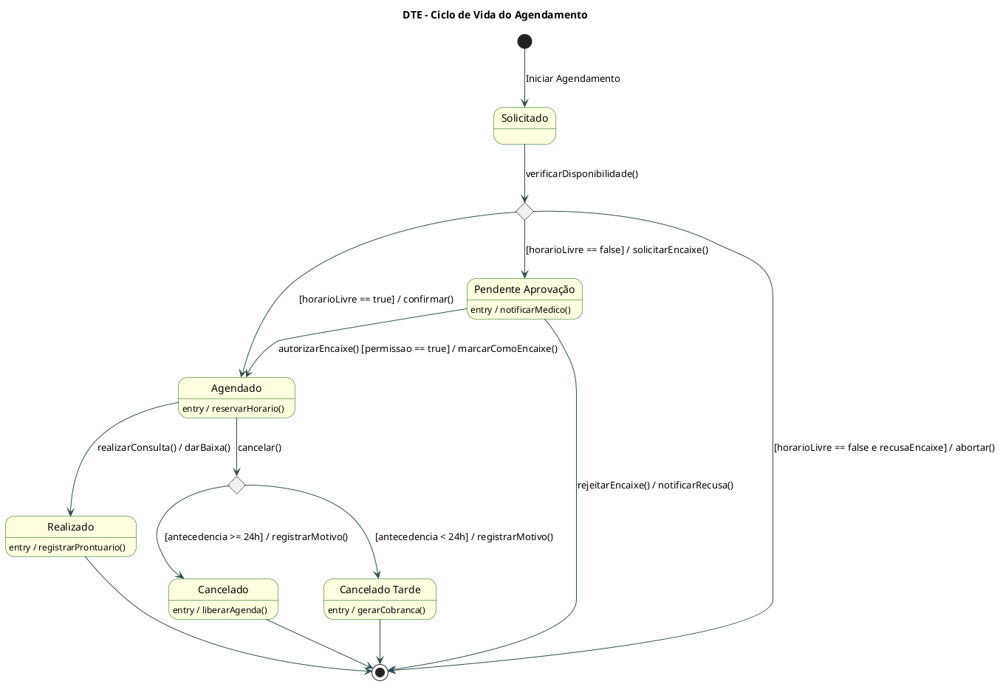
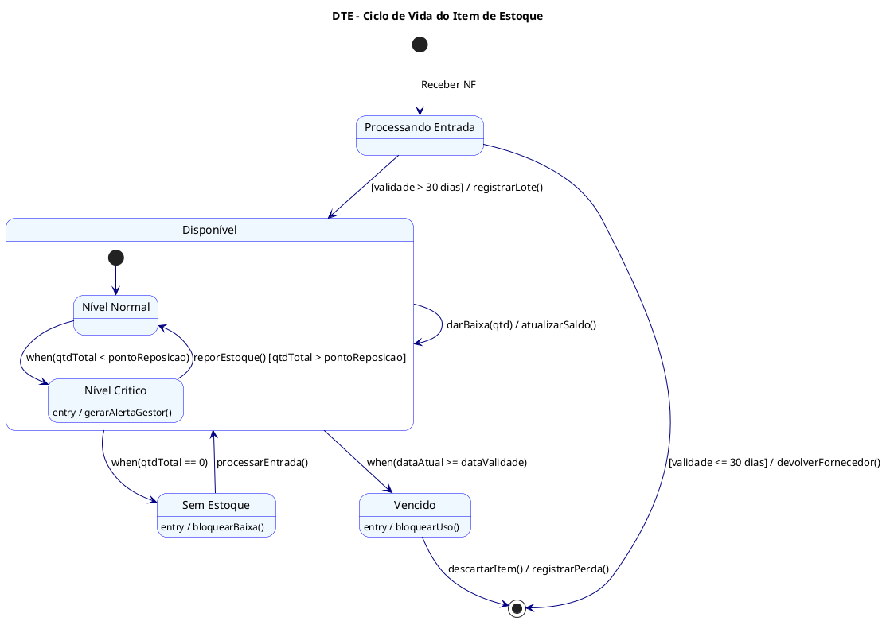
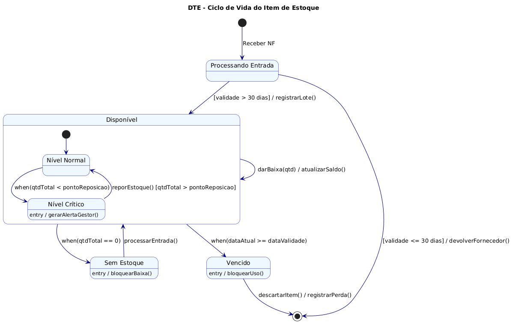
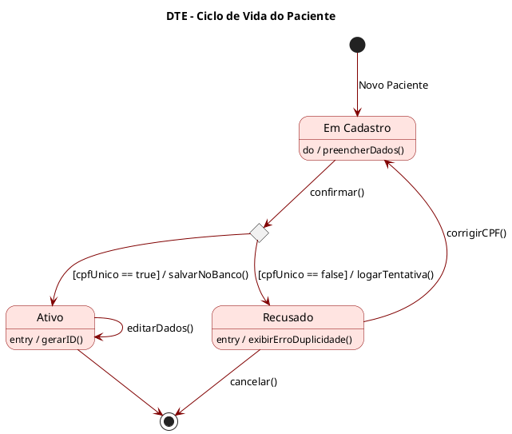
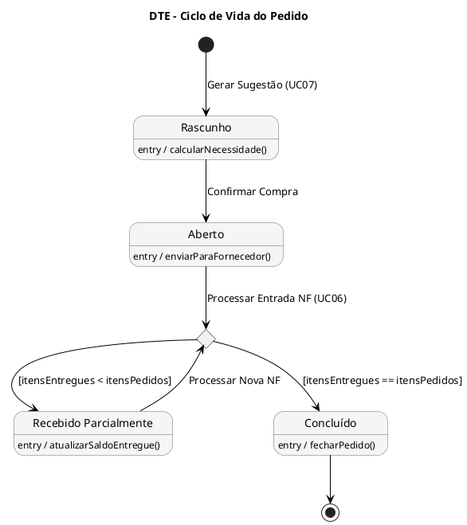
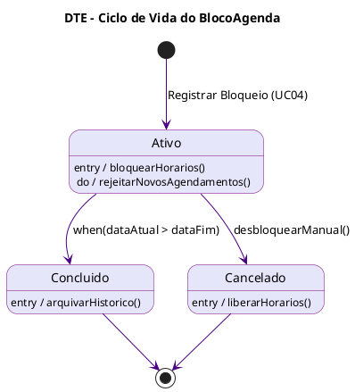

# 3.10. Modelagem de Estados

Este documento descreve o comportamento dinâmico de 5 objetos essenciais do sistema SimpleHealth, cobrindo os módulos de Cadastro, Agendamento e Estoque através de Diagramas de Transição de Estados (DTE).

## Sumário

- [Notas Técnicas - Correções de Discrepâncias](#notas-técnicas---correções-de-discrepâncias)
- [1. Descrição dos Objetos e Estados](#1-descrição-dos-objetos-e-estados)
  - [A. Módulo Cadastro: Objeto Paciente](#a-módulo-cadastro-objeto-paciente)
  - [B. Módulo Agendamento: Objeto Agendamento](#b-módulo-agendamento-objeto-agendamento)
  - [C. Módulo Estoque: Objeto Item](#c-módulo-estoque-objeto-item)
  - [D. Módulo Estoque: Objeto Pedido](#d-módulo-estoque-objeto-pedido)
  - [E. Módulo Agendamento: Objeto BlocoAgenda](#e-módulo-agendamento-objeto-blocoagenda)
- [2. Diagramas de Transição de Estados (DTE)](#2-diagramas-de-transição-de-estados-dte)
  - [DTE 1: Objeto Agendamento](#dte-1-objeto-agendamento)
  - [DTE 2: Objeto Item (Estoque)](#dte-2-objeto-item-estoque)
  - [DTE 3: Objeto Paciente](#dte-3-objeto-paciente)
  - [DTE 4: Objeto Pedido](#dte-4-objeto-pedido)
  - [DTE 5: Objeto BlocoAgenda](#dte-5-objeto-blocoagenda)

---

## Notas Técnicas - Correções de Discrepâncias

Os diagramas de estados foram atualizados para refletir discrepâncias identificadas.

### Discrepância 5.1: UC07 - Impacto no DTE Item e Pedido

**Discrepância:** Diagramas mostravam eventos de UC07 (alertas de estoque crítico), mas UC07 não implementado.

**Mudança Feita:** DTEs Item e Pedido atualizados com notas de que UC07 não funciona. Eventos when(estoqueAbaixo) existem no diagrama conceitual mas não disparam ações.

**Justificativa:** UC07 tem publisher mas nenhum subscriber. Alertas não são gerados.

**Documento Detalhado:** [📄 CORRECAO_DISCREPANCIA_5.1.md](../../../Correções%20de%20Alinhamento/CORRECAO_DISCREPANCIA_5.1.md)

---

Para consultar todas as correções, acesse o [📑 Sumário de Correções](../../../Correções%20de%20Alinhamento/SUMARIO_CORRECAO_DISCREPANCIA.md).

---

## 1. Descrição dos Objetos e Estados

### A. Módulo Cadastro: Objeto Paciente

Embora o diagrama de classes mostre o Paciente como uma entidade de dados estática, o Caso de Uso UC01 (Cadastrar Novo Paciente) define um fluxo de validação rigoroso. O objeto passa por um estágio transitório de validação antes de se tornar persistente no sistema.

#### Estados Identificados:

- **Em Validação**: O sistema verifica a formatação e unicidade do CPF
- **Ativo**: O paciente foi validado, gravado e está apto para agendamentos
- **Recusado/Erro**: O CPF já existe ou é inválido, impedindo a persistência

---

### B. Módulo Agendamento: Objeto Agendamento

Este é o objeto com o ciclo de vida mais complexo, envolvendo interações entre Paciente, Médico e Gestor. As transições dependem de disponibilidade, permissões (encaixe) e execução do serviço, conforme UC02, UC03 e UC09.

#### Estados Identificados:

- **Solicitado**: Estado inicial onde se verifica a disponibilidade na agenda
- **Agendado (Confirmado)**: O horário foi reservado com sucesso e o status na agenda do médico é "Ocupado"
- **Pendente de Aprovação (Encaixe)**: Ocorre quando há conflito de agenda, mas o usuário solicita um "Encaixe" (UC03), dependendo de permissão
- **Cancelado**: O agendamento foi revogado antes da execução. Pode ocorrer dentro ou fora do prazo (gerando penalidade/multa)
- **Realizado**: A consulta ocorreu e o sistema deu baixa

---

### C. Módulo Estoque: Objeto Item

O objeto Item possui um comportamento reativo baseado em quantidades (níveis de estoque) e tempo (validade), conforme descrito no UC07 e UC10. Isso se alinha perfeitamente aos eventos temporais (when) descritos nos slides teóricos.

#### Estados Identificados:

- **Disponível**: O item possui saldo suficiente e data de validade segura
- **Estoque Crítico**: A quantidade total caiu abaixo do ponto de reposição, exigindo alerta ao gestor
- **Vencido**: A data de validade foi ultrapassada, exigindo bloqueio de uso e descarte
- **Sem Estoque**: A quantidade total chegou a zero após baixas consecutivas

---

### D. Módulo Estoque: Objeto Pedido

O objeto Pedido gerencia o ciclo de reposição de estoque. Conforme o UC06 e UC07, ele nasce de uma necessidade (alerta de estoque crítico), torna-se uma ordem de compra e passa por um processo de recebimento que pode ser gradual.

#### Estados Identificados:

- **Rascunho (Sugerido)**: O sistema sugere a reposição baseada no estoque crítico, mas o pedido ainda não foi efetivado
- **Aberto (Enviado)**: O pedido foi confirmado e enviado ao fornecedor. Aguarda entrega
- **Recebido Parcialmente**: Parte dos itens chegou e foi processada (UC06), mas ainda há pendências
- **Concluído (Recebido Totalmente)**: Todos os itens foram entregues e o pedido é encerrado

---

### E. Módulo Agendamento: Objeto BlocoAgenda

O BlocoAgenda representa um bloqueio administrativo na agenda do médico (ex: férias, congressos), conforme o UC04. Diferente de um agendamento com paciente, ele é um impedimento de tempo.

#### Estados Identificados:

- **Ativo**: O bloqueio está vigente e impede novos agendamentos no período
- **Concluído**: A data fim do bloqueio já passou (evento temporal)
- **Cancelado**: O médico ou gestor removeu o bloqueio manualmente antes do término

---

## 2. Diagramas de Transição de Estados (DTE)

### DTE 1: Objeto Agendamento

Este diagrama destaca o uso de **Pontos de Junção** para decidir entre um agendamento normal ou um fluxo de exceção (Encaixe), e validações de cancelamento baseadas em regras de negócio.

#### Código PlantUML

#### Diagrama Gerado

---

### DTE 2: Objeto Item (Estoque)

Este diagrama foca no uso de **eventos de mudança (when)** e **eventos temporais** para controlar a validade e níveis de estoque automaticamente.

#### Código PlantUML

#### Diagrama Gerado

---

### DTE 3: Objeto Paciente

Foca na **validação inicial e unicidade do registro (CPF)**.

#### Código PlantUML

#### Diagrama Gerado

---

### DTE 4: Objeto Pedido

Ilustra o **processo de aquisição** e o **loop de recebimento parcial** até a conclusão total.

#### Código PlantUML

#### Diagrama Gerado

---

### DTE 5: Objeto BlocoAgenda

Ilustra um **ciclo de vida simples** baseado em tempo ou ação administrativa de cancelamento.

#### Código PlantUML

#### Diagrama Gerado

---

## Observações sobre os Diagramas

### Conceitos Aplicados

1. **Estados Compostos**: O Item possui um estado "Disponível" que contém dois subestados (Normal e Crítico)
2. **Pontos de Junção (Choice)**: Usados em Agendamento, Paciente e Pedido para decisões baseadas em condições
3. **Eventos Temporais (when)**: Monitoramento automático de validade (Item) e prazos (BlocoAgenda)
4. **Condições de Guarda**: Validações como `[cpfUnico == true]`, `[antecedencia >= 24h]`
5. **Ações de Entrada/Saída**: `entry /`, `do /`, ações em transições `/`

### Rastreabilidade com Casos de Uso

- **DTE Agendamento**: UC02 (Agendar Consulta), UC03 (Solicitar Encaixe), UC09 (Cancelar Agendamento)
- **DTE Item**: UC05 (Dar Baixa), UC06 (Processar Entrada NF), UC07 (Alerta de Estoque Crítico - NÃO IMPLEMENTADO), UC10 (Controlar Validade)
- **DTE Paciente**: UC01 (Cadastrar Novo Paciente)
- **DTE Pedido**: UC06 (Processar Entrada NF), UC07 (Gerar Alerta - NÃO IMPLEMENTADO)
- **DTE BlocoAgenda**: UC04 (Registrar Bloqueio de Agenda)

---

**Versão**: 1.0  
**Última Atualização**: Dezembro de 2025  
**Equipe**: Grupo 4 - SimpleHealth
