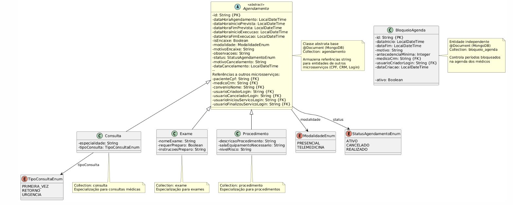
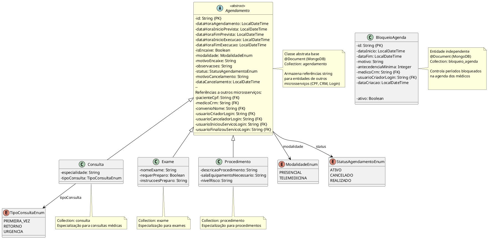
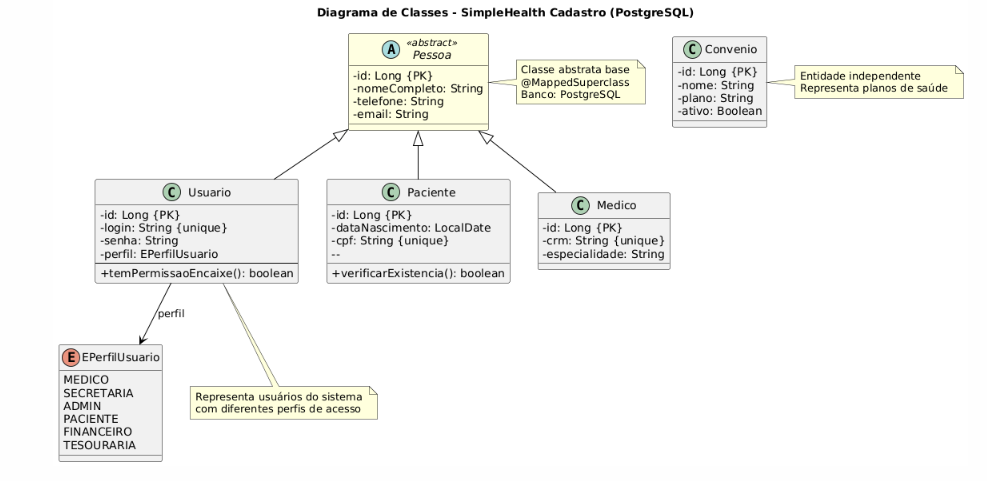
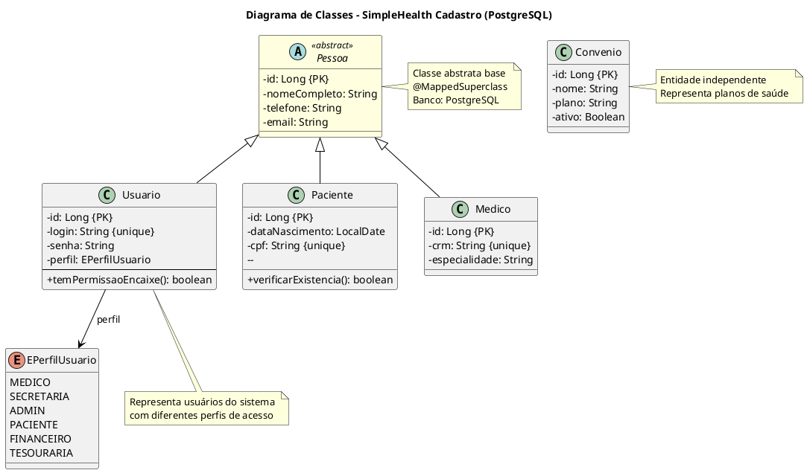
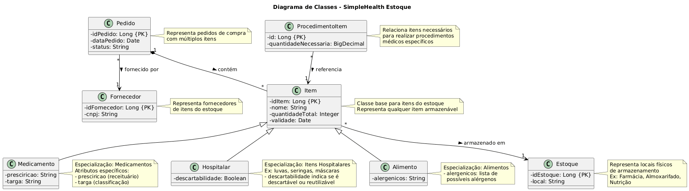

# 3.7. Modelagem de Classes de Projeto

> **⚠️ NOTA TÉCNICA - Discrepância 1.1 Resolvida:**
> 
> **Discrepância Identificada:** A documentação anterior mostrava `Medico extends Usuario`, mas a implementação real no backend possui `Medico extends Pessoa` e `Usuario extends Pessoa` como classes independentes.
> 
> **Análise de Impactos:**
> - Mudança para `Medico extends Usuario` teria **ALTO IMPACTO**
> - Requereria refatoração completa: repositories, services, DTOs, controllers, testes
> - Alteração no modelo de dados PostgreSQL (herança de tabelas)
> - Todo Médico precisaria obrigatoriamente de login/senha
> - Risco de quebra de integração com módulo de Agendamento
> 
> **Decisão:** Manter arquitetura atual do backend (Medico e Usuario são classes irmãs, ambas herdando de Pessoa). Documentação corrigida para refletir implementação real.
> 
> Data da correção: 14/12/2025

> **⚠️ NOTA TÉCNICA - Discrepância 1.4 Resolvida:**
> 
> **Discrepância Identificada:** A documentação mostrava atributos simplificados da classe `Agendamento`, mas a implementação possui atributos mais completos e robustos.
> 
> **Implementação Real (Mais Completa):**
> - Timestamps detalhados: agendamento, previsão e execução real
> - Rastreabilidade completa: usuários que criaram, cancelaram, iniciaram e finalizaram
> - Melhor controle de ciclo de vida do agendamento
> 
> **Decisão:** Atualizar documentação para refletir implementação real, que é **superior** ao planejamento inicial.
> 
> Data da correção: 14/12/2025

> **⚠️ NOTA TÉCNICA - Discrepância 1.7 Resolvida:**
> 
> **Discrepância Identificada:** A documentação mostrava relacionamento `Item "*" --> "1" Estoque`, mas a implementação Cassandra **NÃO possui este relacionamento**.
> 
> **Análise de Impacto:**
> - **Cassandra é NoSQL:** Não suporta joins nativos, relacionamentos complexos não são recomendados
> - **MVP opera com estoque único:** Todos os casos de uso funcionam sem estoqueId
> - **Custo de implementação:** ALTO (80-100 horas) - refatoração completa
> - **Benefício para MVP:** ZERO - nenhum caso de uso requer múltiplos estoques
> 
> **Decisão de Design NoSQL:**
> - ❌ Relacionamento removido da documentação
> - ✅ Sistema opera com estoque único implícito (adequado para MVP)
> - ⚠️ Possível expansão futura se necessário
> 
> Data da correção: 14/12/2025

## Sumário

- [3.7. Modelagem de Classes de Projeto](#37-modelagem-de-classes-de-projeto)
  - [Notas Técnicas - Correções de Discrepâncias](#notas-técnicas---correções-de-discrepâncias)
  - [Sumário](#sumário)
  - [1. Módulo de Agendamento](#1-módulo-de-agendamento)
    - [1.1. Diagrama de Classes - Agendamento](#11-diagrama-de-classes---agendamento)
    - [1.2. Código UML](#12-código-uml)
  - [2. Módulo de Cadastro](#2-módulo-de-cadastro)
    - [2.1. Diagrama de Classes - Cadastro](#21-diagrama-de-classes---cadastro)
    - [2.2. Código UML](#22-código-uml)
  - [3. Módulo de Estoque](#3-módulo-de-estoque)
    - [3.1. Diagrama de Classes - Estoque](#31-diagrama-de-classes---estoque)
    - [3.2. Código UML](#32-código-uml)

---

## Notas Técnicas - Correções de Discrepâncias

Este documento possui notas técnicas detalhadas inline no início (antes deste sumário). As correções principais são:

### Discrepância 1.1: Hierarquia Médico vs Usuario
[📄 CORRECAO_DISCREPANCIA_1.1.md](../../../Correções%20de%20Alinhamento/CORRECAO_DISCREPANCIA_1.1.md)

### Discrepância 1.4: Atributos de Agendamento Divergentes
[📄 CORRECAO_DISCREPANCIA_1.4.md](../../../Correções%20de%20Alinhamento/CORRECAO_DISCREPANCIA_1.4.md)

### Discrepância 1.7: Relacionamento Item ↔ Estoque Faltante
[📄 CORRECAO_DISCREPANCIA_1.7.md](../../../Correções%20de%20Alinhamento/CORRECAO_DISCREPANCIA_1.7.md)

### Discrepância 4.3: Usuario ↔ PerfilUsuario (Enum Incompleto)
[📄 CORRECAO_DISCREPANCIA_4.3.md](../../../Correções%20de%20Alinhamento/CORRECAO_DISCREPANCIA_4.3.md)

Para consultar todas as correções, acesse o [📑 Sumário de Correções](../../../Correções%20de%20Alinhamento/SUMARIO_CORRECAO_DISCREPANCIA.md).

---

## 1. Módulo de Agendamento

### 1.1. Diagrama de Classes - Agendamento



### 1.2. Código UML



---

## 2. Módulo de Cadastro

### 2.1. Diagrama de Classes - Cadastro



### 2.2. Código UML



---

## 3. Módulo de Estoque

### 3.1. Diagrama de Classes - Estoque



### 3.2. Código UML

```plantuml
@startuml Diagrama de Classes - Microsserviço Estoque 
 
title Diagrama de Classes - SimpleHealth Estoque 
 
' Configurações de estilo 
skinparam classAttributeIconSize 0 
skinparam class { 
    BackgroundColor<<abstract>> LightYellow 
    BorderColor Black 
    ArrowColor Black 
} 
 
' Classe base Item 
class Item { 
    - idItem: Long {PK} 
    - nome: String 
    - quantidadeTotal: Integer 
    - validade: Date 
} 
 
' Classes especializadas de Item 
class Medicamento { 
    - presciricao: String 
    - targa: String 
} 
 
class Hospitalar { 
    - descartabilidade: Boolean 
} 
 
class Alimento { 
    - alergenicos: String 
} 
 
' Classe Estoque 
class Estoque { 
    - idEstoque: Long {PK} 
    - local: String 
} 
 
' Classe Fornecedor 
class Fornecedor { 
    - idFornecedor: Long {PK} 
    - cnpj: String 
} 
 


' Classe Pedido 
class Pedido { 
    - idPedido: Long {PK} 
    - dataPedido: Date 
    - status: String 
} 
 
' Classe ProcedimentoItem 
class ProcedimentoItem { 
    - id: Long {PK} 
    - quantidadeNecessaria: BigDecimal 
} 
 
\' Relacionamentos de herança 
Item <|-- Medicamento 
Item <|-- Hospitalar 
Item <|-- Alimento 
 
\' Relacionamentos de composição/associação 
\' NOTA: Relacionamento Item-Estoque não implementado no Cassandra (ver Discrepância 1.7)
\' MVP opera com estoque único implícito - design NoSQL sem joins
Pedido "1" *-- "*" Item : contém > 
Pedido "*" --> "1" Fornecedor : fornecido por > 
ProcedimentoItem "*" --> "1" Item : referencia > 
 
note right of Item
    Classe base para itens do estoque 
    Representa qualquer item armazenável 
end note 
 
note right of Medicamento 
    Especialização: Medicamentos 
    Atributos específicos: 
    - presciricao (receituário) 
    - targa (classificação) 
end note 
 
note right of Hospitalar 
    Especialização: Itens Hospitalares 
    Ex: luvas, seringas, máscaras 
    - descartabilidade indica se é 
      descartável ou reutilizável 
end note 
 
note right of Alimento 
    Especialização: Alimentos 
    - alergenicos: lista de 
      possíveis alérgenos 
end note 


 
note right of Estoque 
    Representa locais físicos 
    de armazenamento 
    Ex: Farmácia, Almoxarifado, 
    Nutrição 
end note 
 
note right of Fornecedor 
    Representa fornecedores 
    de itens do estoque 
end note 
 
note right of Pedido 
    Representa pedidos de compra 
    com múltiplos itens 
end note 
 
note right of ProcedimentoItem 
    Relaciona itens necessários 
    para realizar procedimentos 
    médicos específicos 
end note

@enduml
```
