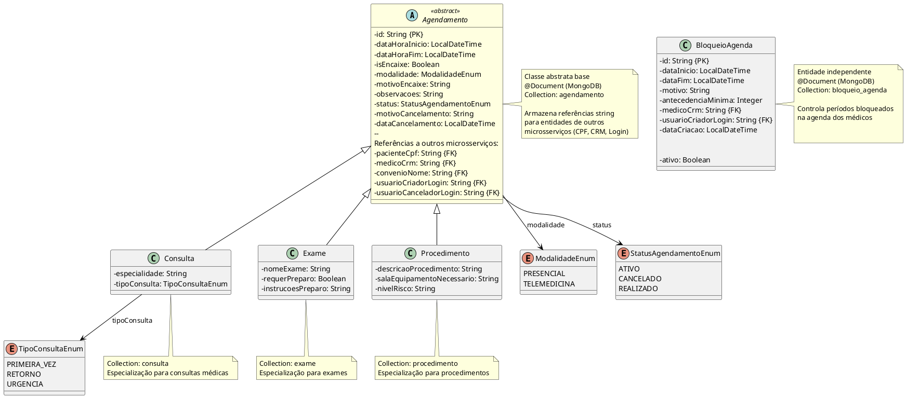
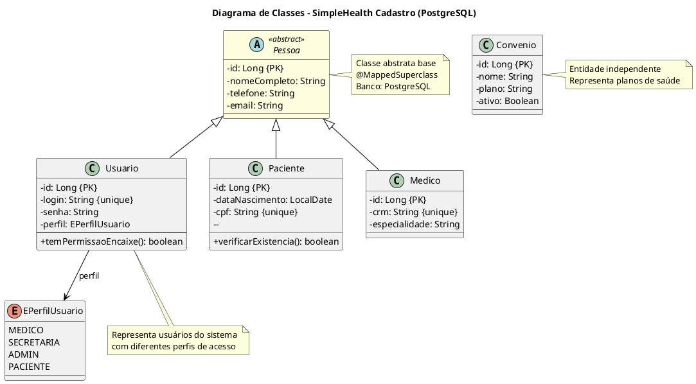
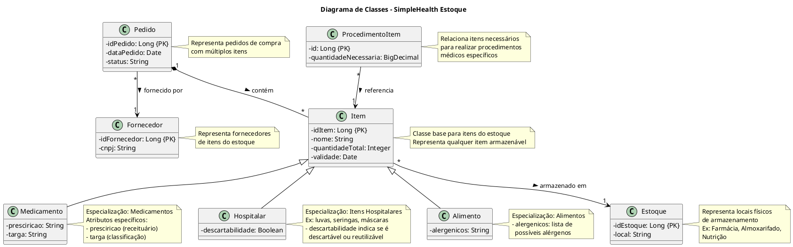

# 3.7. Modelagem de Classes de Projeto

## Sumário

- [3.7. Modelagem de Classes de Projeto](#37-modelagem-de-classes-de-projeto)
  - [Sumário](#sumário)
  - [1. Módulo de Agendamento](#1-módulo-de-agendamento)
    - [1.1. Diagrama de Classes - Agendamento](#11-diagrama-de-classes---agendamento)
    - [1.2. Código UML](#12-código-uml)
  - [2. Módulo de Cadastro](#2-módulo-de-cadastro)
    - [2.1. Diagrama de Classes - Cadastro](#21-diagrama-de-classes---cadastro)
    - [2.2. Código UML](#22-código-uml)
  - [3. Módulo de Estoque](#3-módulo-de-estoque)
    - [3.1. Diagrama de Classes - Estoque](#31-diagrama-de-classes---estoque)
    - [3.2. Código UML](#32-código-uml)

---

## 1. Módulo de Agendamento

### 1.1. Diagrama de Classes - Agendamento

### 1.2. Código UML

---

## 2. Módulo de Cadastro

### 2.1. Diagrama de Classes - Cadastro

### 2.2. Código UML

---

## 3. Módulo de Estoque

### 3.1. Diagrama de Classes - Estoque

### 3.2. Código UML

