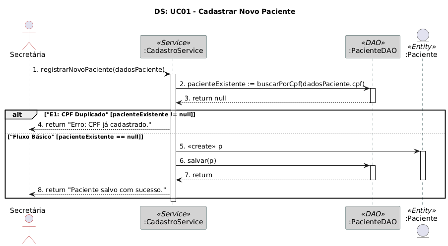
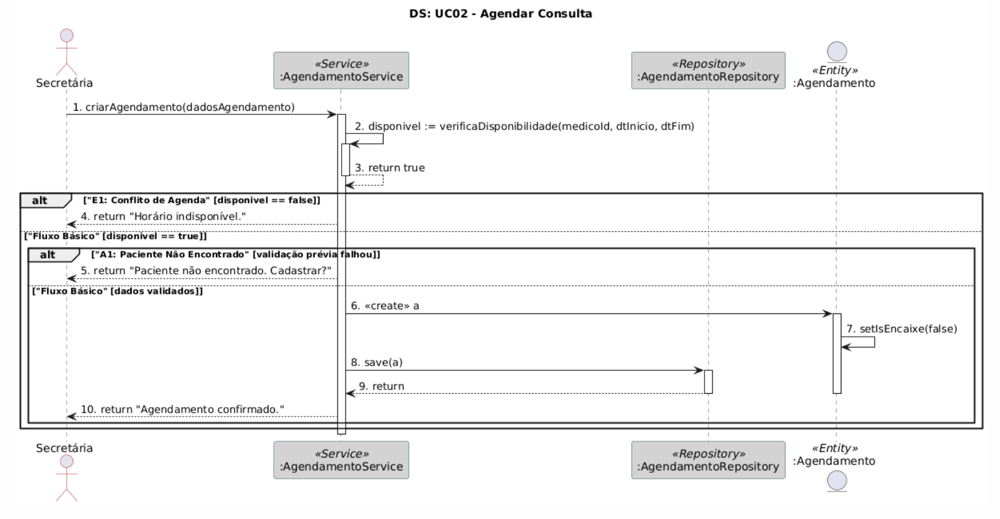
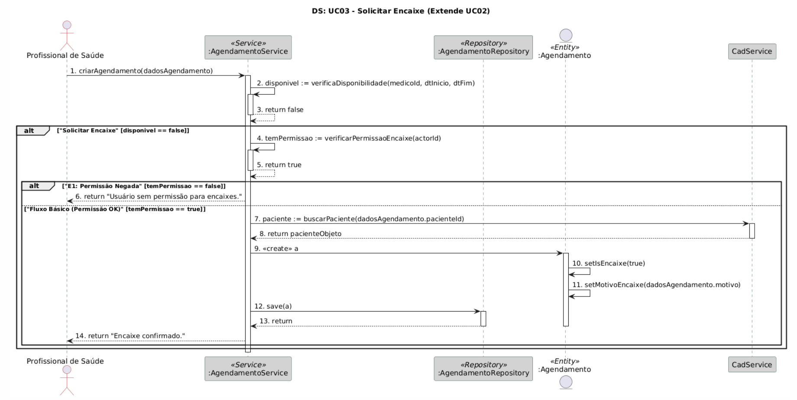
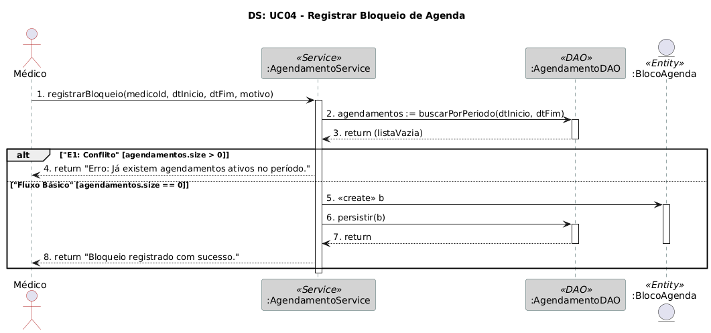
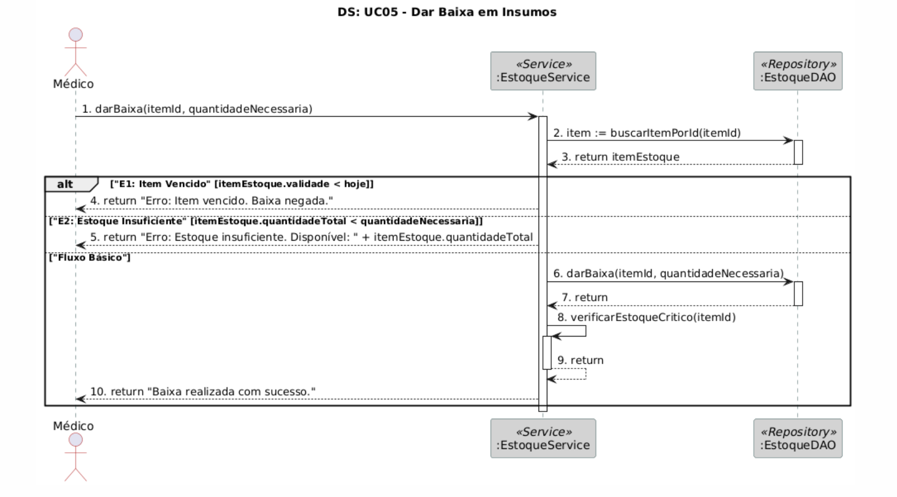
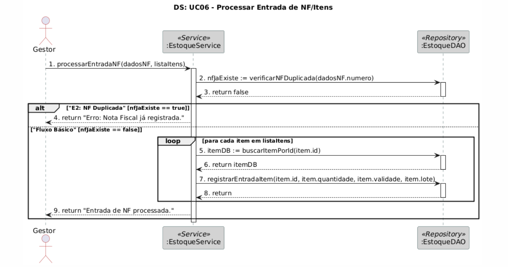
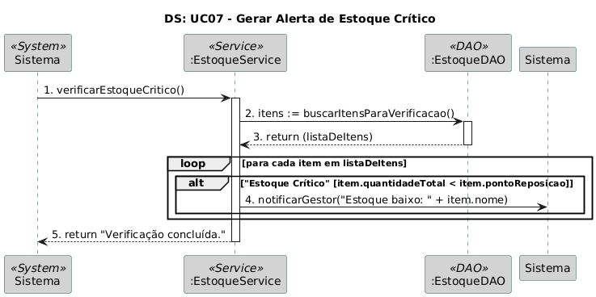
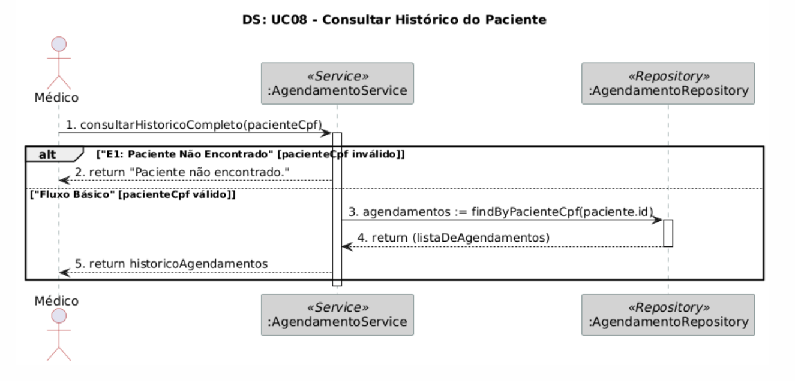
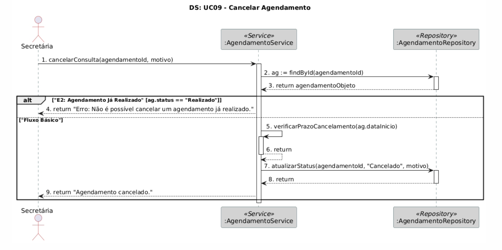
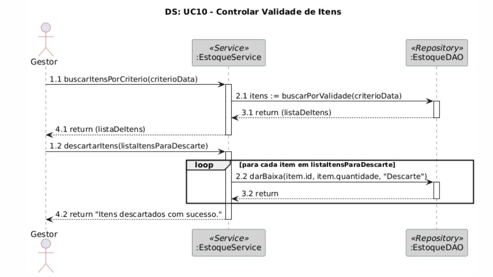

# Modelagem de Interações

## Sumário

- [UC01: Cadastrar Novo Paciente](#uc01-cadastrar-novo-paciente)
- [BorderColor DarkSlateGray](#bordercolor-darkslategray)
- [LifeLineBorderColor DarkSlateGray](#lifelinebordercolor-darkslategray)
- [Actor -\> Service: registrarNovoPaciente(dadosPaciente)](#actor---service-registrarnovopacientedadospaciente)
- [Service -\> DAO: pacienteExistente := buscarPorCpf(dadosPaciente.cpf)](#service---dao-pacienteexistente-buscarporcpfdadospacientecpf)
- [DAO \--\> Service: return null](#dao----service-return-null)
- [Service \--\> Actor: return \"Erro: CPF já cadastrado.\"](#service----actor-return-erro-cpf-já-cadastrado)
- [Service -\> Paciente: \<\<create\>\> p](#service---paciente-create-p)
- [Service -\> DAO: salvar(p)](#service---dao-salvarp)
- [DAO \--\> Service: return](#dao----service-return)
- [Service \--\> Actor: return \"Paciente salvo com sucesso.\"](#service----actor-return-paciente-salvo-com-sucesso)
- [UC02: Agendar Consulta](#uc02-agendar-consulta)
- [BorderColor DarkSlateGray](#bordercolor-darkslategray)
- [LifeLineBorderColor DarkSlateGray](#lifelinebordercolor-darkslategray)
- [Actor -\> AgService: criarAgendamento(dadosAgendamento)](#actor---agservice-criaragendamentodadosagendamento)
- [AgService \--\> AgService: return true](#agservice----agservice-return-true)
- [AgService \--\> Actor: return \"Horário indisponível.\"](#agservice----actor-return-horário-indisponível)
- [CadService \--\> AgService: return pacienteObjeto](#cadservice----agservice-return-pacienteobjeto)
- [AgService \--\> Actor: return \"Paciente não encontrado. Cadastrar?\"](#agservice----actor-return-paciente-não-encontrado-cadastrar)
- [AgService -\> Agendamento: \<\<create\>\> a](#agservice---agendamento-create-a)
- [Agendamento -\> Agendamento: setIsEncaixe(false)](#agendamento---agendamento-setisencaixefalse)
- [AgDAO \--\> Service: return](#agdao----service-return)
- [AgService \--\> Actor: return \"Agendamento confirmado.\"](#agservice----actor-return-agendamento-confirmado)
- [UC03: Solicitar Encaixe](#uc03-solicitar-encaixe)
- [BorderColor DarkSlateGray](#bordercolor-darkslategray)
- [LifeLineBorderColor DarkSlateGray](#lifelinebordercolor-darkslategray)
- [Actor -\> AgService: criarAgendamento(dadosAgendamento)](#actor---agservice-criaragendamentodadosagendamento)
- [AgService \--\> AgService: return false](#agservice----agservice-return-false)
- [AgService -\> CadService: temPermissao := temPermissaoEncaixe(actorId)](#agservice---cadservice-tempermissao-tempermissaoencaixeactorid)
- [CadService \--\> AgService: return true](#cadservice----agservice-return-true)
- [AgService \--\> Actor: return \"Usuário sem permissão para encaixes.\"](#agservice----actor-return-usuário-sem-permissão-para-encaixes)
- [CadService \--\> AgService: return pacienteObjeto](#cadservice----agservice-return-pacienteobjeto)
- [AgService -\> Agendamento: \<\<create\>\> a](#agservice---agendamento-create-a)
- [Agendamento -\> Agendamento: setIsEncaixe(true)](#agendamento---agendamento-setisencaixetrue)
- [AgService -\> AgDAO: persistir(a)](#agservice---agdao-persistira)
- [AgDAO \--\> AgService: return](#agdao----agservice-return)
- [AgService \--\> Actor: return \"Encaixe confirmado.\"](#agservice----actor-return-encaixe-confirmado)
- [BorderColor DarkSlateGray](#bordercolor-darkslategray)
- [LifeLineBorderColor DarkSlateGray](#lifelinebordercolor-darkslategray)
- [AgService -\> AgDAO: agendamentos := buscarPorPeriodo(dtInicio, dtFim)](#agservice---agdao-agendamentos-buscarporperiododtinicio-dtfim)
- [AgDAO \--\> AgService: return (listaVazia)](#agdao----agservice-return-listavazia)
- [AgService -\> Bloco: \<\<create\>\> b](#agservice---bloco-create-b)
- [AgService -\> AgDAO: persistir(b)](#agservice---agdao-persistirb)
- [AgDAO \--\> AgService: return](#agdao----agservice-return)
- [AgService \--\> Actor: return \"Bloqueio registrado com sucesso.\"](#agservice----actor-return-bloqueio-registrado-com-sucesso)
- [UC05: Dar Baixa em Insumos](#uc05-dar-baixa-em-insumos)
- [BorderColor DarkSlateGray](#bordercolor-darkslategray)
- [LifeLineBorderColor DarkSlateGray](#lifelinebordercolor-darkslategray)
- [Actor -\> Service: darBaixa(itemId, quantidadeNecessaria)](#actor---service-darbaixaitemid-quantidadenecessaria)
- [Service -\> DAO: item := buscarItemPorId(itemId)](#service---dao-item-buscaritemporiditemid)
- [DAO \--\> Service: return itemEstoque](#dao----service-return-itemestoque)
- [Service \--\> Actor: return \"Erro: Item vencido. Baixa negada.\"](#service----actor-return-erro-item-vencido-baixa-negada)
- [Service -\> DAO: darBaixa(itemId, quantidadeNecessaria)](#service---dao-darbaixaitemid-quantidadenecessaria)
- [DAO \--\> Service: return](#dao----service-return)
- [Service -\> Service: verificarEstoqueCritico(itemId)](#service---service-verificarestoquecriticoitemid)
- [Service \--\> Service: return](#service----service-return)
- [Service \--\> Actor: return \"Baixa realizada com sucesso.\"](#service----actor-return-baixa-realizada-com-sucesso)
- [BorderColor DarkSlateGray](#bordercolor-darkslategray)
- [LifeLineBorderColor DarkSlateGray](#lifelinebordercolor-darkslategray)
- [Actor -\> Service: processarEntradaNF(dadosNF, listaItens)](#actor---service-processarentradanfdadosnf-listaitens)
- [Service -\> DAO: nfJaExiste := verificarNFDuplicada(dadosNF.numero)](#service---dao-nfjaexiste-verificarnfduplicadadadosnfnumero)
- [DAO \--\> Service: return false](#dao----service-return-false)
- [Service \--\> Actor: return \"Erro: Nota Fiscal já registrada.\"](#service----actor-return-erro-nota-fiscal-já-registrada)
- [Service -\> DAO: itemDB := buscarItemPorId(item.id)](#service---dao-itemdb-buscaritemporiditemid)
- [DAO \--\> Service: return itemDB](#dao----service-return-itemdb)
- [DAO \--\> Service: return](#dao----service-return)
- [Service \--\> Actor: return \"Entrada de NF processada.\"](#service----actor-return-entrada-de-nf-processada)
- [BorderColor DarkSlateGray](#bordercolor-darkslategray)
- [LifeLineBorderColor DarkSlateGray](#lifelinebordercolor-darkslategray)
- [Actor -\> Service: verificarEstoqueCritico()](#actor---service-verificarestoquecritico)
- [Service -\> DAO: itens := buscarItensParaVerificacao()](#service---dao-itens-buscaritensparaverificacao)
- [DAO \--\> Service: return (listaDeItens)](#dao----service-return-listadeitens)
- [Service -\> Sistema: notificarGestor(\"Estoque baixo: \" + item.nome)](#service---sistema-notificargestorestoque-baixo-itemnome)
- [Service \--\> Actor: return \"Verificação concluída.\"](#service----actor-return-verificação-concluída)
- [BorderColor DarkSlateGray](#bordercolor-darkslategray)
- [LifeLineBorderColor DarkSlateGray](#lifelinebordercolor-darkslategray)
- [Actor -\> AgService: consultarHistoricoCompleto(pacienteCpf)](#actor---agservice-consultarhistoricocompletopacientecpf)
- [AgService -\> CadService: paciente := buscarPacientePorCpf(pacienteCpf)](#agservice---cadservice-paciente-buscarpacienteporcpfpacientecpf)
- [CadService \--\> AgService: return pacienteObjeto](#cadservice----agservice-return-pacienteobjeto)
- [AgService \--\> Actor: return \"Paciente não encontrado.\"](#agservice----actor-return-paciente-não-encontrado)
- [AgDAO \--\> AgService: return (listaDeAgendamentos)](#agdao----agservice-return-listadeagendamentos)
- [EstDAO \--\> AgService: return (listaDeInsumos)](#estdao----agservice-return-listadeinsumos)
- [AgService \--\> Actor: return historicoCompleto](#agservice----actor-return-historicocompleto)
- [UC09: Cancelar Agendamento](#uc09-cancelar-agendamento)
- [BorderColor DarkSlateGray](#bordercolor-darkslategray)
- [LifeLineBorderColor DarkSlateGray](#lifelinebordercolor-darkslategray)
- [Actor -\> AgService: cancelarConsulta(agendamentoId, motivo)](#actor---agservice-cancelarconsultaagendamentoid-motivo)
- [AgService -\> AgDAO: ag := buscarAgendamentoPorId(agendamentoId)](#agservice---agdao-ag-buscaragendamentoporidagendamentoid)
- [AgDAO \--\> AgService: return agendamentoObjeto](#agdao----agservice-return-agendamentoobjeto)
- [AgService -\> AgService: verificarPrazoCancelamento(ag.dataInicio)](#agservice---agservice-verificarprazocancelamentoagdatainicio)
- [AgService \--\> AgService: return](#agservice----agservice-return)
- [AgDAO \--\> AgService: return](#agdao----agservice-return)
- [AgService \--\> Actor: return \"Agendamento cancelado.\"](#agservice----actor-return-agendamento-cancelado)
- [BorderColor DarkSlateGray](#bordercolor-darkslategray)
- [LifeLineBorderColor DarkSlateGray](#lifelinebordercolor-darkslategray)
- [Actor -\> Service: buscarItensPorCriterio(criterioData)](#actor---service-buscaritensporcriteriocriteriodata)
- [Service -\> DAO: itens := buscarPorValidade(criterioData)](#service---dao-itens-buscarporvalidadecriteriodata)
- [DAO \--\> Service: return (listaDeItens)](#dao----service-return-listadeitens)
- [Service \--\> Actor: return (listaDeItens)](#service----actor-return-listadeitens)
- [Actor -\> Service: descartarItens(listaItensParaDescarte)](#actor---service-descartaritenslistaitensparadescarte)
- [Service -\> DAO: darBaixa(item.id, item.quantidade, \"Descarte\")](#service---dao-darbaixaitemid-itemquantidade-descarte)
- [DAO \--\> Service: return](#dao----service-return)
- [Service \--\> Actor: return \"Itens descartados com sucesso.\"](#service----actor-return-itens-descartados-com-sucesso)

---

3.9. Modelagem de Interações

## UC01: Cadastrar Novo Paciente

\@startuml

\' Diagrama de Sequência para UC01: Cadastrar Novo Paciente

\' Baseado no Fluxo Básico e Exceção E1 do documento de Casos de Uso

\' e métodos do Diagrama de Classes.

skinparam participant {

## BorderColor DarkSlateGray

BackgroundColor LightGray

ArrowColor Firebrick

}

skinparam sequence {

## LifeLineBorderColor DarkSlateGray

ActorBorderColor Firebrick

}

title \"DS: UC01 - Cadastrar Novo Paciente\"

actor Secretária as Actor

\' Define os participantes conforme o Diagrama de Classes e Arquitetura
Lógica

\' O CadastroService atua como Controlador/Facade

participant \":CadastroService\" as Service \<\<Service\>\>

participant \":PacienteDAO\" as DAO \<\<DAO\>\>

entity \":Paciente\" as Paciente \<\<Entity\>\>

autonumber \"0.\"

## Actor -\> Service: registrarNovoPaciente(dadosPaciente)

activate Service

\' Passo 4: O Sistema valida o formato e a unicidade do CPF.

## Service -\> DAO: pacienteExistente := buscarPorCpf(dadosPaciente.cpf)

activate DAO

\' Supondo que o DAO consulta o banco e não encontra o CPF

## DAO \--\> Service: return null

deactivate DAO

\' Bloco de alternativa (alt) para tratar o Fluxo de Exceção E1

alt \"E1: CPF Duplicado\" \[pacienteExistente != null\]

## Service \--\> Actor: return \"Erro: CPF já cadastrado.\"

else \"Fluxo Básico\" \[pacienteExistente == null\]

\' Passo 7: O Sistema salva o novo registro

\' O Serviço cria a entidade

## Service -\> Paciente: \<\<create\>\> p

activate Paciente

\' O Serviço comanda o DAO para salvar a entidade

## Service -\> DAO: salvar(p)

activate DAO

## DAO \--\> Service: return

deactivate DAO

deactivate Paciente

\' Passo 8: O caso de uso é encerrado

## Service \--\> Actor: return \"Paciente salvo com sucesso.\"

end

deactivate Service

\@enduml

## UC02: Agendar Consulta

\@startuml

\' Diagrama de Sequência para UC02: Agendar Consulta

\' Baseado no Fluxo Básico, Alternativo A1 e Exceção E1.

\' Demonstra a colaboração entre diferentes serviços (Agendamento e
Cadastro).

skinparam participant {

## BorderColor DarkSlateGray

BackgroundColor LightGray

ArrowColor Firebrick

}

skinparam sequence {

## LifeLineBorderColor DarkSlateGray

ActorBorderColor Firebrick

}

title \"DS: UC02 - Agendar Consulta\"

actor Secretária as Actor

\' Participantes baseados no Diagrama de Classes

participant \":AgendamentoService\" as AgService \<\<Service\>\>

participant \":CadastroService\" as CadService \<\<Service\>\>

participant \":AgendamentoDAO\" as AgDAO \<\<DAO\>\>

entity \":Agendamento\" as Agendamento \<\<Entity\>\>

autonumber \"0.\"

\' Passos 1, 2, 5, 6 do UC: Usuário seleciona data, paciente, tipo e
confirma

## Actor -\> AgService: criarAgendamento(dadosAgendamento)

activate AgService

\' Passo 3: O Sistema consulta o AgendamentoService para verificar a
disponibilidade.

\' Esta é uma auto-mensagem

AgService -\> AgService: disponivel := verificaDisponibilidade(medicoId,
dtInicio, dtFim)

activate AgService

\' Supondo happy path

## AgService \--\> AgService: return true

deactivate AgService

\' Bloco \'alt\' para tratar Exceção E1 (Conflito de Agenda)

alt \"E1: Conflito de Agenda\" \[disponivel == false\]

## AgService \--\> Actor: return \"Horário indisponível.\"

else \"Fluxo Básico\" \[disponivel == true\]

\' Passo 4: O usuário pesquisa e seleciona o Paciente\... usando o
CadastroService

\' A classe AgendamentoService depende do CadastroService

AgService -\> CadService: paciente :=
buscarPaciente(dadosAgendamento.pacienteId)

activate CadService

\' Supondo happy path

## CadService \--\> AgService: return pacienteObjeto

deactivate CadService

\' Bloco \'alt\' para tratar Fluxo Alternativo A1 (Paciente Não
Encontrado)

alt \"A1: Paciente Não Encontrado\" \[paciente == null\]

## AgService \--\> Actor: return \"Paciente não encontrado. Cadastrar?\"

else \"Fluxo Básico\" \[paciente != null\]

\' Passo 7: O Sistema salva a Consulta

## AgService -\> Agendamento: \<\<create\>\> a

activate Agendamento

\' Define o atributo isEncaixe como false por padrão

## Agendamento -\> Agendamento: setIsEncaixe(false)

AgService -\> AgDAO: persistir(a)

activate AgDAO

## AgDAO \--\> Service: return

deactivate AgDAO

deactivate Agendamento

\' Passo 8: O caso de uso é encerrado

## AgService \--\> Actor: return \"Agendamento confirmado.\"

end

end

deactivate AgService

\@enduml

## UC03: Solicitar Encaixe

\@startuml

\' Diagrama de Sequência para UC03: Solicitar Encaixe

\' Baseado no Fluxo Básico e Exceção E1. Este UC extende UC02.

skinparam participant {

## BorderColor DarkSlateGray

BackgroundColor LightGray

ArrowColor Firebrick

}

skinparam sequence {

## LifeLineBorderColor DarkSlateGray

ActorBorderColor Firebrick

}

title \"DS: UC03 - Solicitar Encaixe (Extende UC02)\"

actor \"Profissional de Saúde\" as Actor

\' Participantes baseados no Diagrama de Classes

participant \":AgendamentoService\" as AgService \<\<Service\>\>

participant \":CadastroService\" as CadService \<\<Service\>\>

participant \":AgendamentoDAO\" as AgDAO \<\<DAO\>\>

entity \":Agendamento\" as Agendamento \<\<Entity\>\>

autonumber \"0.\"

\' Passo 1: O Ator tenta realizar o UC02 (Agendar Consulta)

## Actor -\> AgService: criarAgendamento(dadosAgendamento)

activate AgService

\' Passo 1 (cont.): \...mas a verificação de disponibilidade falha.

AgService -\> AgService: disponivel := verificaDisponibilidade(medicoId,
dtInicio, dtFim)

activate AgService

## AgService \--\> AgService: return false

deactivate AgService

\' Passo 2 e 3: O Sistema pergunta \"Deseja solicitar um encaixe?\" e o
Ator confirma.

\' Bloco \'alt\' para o fluxo de encaixe

alt \"Solicitar Encaixe\" \[disponivel == false\]

\' Passo 4: O Sistema verifica a permissão do Ator

\' O UC menciona \"temPermissaoEncaixe()\"

## AgService -\> CadService: temPermissao := temPermissaoEncaixe(actorId)

activate CadService

## CadService \--\> AgService: return true

deactivate CadService

\' Bloco \'alt\' para tratar Exceção E1 (Permissão Negada)

alt \"E1: Permissão Negada\" \[temPermissao == false\]

## AgService \--\> Actor: return \"Usuário sem permissão para encaixes.\"

else \"Fluxo Básico (Permissão OK)\" \[temPermissao == true\]

\' Re-valida o paciente (como no UC02)

AgService -\> CadService: paciente :=
buscarPaciente(dadosAgendamento.pacienteId)

activate CadService

## CadService \--\> AgService: return pacienteObjeto

deactivate CadService

\' Passo 5: O Sistema salva o Agendamento com o flag isEncaixe = true

## AgService -\> Agendamento: \<\<create\>\> a

activate Agendamento

## Agendamento -\> Agendamento: setIsEncaixe(true)

Agendamento -\> Agendamento: setMotivoEncaixe(dadosAgendamento.motivo)

## AgService -\> AgDAO: persistir(a)

activate AgDAO

## AgDAO \--\> AgService: return

deactivate AgDAO

deactivate Agendamento

\' Passo 6: O caso de uso é encerrado

## AgService \--\> Actor: return \"Encaixe confirmado.\"

end

end

deactivate AgService

\@enduml

**UC04: Registrar Bloqueio de Agenda**

\@startuml

\' Diagrama de Sequência para UC04: Registrar Bloqueio de Agenda

\' Baseado no Fluxo Básico e Exceção E1.

skinparam participant {

## BorderColor DarkSlateGray

BackgroundColor LightGray

ArrowColor Firebrick

}

skinparam sequence {

## LifeLineBorderColor DarkSlateGray

ActorBorderColor Firebrick

}

title \"DS: UC04 - Registrar Bloqueio de Agenda\"

\' Ator pode ser Médico ou Gestor

actor Médico as Actor

\' Participantes baseados no Diagrama de Classes

participant \":AgendamentoService\" as AgService \<\<Service\>\>

participant \":AgendamentoDAO\" as AgDAO \<\<DAO\>\>

entity \":BlocoAgenda\" as Bloco \<\<Entity\>\>

autonumber \"0.\"

\' Passos 1-3, 5: Ator acessa função, informa dados e confirma

Actor -\> AgService: registrarBloqueio(medicoId, dtInicio, dtFim,
motivo)

activate AgService

\' Passo 4: O Sistema verifica a existência de Agendamentos Ativos

\' O método buscarPorPeriodo(data) é usado para essa verificação

## AgService -\> AgDAO: agendamentos := buscarPorPeriodo(dtInicio, dtFim)

activate AgDAO

\' Supondo happy path (sem conflitos)

## AgDAO \--\> AgService: return (listaVazia)

deactivate AgDAO

\' Bloco \'alt\' para tratar Exceção E1 (Conflito com Agendamento)

alt \"E1: Conflito\" \[agendamentos.size \> 0\]

AgService \--\> Actor: return \"Erro: Já existem agendamentos ativos no
período.\"

else \"Fluxo Básico\" \[agendamentos.size == 0\]

\' Passo 6: O Sistema salva o novo BlocoAgenda

\' O UC diz que salva no AgendamentoDAO

## AgService -\> Bloco: \<\<create\>\> b

activate Bloco

\' Assumindo que o AgendamentoDAO pode persistir um BlocoAgenda

## AgService -\> AgDAO: persistir(b)

activate AgDAO

## AgDAO \--\> AgService: return

deactivate AgDAO

deactivate Bloco

\' Passo 7: O caso de uso é encerrado

## AgService \--\> Actor: return \"Bloqueio registrado com sucesso.\"

end

deactivate AgService

\@enduml

## UC05: Dar Baixa em Insumos

\@startuml

\' Diagrama de Sequência para UC05: Dar Baixa em Insumos

\' Baseado no Fluxo Básico e Exceções E1 e E2.

skinparam participant {

## BorderColor DarkSlateGray

BackgroundColor LightGray

ArrowColor Firebrick

}

skinparam sequence {

## LifeLineBorderColor DarkSlateGray

ActorBorderColor Firebrick

}

title \"DS: UC05 - Dar Baixa em Insumos\"

\' Ator pode ser Médico ou Secretária

actor Médico as Actor

\' Participantes baseados no Diagrama de Classes

participant \":EstoqueService\" as Service \<\<Service\>\>

participant \":EstoqueDAO\" as DAO \<\<DAO\>\>

autonumber \"0.\"

\' Passos 1, 2, 4: Ator acessa função, seleciona item e informa
quantidade

## Actor -\> Service: darBaixa(itemId, quantidadeNecessaria)

activate Service

\' Passo 5: O Sistema consulta o EstoqueDAO para verificar a validade e
a disponibilidade.

## Service -\> DAO: item := buscarItemPorId(itemId)

activate DAO

\' Supondo happy path

## DAO \--\> Service: return itemEstoque

deactivate DAO

\' Bloco \'alt\' para tratar Exceções E1 (Vencido) e E2 (Insuficiente)

alt \"E1: Item Vencido\" \[itemEstoque.validade \< hoje\]

## Service \--\> Actor: return \"Erro: Item vencido. Baixa negada.\"

else \"E2: Estoque Insuficiente\" \[itemEstoque.quantidadeTotal \<
quantidadeNecessaria\]

Service \--\> Actor: return \"Erro: Estoque insuficiente. Disponível:
\" + itemEstoque.quantidadeTotal

else \"Fluxo Básico\"

\' Passo 6: O Sistema atualiza a quantidade Total do Item no Estoque.

\' O próprio método darBaixa(id, qtde) no DAO deve fazer isso.

## Service -\> DAO: darBaixa(itemId, quantidadeNecessaria)

activate DAO

## DAO \--\> Service: return

deactivate DAO

\' Passo 7: O Sistema dispara a verificação de Estoque Crítico (UC07)

\' Auto-mensagem

## Service -\> Service: verificarEstoqueCritico(itemId)

activate Service

\' A lógica do UC07 (alerta) acontece aqui

## Service \--\> Service: return

deactivate Service

\' Passo 8: O caso de uso é encerrado

## Service \--\> Actor: return \"Baixa realizada com sucesso.\"

end

deactivate Service

\@enduml

**UC06: Processar Entrada de NF/Itens**

\@startuml

\' Diagrama de Sequência para UC06: Processar Entrada de NF/Itens

\' Baseado no Fluxo Básico e Exceção E2.

skinparam participant {

## BorderColor DarkSlateGray

BackgroundColor LightGray

ArrowColor Firebrick

}

skinparam sequence {

## LifeLineBorderColor DarkSlateGray

ActorBorderColor Firebrick

}

title \"DS: UC06 - Processar Entrada de NF/Itens\"

actor Gestor as Actor

\' Participantes baseados no Diagrama de Classes

participant \":EstoqueService\" as Service \<\<Service\>\>

participant \":EstoqueDAO\" as DAO \<\<DAO\>\>

autonumber \"0.\"

\' Passos 1-2: Ator acessa função e informa NF/Fornecedor

## Actor -\> Service: processarEntradaNF(dadosNF, listaItens)

activate Service

\' Passo E2 (antes): O Sistema verifica se a NF é duplicada

## Service -\> DAO: nfJaExiste := verificarNFDuplicada(dadosNF.numero)

activate DAO

## DAO \--\> Service: return false

deactivate DAO

\' Bloco \'alt\' para tratar Exceção E2 (NF Duplicada)

alt \"E2: NF Duplicada\" \[nfJaExiste == true\]

## Service \--\> Actor: return \"Erro: Nota Fiscal já registrada.\"

else \"Fluxo Básico\" \[nfJaExiste == false\]

\' Passo 3: O usuário insere a lista de Itens

\' Bloco \'loop\' para iterar sobre os itens da NF

loop para cada item em listaItens

\' Passo 4: O Sistema consulta o EstoqueService (DAO)

## Service -\> DAO: itemDB := buscarItemPorId(item.id)

activate DAO

## DAO \--\> Service: return itemDB

deactivate DAO

\' Passo 5: O Sistema incrementa a quantidade

\' (Assumindo um método no DAO para isso)

Service -\> DAO: registrarEntradaItem(item.id, item.quantidade,
item.validade, item.lote)

activate DAO

## DAO \--\> Service: return

deactivate DAO

end

\' Passo 7: O caso de uso é encerrado

## Service \--\> Actor: return \"Entrada de NF processada.\"

end

deactivate Service

\@enduml

**UC07: Gerar Alerta de Estoque Crítico**

\@startuml

\' Diagrama de Sequência para UC07: Gerar Alerta de Estoque Crítico

\' Baseado no Fluxo Básico. Ator é o Sistema.

skinparam participant {

## BorderColor DarkSlateGray

BackgroundColor LightGray

ArrowColor Firebrick

}

skinparam sequence {

## LifeLineBorderColor DarkSlateGray

ActorBorderColor Firebrick

}

title \"DS: UC07 - Gerar Alerta de Estoque Crítico\"

\' O Ator é o Sistema, disparado por um gatilho (timer)

participant Sistema as Actor \<\<System\>\>

participant \":EstoqueService\" as Service \<\<Service\>\>

participant \":EstoqueDAO\" as DAO \<\<DAO\>\>

autonumber \"0.\"

\' Passo 1: O Sistema inicia a verificação

\' (O UC05/UC06 pode chamar isso, ou um timer. Modelando o timer)

## Actor -\> Service: verificarEstoqueCritico()

activate Service

\' Passo 2: O Sistema percorre todos os Itens ativos

\' (Assumindo um método no DAO que busca itens relevantes)

## Service -\> DAO: itens := buscarItensParaVerificacao()

activate DAO

## DAO \--\> Service: return (listaDeItens)

deactivate DAO

\' Bloco \'loop\' para iterar sobre os itens

loop para cada item em listaDeItens

\' Passo 3 e 4: Compara quantidade e gera alerta

alt \"Estoque Crítico\" \[item.quantidadeTotal \< item.pontoReposicao\]

\' Passo 5: O Sistema notifica o Gestor

\' (Inferindo um serviço de notificação)

## Service -\> Sistema: notificarGestor(\"Estoque baixo: \" + item.nome)

end

end

\' Passo 6: O caso de uso é encerrado

## Service \--\> Actor: return \"Verificação concluída.\"

deactivate Service

\@enduml

**UC08: Consultar Histórico do Paciente**

\@startuml

\' Diagrama de Sequência para UC08: Consultar Histórico do Paciente

\' Baseado no Fluxo Básico.

skinparam participant {

## BorderColor DarkSlateGray

BackgroundColor LightGray

ArrowColor Firebrick

}

skinparam sequence {

## LifeLineBorderColor DarkSlateGray

ActorBorderColor Firebrick

}

title \"DS: UC08 - Consultar Histórico do Paciente\"

actor Médico as Actor

\' Participantes: O AgendamentoService orquestra, chamando outros
serviços

participant \":AgendamentoService\" as AgService \<\<Service\>\>

participant \":CadastroService\" as CadService \<\<Service\>\>

participant \":AgendamentoDAO\" as AgDAO \<\<DAO\>\>

participant \":EstoqueDAO\" as EstDAO \<\<DAO\>\>

autonumber \"0.\"

\' Passo 1 e 2: Ator acessa função e pesquisa paciente

## Actor -\> AgService: consultarHistoricoCompleto(pacienteCpf)

activate AgService

\' Passo 3: O Sistema exibe os dados cadastrais (via CadastroService)

## AgService -\> CadService: paciente := buscarPacientePorCpf(pacienteCpf)

activate CadService

## CadService \--\> AgService: return pacienteObjeto

deactivate CadService

\' Bloco \'alt\' para Exceção E1 (Paciente Não Encontrado)

alt \"E1: Paciente Não Encontrado\" \[paciente == null\]

## AgService \--\> Actor: return \"Paciente não encontrado.\"

else \"Fluxo Básico\" \[paciente != null\]

\' Passo 4: O Sistema consolida a lista de Agendamentos

AgService -\> AgDAO: agendamentos :=
buscarAgendamentosPorPaciente(paciente.id)

activate AgDAO

## AgDAO \--\> AgService: return (listaDeAgendamentos)

deactivate AgDAO

\' Passo 5: O Sistema exibe os insumos baixados (UC05)

\' Bloco \'loop\' para buscar insumos de cada agendamento

loop para cada agendamento em agendamentos

AgService -\> EstDAO: insumos :=
buscarInsumosPorAgendamento(agendamento.id)

activate EstDAO

## EstDAO \--\> AgService: return (listaDeInsumos)

deactivate EstDAO

\' (O AgService está montando o objeto de histórico)

end

\' Passo 6: O caso de uso é encerrado

## AgService \--\> Actor: return historicoCompleto

end

deactivate AgService

\@enduml

## UC09: Cancelar Agendamento

\@startuml

\' Diagrama de Sequência para UC09: Cancelar Agendamento

\' Baseado no Fluxo Básico e Exceção E2.

skinparam participant {

## BorderColor DarkSlateGray

BackgroundColor LightGray

ArrowColor Firebrick

}

skinparam sequence {

## LifeLineBorderColor DarkSlateGray

ActorBorderColor Firebrick

}

title \"DS: UC09 - Cancelar Agendamento\"

actor Secretária as Actor

\' Participantes baseados no Diagrama de Classes

participant \":AgendamentoService\" as AgService \<\<Service\>\>

participant \":AgendamentoDAO\" as AgDAO \<\<DAO\>\>

autonumber \"0.\"

\' Passo 1 e 2: Ator acessa agendamento e seleciona \"Cancelar\"

\' O método \`cancelarConsulta\` está no AgendamentoService

## Actor -\> AgService: cancelarConsulta(agendamentoId, motivo)

activate AgService

\' Passo E2 (antes): O Sistema verifica o status do agendamento

\' (Inferindo um método \`buscarPorId\` no DAO)

## AgService -\> AgDAO: ag := buscarAgendamentoPorId(agendamentoId)

activate AgDAO

## AgDAO \--\> AgService: return agendamentoObjeto

deactivate AgDAO

\' Bloco \'alt\' para Exceção E2 (Já Realizado)

alt \"E2: Agendamento Já Realizado\" \[ag.status == \"Realizado\"\]

AgService \--\> Actor: return \"Erro: Não é possível cancelar um
agendamento já realizado.\"

else \"Fluxo Básico\"

\' Passo 4: O Sistema verifica a antecedência (RN-AGENDA.3)

## AgService -\> AgService: verificarPrazoCancelamento(ag.dataInicio)

activate AgService

\' (Lógica de RN-AGENDA.3 e E1 acontece aqui)

## AgService \--\> AgService: return

deactivate AgService

\' Passo 6: O Sistema atualiza o status

\' (Inferindo um método de atualização de status no DAO)

AgService -\> AgDAO: atualizarStatus(agendamentoId, \"Cancelado\",
motivo)

activate AgDAO

## AgDAO \--\> AgService: return

deactivate AgDAO

\' Passo 7: O caso de uso é encerrado

## AgService \--\> Actor: return \"Agendamento cancelado.\"

end

deactivate AgService

\@enduml

**UC10: Controlar Validade de Itens**

\@startuml

\' Diagrama de Sequência para UC10: Controlar Validade de Itens

\' Baseado no Fluxo Básico.

skinparam participant {

## BorderColor DarkSlateGray

BackgroundColor LightGray

ArrowColor Firebrick

}

skinparam sequence {

## LifeLineBorderColor DarkSlateGray

ActorBorderColor Firebrick

}

title \"DS: UC10 - Controlar Validade de Itens\"

actor Gestor as Actor

\' Participantes baseados no Diagrama de Classes

participant \":EstoqueService\" as Service \<\<Service\>\>

participant \":EstoqueDAO\" as DAO \<\<DAO\>\>

autonumber \"0.1\"

\' Passo 1 e 2: Ator acessa função e informa critério

\' (Inferindo um método de busca no Service)

## Actor -\> Service: buscarItensPorCriterio(criterioData)

activate Service

\' Passo 3: O Sistema busca todos os Itens

\' O método \`buscarPorValidade\` está no EstoqueDAO

## Service -\> DAO: itens := buscarPorValidade(criterioData)

activate DAO

## DAO \--\> Service: return (listaDeItens)

deactivate DAO

\' Passo 4: O Sistema exibe a lista

## Service \--\> Actor: return (listaDeItens)

deactivate Service

\' \-\-- Fluxo de Descarte (separado, pois depende da ação do Gestor)
\-\--

autonumber \"0.2\"

\' Passo 5: O Gestor seleciona os Itens e confirma a ação

## Actor -\> Service: descartarItens(listaItensParaDescarte)

activate Service

\' Passo 6: O Sistema registra a saída por descarte

\' Bloco \'loop\' para iterar sobre os itens selecionados

loop para cada item em listaItensParaDescarte

\' Reutiliza o método \`darBaixa\` do UC05, mas com motivo \"Descarte\"

## Service -\> DAO: darBaixa(item.id, item.quantidade, \"Descarte\")

activate DAO

## DAO \--\> Service: return

deactivate DAO

end

\' Passo 7: O caso de uso é encerrado

## Service \--\> Actor: return \"Itens descartados com sucesso.\"

deactivate Service

\@enduml

