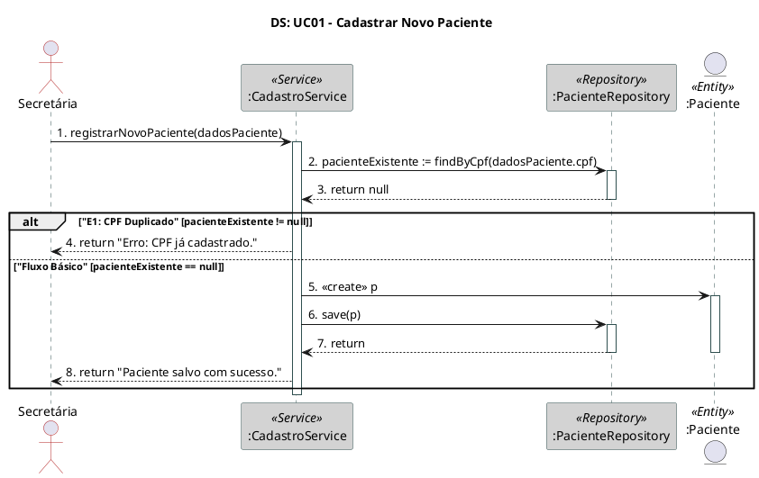
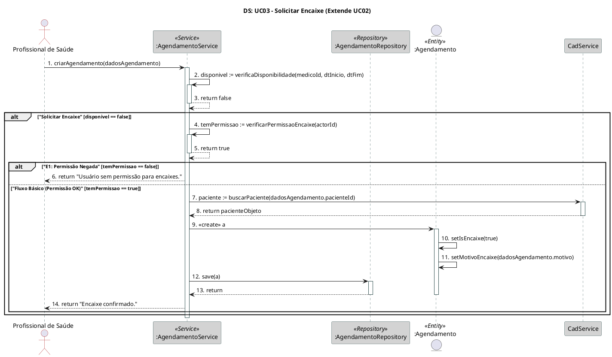
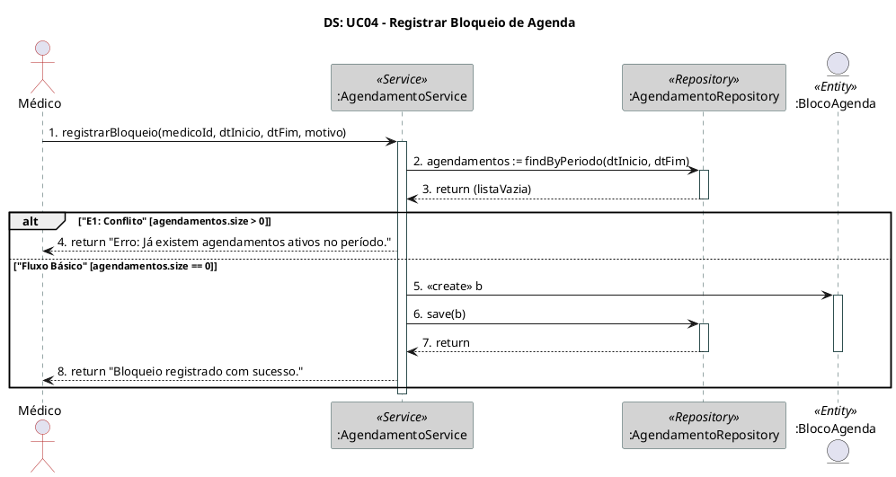
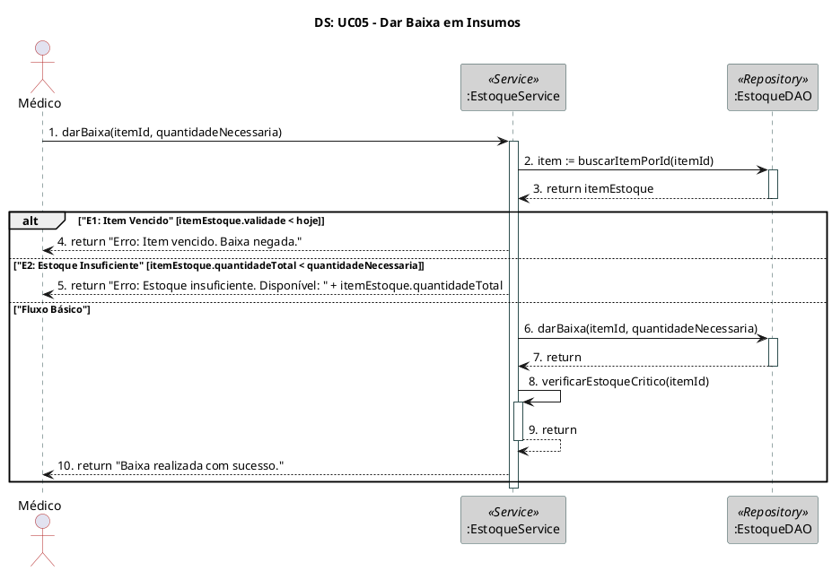
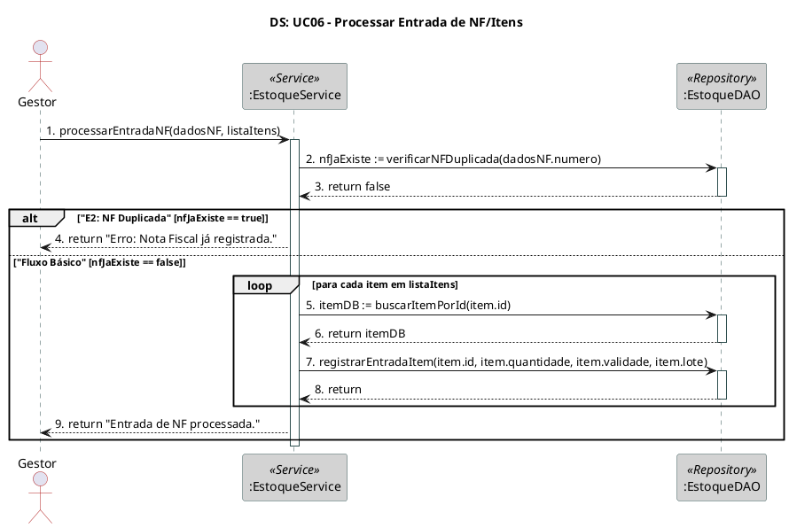
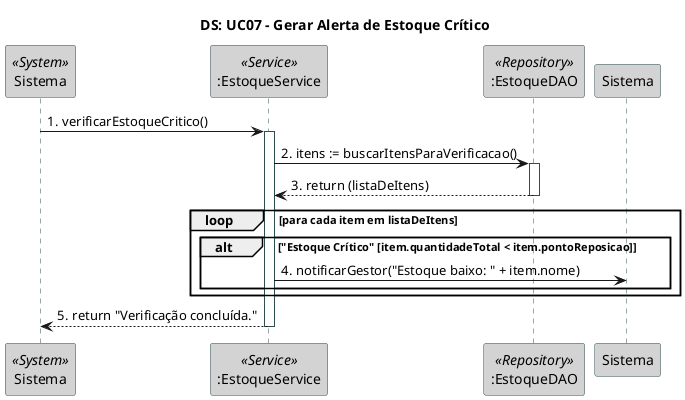
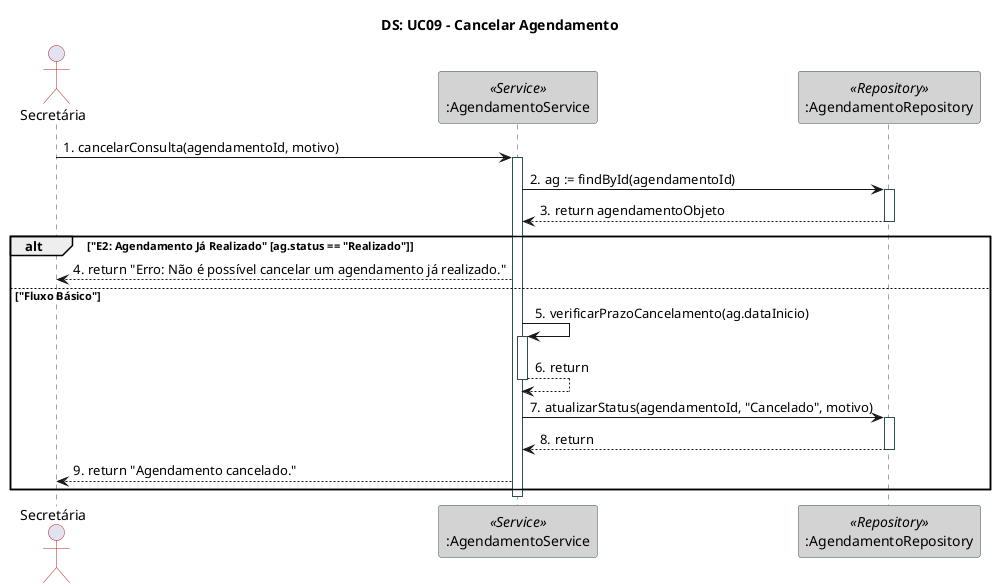
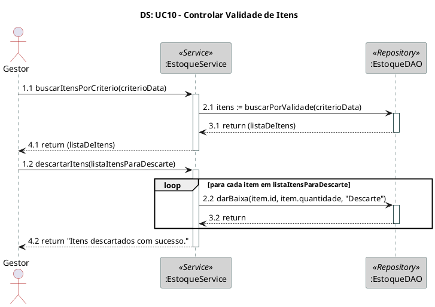

# 3.9. Modelagem de Interações

Este documento apresenta os diagramas de sequência (DS) para os principais casos de uso do sistema SimpleHealth, demonstrando as interações entre objetos durante a execução de cada funcionalidade.

## Sumário

- [Notas Técnicas - Correções de Discrepâncias](#notas-técnicas---correções-de-discrepâncias)
- [UC01: Cadastrar Novo Paciente](#uc01-cadastrar-novo-paciente)
- [UC02: Agendar Consulta](#uc02-agendar-consulta)
- [UC03: Solicitar Encaixe](#uc03-solicitar-encaixe)
- [UC04: Registrar Bloqueio de Agenda](#uc04-registrar-bloqueio-de-agenda)
- [UC05: Dar Baixa em Insumos](#uc05-dar-baixa-em-insumos)
- [UC06: Processar Entrada de NF/Itens](#uc06-processar-entrada-de-nfitens)
- [UC07: Gerar Alerta de Estoque Crítico](#uc07-gerar-alerta-de-estoque-crítico)
- [UC08: Consultar Histórico do Paciente](#uc08-consultar-histórico-do-paciente)
- [UC09: Cancelar Agendamento](#uc09-cancelar-agendamento)
- [UC10: Controlar Validade de Itens](#uc10-controlar-validade-de-itens)

---

## Notas Técnicas - Correções de Discrepâncias

Os diagramas de sequência foram atualizados para refletir discrepâncias identificadas.

### Discrepância 3.3: Integração AgendamentoService → CadastroService

**Discrepância:** Diagramas mostravam chamadas diretas entre serviços de módulos diferentes.

**Mudança Feita:** Diagramas UC02 e UC03 simplificados para mostrar uso de strings (pacienteCpf, medicoCrm) sem dependências diretas.

**Justificativa:** Microserviços não têm dependências diretas. Integração via Redis Pub/Sub.

**Documento Detalhado:** [📄 CORRECAO_DISCREPANCIA_3.3.md](../../../Correções%20de%20Alinhamento/CORRECAO_DISCREPANCIA_3.3.md)

### Discrepância 3.4: Integração AgendamentoService → EstoqueService

**Discrepância:** UC08 mostrava AgendamentoService integrando com EstoqueService.

**Mudança Feita:** UC08 simplificado para retornar apenas dados de Agendamento, sem integração com Estoque.

**Justificativa:** DarBaixaInsumosUseCase é independente no módulo Estoque.

**Documento Detalhado:** [📄 CORRECAO_DISCREPANCIA_3.4.md](../../../Correções%20de%20Alinhamento/CORRECAO_DISCREPANCIA_3.4.md)

### Discrepância 5.1: UC07 - Gerar Alerta de Estoque Crítico

**Discrepância:** Diagrama mostrava fluxo completo, mas não implementado.

**Mudança Feita:** Cabeçalho do UC07 marcado como `[NÃO IMPLEMENTADO]`.

**Justificativa:** Publisher existe, subscriber não.

**Documento Detalhado:** [📄 CORRECAO_DISCREPANCIA_5.1.md](../../../Correções%20de%20Alinhamento/CORRECAO_DISCREPANCIA_5.1.md)

### Discrepância 5.2: UC08 - Consultar Histórico do Paciente

**Discrepância:** Diagrama mostrava 5 integrações, mas apenas 3 funcionam.

**Mudança Feita:** Cabeçalho do UC08 marcado como `[IMPLEMENTAÇÃO PARCIAL]` com detalhes dos subscribers.

**Justificativa:** 3 de 5 canais Redis funcionam (consultas, exames, procedimentos).

**Documento Detalhado:** [📄 CORRECAO_DISCREPANCIA_5.2.md](../../../Correções%20de%20Alinhamento/CORRECAO_DISCREPANCIA_5.2.md)

### Discrepância 5.3: UC10 - Controlar Validade de Itens

**Discrepância:** Diagrama mostrava persistência de descartes, mas apenas logs.

**Mudança Feita:** Cabeçalho do UC10 marcado como `[IMPLEMENTAÇÃO PARCIAL]` com nota sobre `registrarMovimentacaoDescarte()`.

**Justificativa:** Método não persiste em BD, apenas imprime no console.

**Documento Detalhado:** [📄 CORRECAO_DISCREPANCIA_5.3.md](../../../Correções%20de%20Alinhamento/CORRECAO_DISCREPANCIA_5.3.md)

---

Para consultar todas as correções, acesse o [📑 Sumário de Correções](../../../Correções%20de%20Alinhamento/SUMARIO_CORRECAO_DISCREPANCIA.md).

---

## UC01: Cadastrar Novo Paciente

### Descrição
Diagrama de Sequência para UC01 baseado no Fluxo Básico e Exceção E1 do documento de Casos de Uso.

### Código PlantUML



### Diagrama Gerado


---

## UC02: Agendar Consulta

### Descrição
Diagrama de Sequência para UC02 baseado no Fluxo Básico, Alternativo A1 e Exceção E1.

**NOTA ARQUITETURAL:** Na implementação real, NÃO existe dependência direta entre AgendamentoService e CadastroService. Os módulos são desacoplados e integram-se via Redis Pub/Sub (eventos). Consultas armazenam apenas pacienteCpf (String), não objetos Paciente.

### Código PlantUML

```plantuml
@startuml

' Diagrama de Sequência para UC02: Agendar Consulta
' Baseado no Fluxo Básico, Alternativo A1 e Exceção E1.
' Demonstra a colaboração entre diferentes serviços (Agendamento e Cadastro).

skinparam participant {
  BorderColor DarkSlateGray
  BackgroundColor LightGray
  ArrowColor Firebrick
}

skinparam sequence {
  LifeLineBorderColor DarkSlateGray
  ActorBorderColor Firebrick
}

title "DS: UC02 - Agendar Consulta"

actor Secretária as Actor

\' Participantes baseados no Diagrama de Classes
participant ":AgendamentoService" as AgService <<Service>>
participant ":AgendamentoRepository" as AgRepository <<Repository>>
entity ":Agendamento" as Agendamento <<Entity>>

autonumber "0."

' Passos 1, 2, 5, 6 do UC: Usuário seleciona data, paciente, tipo e confirma
Actor -> AgService: criarAgendamento(dadosAgendamento)
activate AgService

' Passo 3: O Sistema consulta o AgendamentoService para verificar a disponibilidade.
' Esta é uma auto-mensagem
AgService -> AgService: disponivel := verificaDisponibilidade(medicoId, dtInicio, dtFim)
activate AgService

' Supondo happy path
AgService --> AgService: return true
deactivate AgService

' Bloco 'alt' para tratar Exceção E1 (Conflito de Agenda)
alt "E1: Conflito de Agenda" [disponivel == false]
  AgService --> Actor: return "Horário indisponível."
else "Fluxo Básico" [disponivel == true]
  \' Passo 4: Validação de dados (pacienteCpf, medicoCrm) ocorre na camada controller/frontend
  \' NOTA: NÃO há chamada direta AgendamentoService -> CadastroService
  \' Agendamento armazena apenas String (pacienteCpf, medicoCrm, convenioNome)
  
  \' Bloco \'alt\' para tratar Fluxo Alternativo A1 (Paciente Não Encontrado)
  alt "A1: Paciente Não Encontrado" [validação prévia falhou]
    AgService --> Actor: return "Paciente não encontrado. Cadastrar?"
  else "Fluxo Básico" [dados validados]
    \' Passo 7: O Sistema salva a Consulta
    AgService -> Agendamento: <<create>> a
    activate Agendamento
    
    \' Define o atributo isEncaixe como false por padrão
    Agendamento -> Agendamento: setIsEncaixe(false)
    
    AgService -> AgRepository: save(a)
    activate AgRepository
    AgRepository --> AgService: return
    deactivate AgRepository
    deactivate Agendamento
    
    ' Passo 8: O caso de uso é encerrado
    AgService --> Actor: return "Agendamento confirmado."
  end
end

deactivate AgService

@enduml
```

### Diagrama Gerado


---

## UC03: Solicitar Encaixe

### Descrição
Diagrama de Sequência para UC03 baseado no Fluxo Básico e Exceção E1. Este UC extende UC02.

### Código PlantUML



### Diagrama Gerado


---

## UC04: Registrar Bloqueio de Agenda

### Descrição
Diagrama de Sequência para UC04 baseado no Fluxo Básico e Exceção E1.

### Código PlantUML



### Diagrama Gerado


---

## UC05: Dar Baixa em Insumos

### Descrição
Diagrama de Sequência para UC05 baseado no Fluxo Básico e Exceções E1 e E2.

### Código PlantUML



### Diagrama Gerado


---

## UC06: Processar Entrada de NF/Itens

### Descrição
Diagrama de Sequência para UC06 baseado no Fluxo Básico e Exceção E2.

### Código PlantUML



### Diagrama Gerado


---

## UC07: Gerar Alerta de Estoque Crítico **[REDUÇÃO DE ESCOPO - NÃO IMPLEMENTADO]**

### Descrição
⚠️ **REDUÇÃO DE ESCOPO**: Este caso de uso foi planejado mas NÃO está implementado. O módulo Estoque não possui subscriber Redis para processar solicitações de alertas automáticos.

Diagrama de Sequência para UC07 baseado no Fluxo Básico. O Ator é o Sistema, disparado por um gatilho (timer ou chamada de UC05/UC06).

### Código PlantUML



### Diagrama Gerado


---

## UC08: Consultar Histórico do Paciente **[IMPLEMENTAÇÃO PARCIAL]**

### Descrição
⚠️ **IMPLEMENTAÇÃO PARCIAL**: Este caso de uso está parcialmente implementado. O `ConsultarHistoricoPacienteUseCase` publica solicitações via Redis para 5 canais, mas apenas o módulo Agendamento responde (consultas, exames, procedimentos). Os módulos **Estoque** e **Financeiro** NÃO possuem subscribers, então `itensBaixados` e `pagamentos` sempre retornam vazios.

Diagrama de Sequência para UC08 baseado no Fluxo Básico. O AgendamentoService orquestra, chamando outros serviços.

### Código PlantUML

```plantuml
@startuml

' Diagrama de Sequência para UC08: Consultar Histórico do Paciente
' Baseado no Fluxo Básico.

skinparam participant {
  BorderColor DarkSlateGray
  BackgroundColor LightGray
  ArrowColor Firebrick
}

skinparam sequence {
  LifeLineBorderColor DarkSlateGray
  ActorBorderColor Firebrick
}

title "DS: UC08 - Consultar Histórico do Paciente"

actor Médico as Actor

\' Participantes: Cada serviço trabalha com seu próprio domínio
\' NOTA: Integração entre módulos via Redis Pub/Sub (não há chamadas diretas)
\' REDUÇÃO DE ESCOPO: Histórico de insumos (Estoque) removido do UC08
participant ":AgendamentoService" as AgService \<\<Service\>\>
participant ":AgendamentoRepository" as AgRepository \<\<Repository\>\>

autonumber "0."

' Passo 1 e 2: Ator acessa função e pesquisa paciente
Actor -> AgService: consultarHistoricoCompleto(pacienteCpf)
activate AgService

' Passo 3: Validação de pacienteCpf ocorre na camada controller/frontend
' NOTA: Agendamento já possui pacienteCpf (String), não precisa buscar no Cadastro
' Módulos são desacoplados - NÃO há chamada AgendamentoService -> CadastroService

' Bloco 'alt' para Exceção E1 (Paciente Não Encontrado)
alt "E1: Paciente Não Encontrado" [pacienteCpf inválido]
  AgService --> Actor: return "Paciente não encontrado."
else "Fluxo Básico" [pacienteCpf válido]
  \' Passo 4: O Sistema consolida a lista de Agendamentos
  AgService -> AgRepository: agendamentos := findByPacienteCpf(paciente.id)
  activate AgRepository
  AgRepository --> AgService: return (listaDeAgendamentos)
  deactivate AgRepository
  
  \' REDUÇÃO DE ESCOPO: Histórico de insumos não é integrado ao UC08
  \' NOTA: UC05 (Dar Baixa em Insumos) é independente do módulo Agendamento
  \' Cada módulo consulta apenas seu próprio banco (Database per Service)
  
  \' Passo 5: O caso de uso é encerrado
  AgService --> Actor: return historicoAgendamentos
end

deactivate AgService

@enduml
```

### Diagrama Gerado


---

## UC09: Cancelar Agendamento

### Descrição
Diagrama de Sequência para UC09 baseado no Fluxo Básico e Exceção E2.

### Código PlantUML



### Diagrama Gerado


---

## UC10: Controlar Validade de Itens **[REDUÇÃO DE ESCOPO - IMPLEMENTAÇÃO PARCIAL]**

> **Status de Implementação**: UC10 está **parcialmente implementado**. A busca de itens por validade (endpoint `/validade`) funciona corretamente. Porém, o método `registrarMovimentacaoDescarte()` apenas imprime logs no console, não persiste movimentações em banco de dados conforme descrito no diagrama abaixo.

### Descrição
Diagrama de Sequência para UC10 baseado no Fluxo Básico. Demonstra busca de itens por validade e descarte.

### Código PlantUML



### Diagrama Gerado


---

## Observações

- Todos os diagramas seguem o padrão estabelecido no Diagrama de Classes
- Os Services atuam como Controllers/Facades
- DAOs são responsáveis pela persistência
- Entidades são criadas dinamicamente conforme necessário
- Tratamento de exceções é demonstrado com blocos `alt`
- Iterações são demonstradas com blocos `loop`

---

**Versão**: 1.0  
**Última Atualização**: Dezembro de 2025  
**Equipe**: Grupo 4 - SimpleHealth
