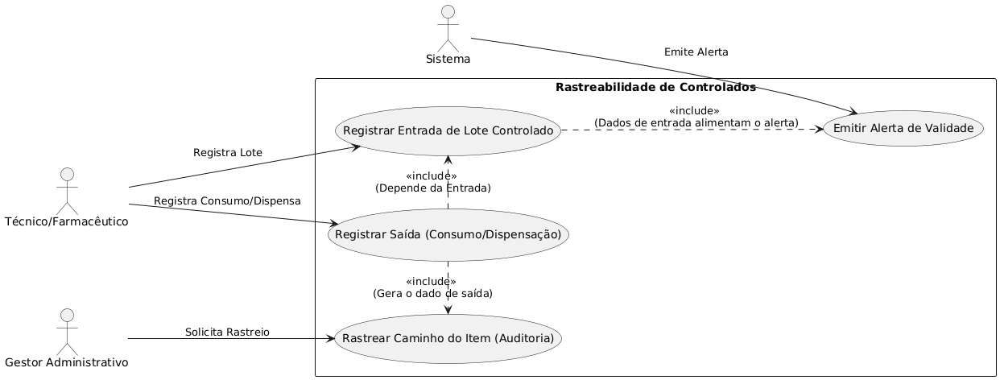
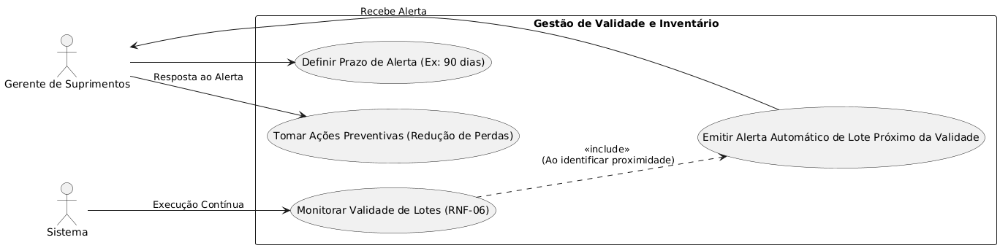
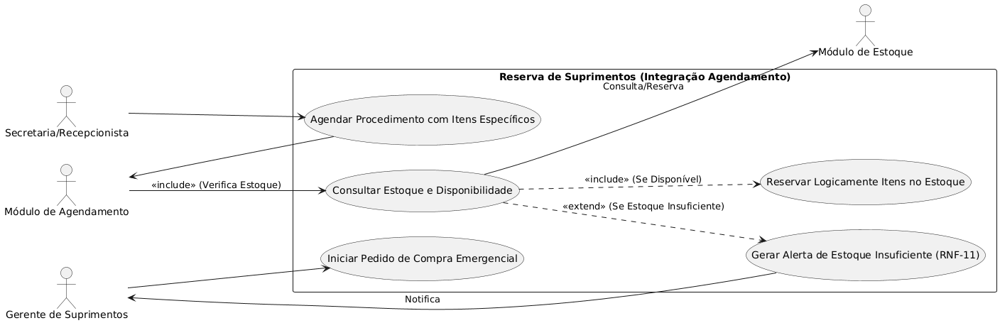
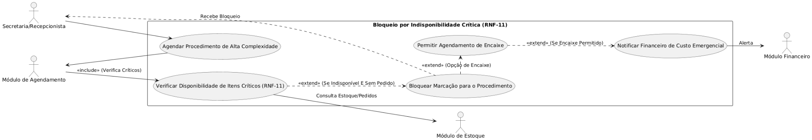
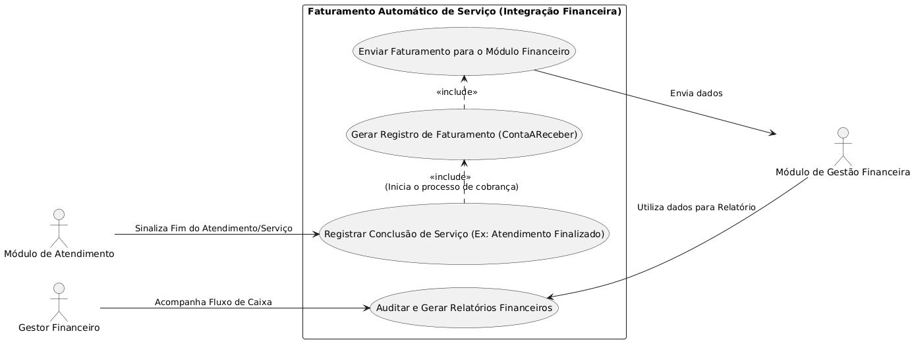
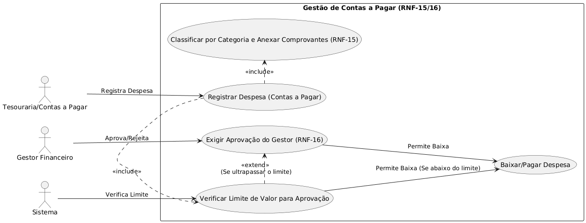
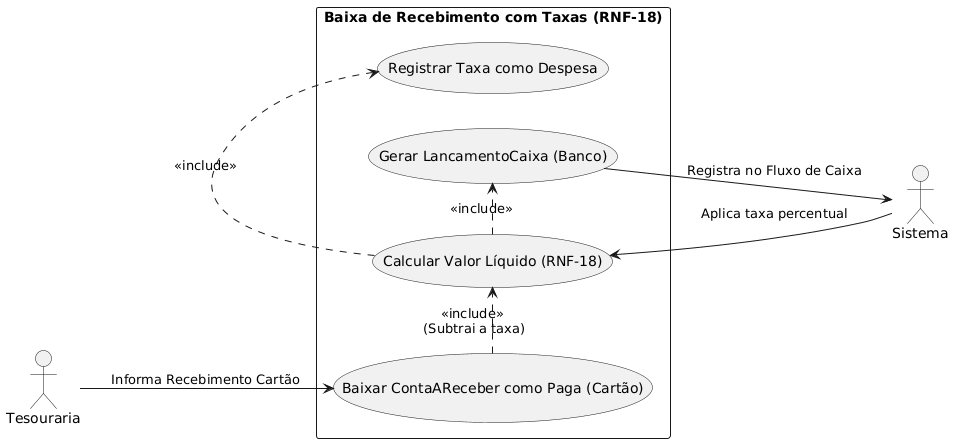
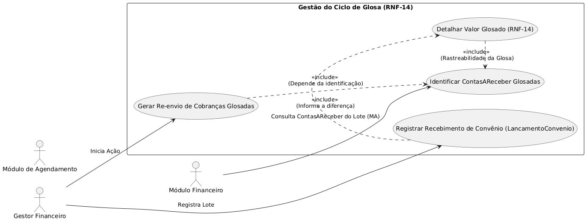

## **1. Módulo: Rastreabilidade Completa de Medicamento Controlado**

Snippet de código

\@startuml

left to right direction

actor \"Técnico/Farmacêutico\" as A1

actor \"Gestor Administrativo\" as A2

actor \"Sistema\" as S

rectangle \"Rastreabilidade de Controlados\" {

usecase \"Registrar Entrada de Lote Controlado\" as UC1

usecase \"Registrar Saída (Consumo/Dispensação)\" as UC2

usecase \"Rastrear Caminho do Item (Auditoria)\" as UC3

usecase \"Emitir Alerta de Validade\" as UC4

A1 \--\> UC1 : Registra Lote

A1 \--\> UC2 : Registra Consumo/Dispensa

A2 \--\> UC3 : Solicita Rastreio

UC2 .\> UC1 : \<\<include\>\> \\n(Depende da Entrada)

UC2 .\> UC3 : \<\<include\>\> \\n(Gera o dado de saída)

UC1 ..\> UC4 : \<\<include\>\> \\n(Dados de entrada alimentam o alerta)

S \--\> UC4 : Emite Alerta

}

\@enduml

## **2. Módulo: Alerta e Gestão de Inventário Próximo da Validade**

Snippet de código

\@startuml

left to right direction

actor \"Gerente de Suprimentos\" as A1

actor \"Sistema\" as S

rectangle \"Gestão de Validade e Inventário\" {

usecase \"Definir Prazo de Alerta (Ex: 90 dias)\" as UC1

usecase \"Monitorar Validade de Lotes (RNF-06)\" as UC2

usecase \"Emitir Alerta Automático de Lote Próximo da Validade\" as UC3

usecase \"Tomar Ações Preventivas (Redução de Perdas)\" as UC4

A1 \--\> UC1

A1 \--\> UC4 : Resposta ao Alerta

S \--\> UC2 : Execução Contínua

UC2 ..\> UC3 : \<\<include\>\> \\n(Ao identificar proximidade)

UC3 \--\> A1 : Recebe Alerta

}

\@endumml

## **3. Módulo Integrado: Reserva de Suprimentos para Procedimento Agendado**

Snippet de código

\@startuml

left to right direction

actor \"Secretaria/Recepcionista\" as A1

actor \"Gerente de Suprimentos\" as A2

actor \"Módulo de Agendamento\" as MA

actor \"Módulo de Estoque\" as ME

rectangle \"Reserva de Suprimentos (Integração Agendamento)\" {

usecase \"Agendar Procedimento com Itens Específicos\" as UC1

usecase \"Consultar Estoque e Disponibilidade\" as UC2

usecase \"Reservar Logicamente Itens no Estoque\" as UC3

usecase \"Gerar Alerta de Estoque Insuficiente (RNF-11)\" as UC4

usecase \"Iniciar Pedido de Compra Emergencial\" as UC5

A1 \--\> UC1

UC1 \--\> MA

MA \--\> UC2 : \<\<include\>\> (Verifica Estoque)

UC2 ..\> UC3 : \<\<include\>\> (Se Disponível)

UC2 ..\> UC4 : \<\<extend\>\> (Se Estoque Insuficiente)

UC2 \--\> ME : Consulta/Reserva

UC4 \--\> A2 : Notifica

A2 \--\> UC5

}

\@enduml

## **4. Módulo Integrado: Apuração Automática do Custo da Mercadoria Vendida (CMV)**

Snippet de código

\@startuml

left to right direction

actor \"Módulo de Estoque\" as ME

actor \"Módulo de Gestão Financeira\" as MF

actor \"Gestor Financeiro\" as A1

rectangle \"Apuração Automática do CMV (Integração Financeiro)\" {

usecase \"Registrar Baixa de Item por Consumo\" as UC1

usecase \"Registrar Custo Unitário do Lote\" as UC2

usecase \"Enviar Custo para Módulo Financeiro\" as UC3

usecase \"Associar Custo à ContaAReceber do Serviço\" as UC4

usecase \"Apurar Custo por Atendimento/Resultado\" as UC5

ME \--\> UC1 : Sinal de Baixa

UC1 ..\> UC2 : \<\<include\>\> (Determina o Custo)

UC2 ..\> UC3 : \<\<include\>\>

UC3 \--\> MF : Transfere Custo

MF \--\> UC4 : Recebe Custo

UC4 ..\> UC5 : \<\<include\>\>

A1 \--\> UC5 : Análise Estratégica

}

\@enduml

## **5. Módulo Integrado: Bloqueio de Agendamento por Indisponibilidade Crítica de Item**

Snippet de código

\@startuml

left to right direction

actor \"Secretaria/Recepcionista\" as A1

actor \"Módulo de Agendamento\" as MA

actor \"Módulo de Estoque\" as ME

actor \"Módulo Financeiro\" as MF

rectangle \"Bloqueio por Indisponibilidade Crítica (RNF-11)\" {

usecase \"Agendar Procedimento de Alta Complexidade\" as UC1

usecase \"Verificar Disponibilidade de Itens Críticos (RNF-11)\" as UC2

usecase \"Bloquear Marcação para o Procedimento\" as UC3

usecase \"Permitir Agendamento de Encaixe\" as UC4

usecase \"Notificar Financeiro de Custo Emergencial\" as UC5

A1 \--\> UC1

UC1 \--\> MA

MA \--\> UC2 : \<\<include\>\> (Verifica Críticos)

UC2 \--\> ME : Consulta Estoque/Pedidos

UC2 ..\> UC3 : \<\<extend\>\> (Se Indisponível E Sem Pedido)

A1 \<. UC3 : Recebe Bloqueio

UC3 .\> UC4 : \<\<extend\>\> (Opção de Encaixe)

UC4 ..\> UC5 : \<\<extend\>\> (Se Encaixe Permitido)

UC5 \--\> MF : Alerta

}

\@enduml

Você pode copiar e colar cada bloco de código em um editor de PlantUML
(online ou local) para gerar as imagens dos diagramas de Caso de Uso.

## **6. Módulo: Gestão de Bloqueios e Indisponibilidade da Agenda Médica**

Este diagrama foca no controle e bloqueio da agenda.

Snippet de código

\@startuml

left to right direction

actor \"Médico\" as A1

actor \"Secretaria\" as A2

rectangle \"Controle de Agenda e Bloqueios\" {

usecase \"Registrar Indisponibilidade na Agenda (RNF-10)\" as UC1

usecase \"Bloquear Horário para Agendamento\" as UC2

usecase \"Visualizar Agenda Unificada\" as UC3

A1 \--\> UC1 : Registra Férias/Congresso

A2 \--\> UC1 : Registra Almoço/Compromisso

UC1 ..\> UC2 : \<\<include\>\> \\n(O registro de indisponibilidade
efetua o bloqueio)

UC2 -\[hidden\]-\> UC1

A1 \--\> UC3

A2 \--\> UC3 : Aumenta a Ocupação

}

\@enduml

## **7. Módulo: Registro de Agendamento com Verificação de Integridade**

Este diagrama destaca o processo de agendamento e as checagens de
integridade de dados.

Snippet de código

\@startuml

left to right direction

actor \"Secretaria/Recepcionista\" as A1

actor \"Sistema\" as S

rectangle \"Registro de Agendamento (RNF-08)\" {

usecase \"Agendar Consulta (Primeira ou Retorno)\" as UC1

usecase \"Verificar Paciente Pré-Cadastrado\" as UC2

usecase \"Verificar Médico Pré-Cadastrado\" as UC3

usecase \"Verificar Disponibilidade do Médico\" as UC4

usecase \"Concluir Registro (Eficiência \< 60s)\" as UC5

A1 \--\> UC1 : Informa Paciente, Médico e Convênio

UC1 .\> UC2 : \<\<include\>\> \\n(Restrição de Integridade)

UC1 .\> UC3 : \<\<include\>\> \\n(Restrição de Integridade)

UC1 .\> UC4 : \<\<include\>\> \\n(Verifica Agenda)

S \--\> UC2

S \--\> UC3

S \--\> UC4

UC1 \--\> UC5 : Finaliza com Sucesso

}

\@enduml

## **8. Módulo Integrado: Faturamento Automático de Serviço Concluído**

Este diagrama ilustra a integração entre a **Conclusão do Serviço** e o
**Módulo Financeiro** para faturamento.

Snippet de código

\@startuml

left to right direction

actor \"Módulo de Atendimento\" as MA

actor \"Módulo de Gestão Financeira\" as MF

actor \"Gestor Financeiro\" as A1

rectangle \"Faturamento Automático de Serviço (Integração Financeira)\"
{

usecase \"Registrar Conclusão de Serviço (Ex: Atendimento Finalizado)\"
as UC1

usecase \"Gerar Registro de Faturamento (ContaAReceber)\" as UC2

usecase \"Enviar Faturamento para o Módulo Financeiro\" as UC3

usecase \"Auditar e Gerar Relatórios Financeiros\" as UC4

MA \--\> UC1 : Sinaliza Fim do Atendimento/Serviço

UC1 .\> UC2 : \<\<include\>\> \\n(Inicia o processo de cobrança)

UC2 .\> UC3 : \<\<include\>\>

UC3 \--\> MF : Envia dados

MF \--\> UC4 : Utiliza dados para Relatório

A1 \--\> UC4 : Acompanha Fluxo de Caixa

}

\@enduml

## **9. Módulo: Gestão e Aprovação de Contas a Pagar por Limite de Valor**

Este diagrama mostra o fluxo de registro e aprovação de despesas com
limite.

Snippet de código

\@startuml

left to right direction

actor \"Tesouraria/Contas a Pagar\" as A1

actor \"Gestor Financeiro\" as A2

actor \"Sistema\" as S

rectangle \"Gestão de Contas a Pagar (RNF-15/16)\" {

usecase \"Registrar Despesa (Contas a Pagar)\" as UC1

usecase \"Classificar por Categoria e Anexar Comprovantes (RNF-15)\" as
UC2

usecase \"Verificar Limite de Valor para Aprovação\" as UC3

usecase \"Exigir Aprovação do Gestor (RNF-16)\" as UC4

usecase \"Baixar/Pagar Despesa\" as UC5

A1 \--\> UC1 : Registra Despesa

UC1 .\> UC2 : \<\<include\>\>

UC1 .\> UC3 : \<\<include\>\>

S \--\> UC3 : Verifica Limite

UC3 .\> UC4 : \<\<extend\>\> \\n(Se ultrapassar o limite)

A2 \--\> UC4 : Aprova/Rejeita

UC4 \--\> UC5 : Permite Baixa

UC3 \--\> UC5 : Permite Baixa (Se abaixo do limite)

}

\@enduml

## **10. Módulo: Cálculo Líquido e Baixa de Recebimento com Taxas de Cartão**

Este diagrama detalha o processo de baixa de recebimento por cartão com
cálculo automático de taxas.

Snippet de código

\@startuml

left to right direction

actor \"Tesouraria\" as A1

actor \"Sistema\" as S

rectangle \"Baixa de Recebimento com Taxas (RNF-18)\" {

usecase \"Baixar ContaAReceber como Paga (Cartão)\" as UC1

usecase \"Calcular Valor Líquido (RNF-18)\" as UC2

usecase \"Registrar Taxa como Despesa\" as UC3

usecase \"Gerar LancamentoCaixa (Banco)\" as UC4

A1 \--\> UC1 : Informa Recebimento Cartão

UC1 .\> UC2 : \<\<include\>\> \\n(Subtrai a taxa)

UC2 .\> UC3 : \<\<include\>\>

UC2 .\> UC4 : \<\<include\>\>

S \--\> UC2 : Aplica taxa percentual

UC4 \--\> S : Registra no Fluxo de Caixa

}

\@enduml

## **11. Módulo Integrado: Conciliação e Gestão do Ciclo de Glosa de Convênios**

Este diagrama foca na conciliação e no tratamento das glosas de
convênios.

Snippet de código

\@startuml

left to right direction

actor \"Gestor Financeiro\" as A1

actor \"Módulo Financeiro\" as MF

actor \"Módulo de Agendamento\" as MA

rectangle \"Gestão do Ciclo de Glosa (RNF-14)\" {

usecase \"Registrar Recebimento de Convênio (LancamentoConvenio)\" as
UC1

usecase \"Detalhar Valor Glosado (RNF-14)\" as UC2

usecase \"Identificar ContasAReceber Glosadas\" as UC3

usecase \"Gerar Re-envio de Cobranças Glosadas\" as UC4

A1 \--\> UC1 : Registra Lote

UC1 .\> UC2 : \<\<include\>\> \\n(Informa a diferença)

MF \--\> UC3 : Consulta ContasAReceber do Lote (MA)

UC2 .\> UC3 : \<\<include\>\> \\n(Rastreabilidade da Glosa)

A1 \--\> UC4 : Inicia Ação

UC4 ..\> UC3 : \<\<include\>\> \\n(Depende da identificação)

}

\@enduml

## **12. Módulo Integrado: Repasse Médico Automático Baseado em Receita Realizada**

Este diagrama ilustra o cálculo e a geração do repasse médico de forma
automática.

Snippet de código

\@startuml

left to right direction

actor \"Gestor Financeiro\" as A1

actor \"Módulo Financeiro\" as MF

actor \"Módulo de Agendamento\" as MA

rectangle \"Repasse Médico Automático\" {

usecase \"Calcular Valor de Repasse por Médico\" as UC1

usecase \"Gerar ContasAPagar de Repasse\" as UC2

usecase \"Eliminar Planilhas Manuais (Transparência)\" as UC3

MA \--\> MF : Notificação de Recebimento Baixado

MF \--\> UC1 : Utiliza Receitas (ContasAReceber) para Cálculo

A1 \--\> UC2 : Inicia Geração

UC1 .\> UC2 : \<\<include\>\> \\n(Repasse é o dado de entrada da
ContaAPagar)

UC2 .\> UC3 : \<\<include\>\>

}

\@enduml

## **13. Módulo Integrado: Rastreabilidade Financeira de Custos de Suprimentos por NF**

Este diagrama mostra a ligação entre o pagamento (Financeiro) e a Nota
Fiscal de entrada (Estoque).

Snippet de código

\@startuml

left to right direction

actor \"Gestor Financeiro\" as A1

actor \"Módulo Financeiro\" as MF

actor \"Módulo de Estoque\" as ME

rectangle \"Rastreabilidade Financeira de Custos por NF\" {

usecase \"Registrar Pagamento de ContaAPagar (Fornecedor)\" as UC1

usecase \"Associar Pagamento à Nota Fiscal de Estoque\" as UC2

usecase \"Rastrear Custo de Lote de Item (Conformidade)\" as UC3

A1 \--\> UC1 : Paga Fornecedor

UC1 .\> UC2 : \<\<include\>\> \\n(Vincula a NF de entrada)

MF \--\> UC2 : Mantém Associação

ME \--\> UC2 : Fornece dados da NF

A1 \--\> UC3 : Solicita Rastreabilidade

UC3 .\> UC2 : \<\<include\>\> \\n(Depende da associação para rastreio)

}

\@enduml

