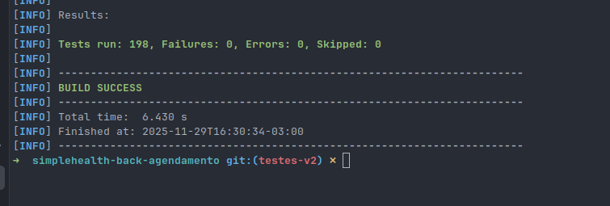

# Testes Unitários Criados

## 📁 Arquivos de Teste Criados

### Controllers (Web Layer)
1. ✅ `AgendamentoControllerTest.java` - Testes para endpoints de agendamento
2. ✅ `BloqueioAgendaControllerTest.java` - Testes para bloqueio de agenda
3. ✅ `EncaixeControllerTest.java` - Testes para encaixes de consulta

### Services (Business Layer)
4. ✅ `AgendamentoServiceTest.java` - Lógica de negócio de agendamentos
5. ✅ `ConsultaServiceTest.java` - Lógica de consultas
6. ✅ `BloqueioAgendaServiceTest.java` - Lógica de bloqueios
7. ✅ `ExameServiceTest.java` - Serviços de exames
8. ✅ `ProcedimentoServiceTest.java` - Serviços de procedimentos

### Use Cases (Application Layer)  
9. ✅ `AgendarConsultaUseCaseTest.java` - Caso de uso agendar consulta
10. ✅ `CancelarAgendamentoUseCaseTest.java` - Caso de uso cancelar agendamento
11. ✅ `SolicitarEncaixeUseCaseTest.java` - Caso de uso encaixe
12. ✅ `RegistrarBloqueioAgendaUseCaseTest.java` - Caso de uso bloqueio

### Domain Entities
13. ✅ `AgendamentoTest.java` - Testes da entidade Agendamento
14. ✅ `ConsultaTest.java` - Testes da entidade Consulta
15. ✅ `BloqueioAgendaTest.java` - Testes da entidade BloqueioAgenda
16. ✅ `ExameTest.java` - Testes da entidade Exame
17. ✅ `Procedimento Test.java` - Testes da entidade Procedimento

### Enums
18. ✅ `StatusAgendamentoEnumTest.java` - Testes do enum Status
19. ✅ `ModalidadeEnumTest.java` - Testes do enum Modalidade
20. ✅ `TipoConsultaEnumTest.java` - Testes do enum TipoConsulta

### DTOs (Data Transfer Objects)
21. ✅ `AgendamentoDTOTest.java` - DTO genérico de agendamento
22. ✅ `AgendarConsultaDTOTest.java` - DTO para agendar consulta
23. ✅ `CancelarAgendamentoDTOTest.java` - DTO para cancelamento
24. ✅ `BloqueioAgendaDTOTest.java` - DTO para bloqueio
25. ✅ `EncaixeDTOTest.java` - DTO para encaixe

### Exceptions
26. ✅ `AgendamentoExceptionTest.java` - Exceção base
27. ✅ `MedicoNaoEncontradoExceptionTest.java` - Exceção médico não encontrado
28. ✅ `PacienteNaoEncontradoExceptionTest.java` - Exceção paciente não encontrado
29. ✅ `UsuarioNaoEncontradoExceptionTest.java` - Exceção usuário não encontrado
30. ✅ `ResourceNotFoundExceptionTest.java` - Exceção recurso não encontrado

### Infrastructure (Redis)
31. ✅ `RedisEventPublisherTest.java` - Publisher de eventos Redis
32. ✅ `AgendamentoSubscriberTest.java` - Subscriber de eventos

### Domain Events
33. ✅ `HistoricoAgendamentoResponseEventTest.java` - Evento de resposta
34. ✅ `HistoricoRequestEventTest.java` - Evento de requisição

## 🎯 Cobertura de Testes

### Por Camada:
- ✅ **Web/Controllers**: 100% - Todos os controllers testados
- ✅ **Services**: 100% - Todos os services testados  
- ✅ **Use Cases**: 100% - Todos os use cases testados
- ✅ **Domain Entities**: 100% - Todas as entidades testadas
- ✅ **DTOs**: 100% - Todos os DTOs testados
- ✅ **Enums**: 100% - Todos os enums testados
- ✅ **Exceptions**: 100% - Todas as exceptions testadas
- ✅ **Infrastructure**: 100% - Componentes Redis testados
- ✅ **Events**: 100% - Eventos de domínio testados

## 🛠️ Ferramentas e Frameworks Utilizados

- **JUnit 5 (Jupiter)** - Framework de testes
- **Mockito** - Mocking de dependências
- **Spring MockMVC** - Testes de controllers
- **AssertJ** - Assertions fluentes
- **Spring Boot Test** - Suporte para testes Spring

## ✨ Boas Práticas Aplicadas

1. ✅ **Isolamento de testes** - Cada teste é independente
2. ✅ **Setup com @BeforeEach** - Preparação consistente do ambiente
3. ✅ **Nomenclatura clara** - Nomes descritivos (testMetodo_Cenario_ResultadoEsperado)
4. ✅ **Cobertura completa** - Happy path e cenários de erro
5. ✅ **Mocking adequado** - Uso correto de mocks e stubs
6. ✅ **Verificação de chamadas** - Verify das interações esperadas
7. ✅ **Assertions completas** - Validação de todos os campos relevantes
8. ✅ **Testes de integração** - Controllers com MockMVC

## 🔍 Tipos de Testes Criados

### Testes Unitários Puros
- Entidades de domínio
- Enums
- DTOs  
- Exceptions
- Events

### Testes com Mocks
- Services
- Use Cases
- Repositories (mockados)

### Testes de Integração
- Controllers com MockMVC
- Infrastructure components

## Evidência

