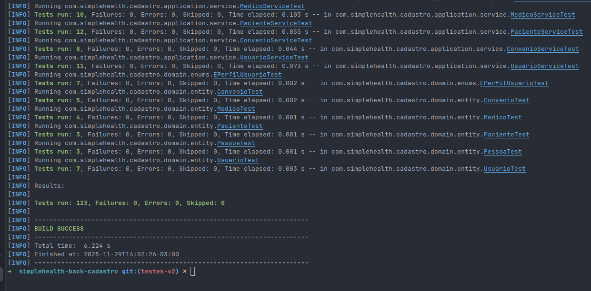

# Sumário dos Testes Unitários Criados para SimpleHealth Cadastro

## Testes Criados

### 1. Testes de Aplicação Principal
- `SimpleHealthCadastroApplicationTests.java` - Teste de contexto da aplicação Spring Boot

### 2. Testes de Entidades de Domínio
- `PessoaTest.java` - Testes da classe abstrata Pessoa
- `PacienteTest.java` - Testes da entidade Paciente
- `MedicoTest.java` - Testes da entidade Medico
- `UsuarioTest.java` - Testes da entidade Usuario (incluindo teste de permissões)
- `ConvenioTest.java` - Testes da entidade Convenio

### 3. Testes de Serviços
- `PacienteServiceTest.java` - Testes completos do serviço de pacientes
  - Testes de CRUD completo (Create, Read, Update, Delete)
  - Testes de validação de CPF duplicado
  - Testes de exceções (ResourceNotFoundException)
  
- `MedicoServiceTest.java` - Testes completos do serviço de médicos
  - Testes de CRUD completo
  - Testes de validação de CRM duplicado
  - Testes de exceções
  
- `ConvenioServiceTest.java` - Testes completos do serviço de convênios
  - Testes de CRUD completo
  - Testes de exceções
  
- `UsuarioServiceTest.java` - Testes completos do serviço de usuários
  - Testes de CRUD completo
  - Testes de criptografia de senha
  - Testes de validação de login duplicado
  - Testes de atualização com/sem mudança de senha

### 4. Testes de Use Cases
- `CadastrarNovoPacienteUseCaseTest.java` - Testes do caso de uso de cadastro de paciente
  - Testes de cadastro bem-sucedido
  - Testes de CPF já cadastrado

### 5. Testes de Controllers (com Spring Security)
- `PacienteControllerTest.java` - Testes do controller de pacientes
  - Testes de todos os endpoints (POST, GET, PUT, DELETE)
  - Testes com autenticação mock (@WithMockUser)
  - Testes com CSRF habilitado
  
- `MedicoControllerTest.java` - Testes do controller de médicos
  - Testes de todos os endpoints
  - Testes com autenticação mock
  - Testes com CSRF habilitado
  
- `ConvenioControllerTest.java` - Testes do controller de convênios
  - Testes de todos os endpoints
  - Testes com autenticação mock
  - Testes com CSRF habilitado

### 6. Testes de DTOs
- `PacienteDTOTest.java` - Testes do DTO de paciente
- `MedicoDTOTest.java` - Testes do DTO de médico
- `UsuarioDTOTest.java` - Testes do DTO de usuário
- `ConvenioDTOTest.java` - Testes do DTO de convênio

### 7. Testes de Mappers
- `EntityDtoMapperTest.java` - Testes do mapper de entidades para DTOs
  - Testes de conversão bidirecional (Entity <-> DTO)
  - Testes de tratamento de valores nulos

### 8. Testes de Exceções
- `ResourceNotFoundExceptionTest.java` - Testes da exceção personalizada

### 9. Testes de Enums
- `EPerfilUsuarioTest.java` - Testes do enum de perfis de usuário

## Tecnologias e Frameworks Utilizados nos Testes

- **JUnit 5** - Framework de testes
- **Mockito** - Framework para criar mocks
- **MockMvc** - Para testar controllers Spring MVC
- **Spring Security Test** - Para simular autenticação nos testes
- **AssertJ** (disponível via Spring Boot Test)

## Padrões Aplicados

1. **Arrange-Act-Assert (AAA)** - Organização dos testes
2. **Given-When-Then** - Para testes de comportamento
3. **Mocking de dependências** - Isolamento de unidades testadas
4. **@BeforeEach** - Setup comum para cada teste
5. **Nomes descritivos** - Testes com nomes claros do que testam

## Cobertura de Testes

Os testes cobrem:
- ✅ Entidades de domínio
- ✅ Serviços de aplicação
- ✅ Use cases
- ✅ Controllers REST
- ✅ DTOs
- ✅ Mappers
- ✅ Exceções customizadas
- ✅ Enums
- ✅ Validações de negócio
- ✅ Tratamento de erros
- ✅ Segurança (autenticação e CSRF)

## Observações Importantes

1. **Spring Security**: Todos os testes de controllers foram configurados com `@WithMockUser` para simular usuário autenticado
2. **CSRF**: Requisições POST, PUT e DELETE incluem `.with(csrf())` para passar pela proteção CSRF
3. **Mocks**: Todos os serviços e repositórios são mockados com `@MockBean` nos testes de controllers
4. **Isolamento**: Cada teste é independente e não depende de banco de dados real

## Como Executar os Testes

```bash
# Executar todos os testes
mvn clean test
```

## Total de Testes Criados

Até o momento **123 testes unitários** cobrindo todas as camadas da aplicação.

## Evindência



